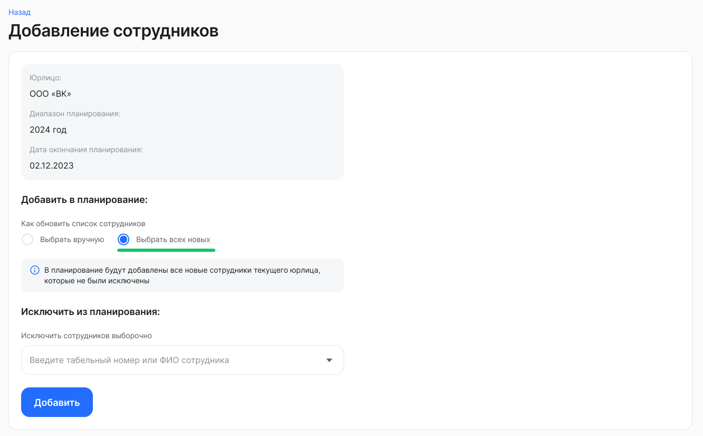
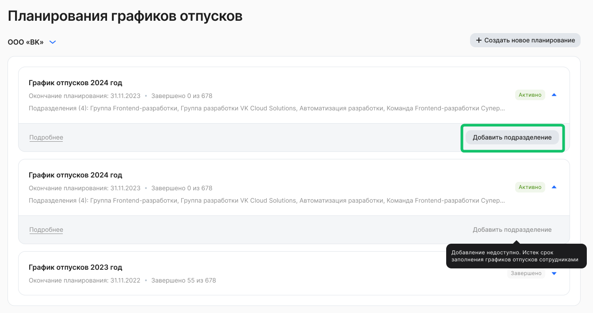
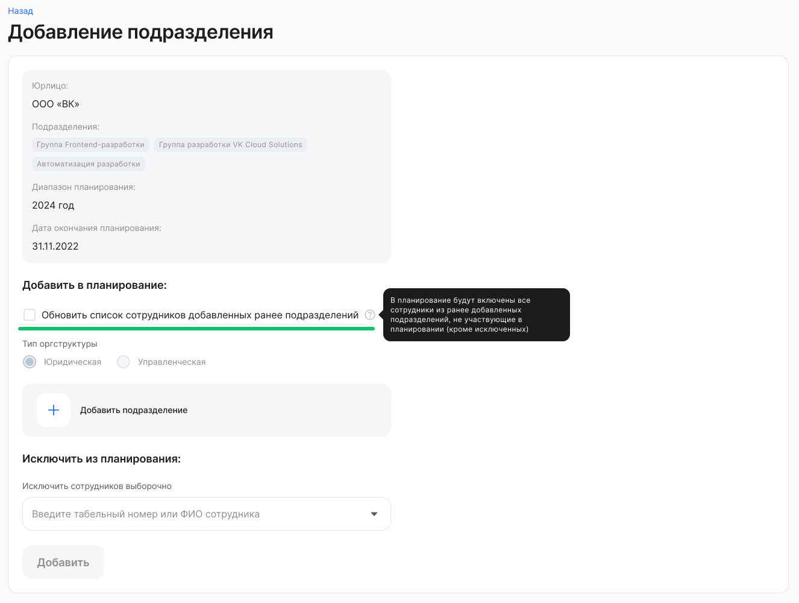

В активном планировании графика отпусков <u>по юрлицу</u> доступно добавление сотрудников — выборочно или всех новых, кто не попал в это планирование. В активном планировании графика отпусков <u>по подразделениям</u> доступно добавление подразделения полностью с его сотрудниками.  

Чтобы добавить новых сотрудников в разрезе подразделений и/или напрямую по табельному номеру/ФИО сотрудника, перейдите в **Настройки КЭДО → Настройки бизнес-процессов → Графики отпусков** **→** детали планирования активного графика отпусков. После добавления новых сотрудников будут созданы задачи на планирование для этих сотрудников.  

При добавлении сотрудников можно выбрать только тех сотрудников, для которых нет активных / успешно завершенных планирований в предстоящем периоде.  

## Добавление сотрудников

Чтобы добавить сотрудников по юрлицу:

1\. Нажмите кнопку **Добавить сотрудников** в деталях планирования.

2\. Выберите один вариант обновления списка сотрудников: **Выбрать вручную** или **Выбрать всех новых**.

2.1. При выборе варианта **Выбрать вручную** укажите тип оргструктуры в компании.

2.2. При выборе варианта **Выбрать всех новых** в планирование будут добавлены все новые сотрудники текущего юрлица, которые не были исключены.

## Добавление подразделения

Чтобы добавить сотрудников по подразделениям:

1. Нажмите кнопку **Добавить подразделение** в деталях планирования. 

 

2. При включении опции **Обновить список сотрудников добавленных ранее подразделений** в планирование будут включены все сотрудники из ранее добавленных подразделений, не участвующие в планировании (кроме исключенных).

Также можно исключить сотрудников, которых нет в активном планировании при добавлении сотрудников/подразделения, например, добавить подразделение, но исключить из него пару человек:
* исключение сотрудников выборочно напрямую по табельному номеру/ФИО требуемых сотрудников;  
* после сохранения изменений выбранные сотрудники исключены и задачи для них отменены.

Бизнес-ценность:
* процесс планирования в системе в полном объеме, по всем сотрудникам и подразделениям;  
* не нужно перезапускать планирование снова, если появились сотрудники до даты завершения планирования;  
* повышение гибкости системы при изменениях организационной структуры.