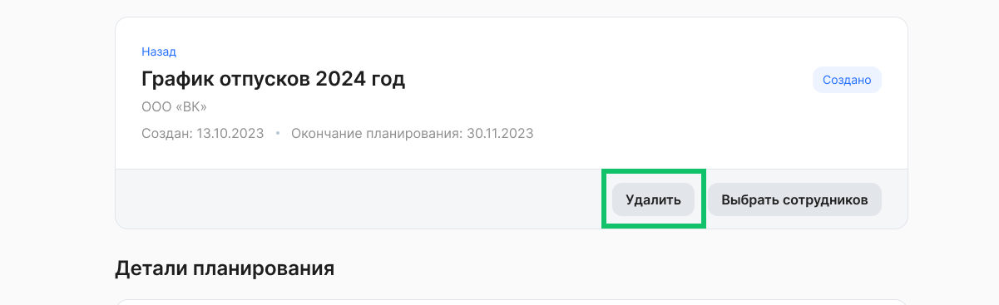
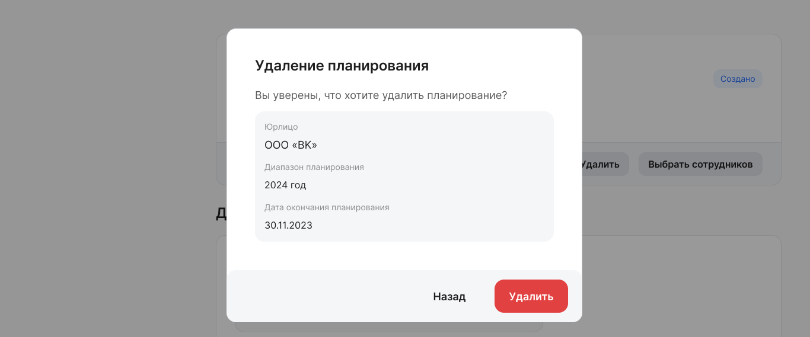

Планирование можно удалить, если в нем не создано ни одной заявки для сотрудника, т.е. планирование находится в статусе «Создано». Для этого нажмите кнопку **Удалить** в блоке планирования и подтвердите удаление.

<warn>
Удалить уже запущенное планирование (в статусе «Активно») можно только через обращение в поддержку support@hrtek.ru
</warn>