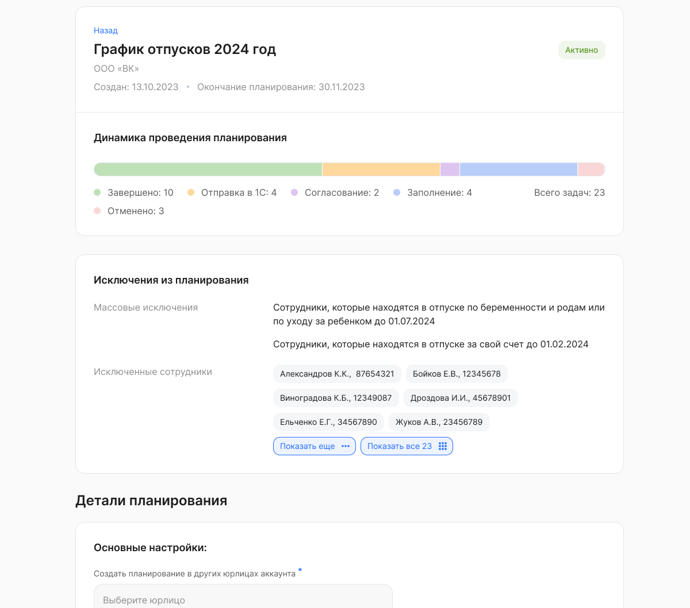

После запуска сбора графиков пользователь с ролью «Менеджер графика отпусков» сможет посмотреть:

- на каких этапах находятся заявки, разосланные участникам планирования;
- список примененных массовых исключений (без ФИО сотрудников);
- список сотрудников, исключенных выборочно (по наведению на ФИО появится подробная информация о сотруднике);
- все [настройки планирования](/ru/hr/company/vacation/create/settings#osnovnye_nastroyki).

Статусы планирования по этапам: 

|Статус|Цвет на шкале прогресса|
| :- | :- |
|Заполнение|голубой|
|Согласование|фиолетовый|
|Отправка отпусков в 1С|желтый|
|Завершено|зеленый|
|Отменено|красный|

