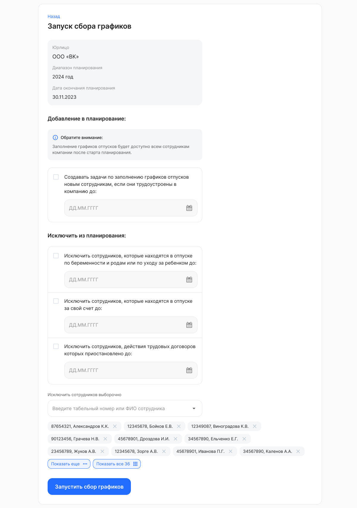

Перед тем как создать задачи по планированию отпусков на сотрудников, можно указать Руководителям:

- заместителей (тип заявки «График отпусков {№ года}» появляется в конце списка);
- настройки согласования: всех/только прямых  (тип заявки «График отпусков {№ года}» появляется в конце списка).

<warn>
После того как задачи будут созданы, добавить заместителей или изменить настройки будет невозможно.
</warn>

До запуска планирования графиков в компании можно уточнить список сотрудников, которые будут в нем участвовать. Для этого нажмите кнопку **Выбрать сотрудников** в блоке планирования.

По умолчанию в планировании участвуют все сотрудники компании, но можно задать правило для добавления новых или исключить отдельные группы сотрудников. 

Исключать сотрудников из общего списка можно:

- Единично
  
  Выбор для списка исключений можно делать по оргструктуре, если она есть в компании. Для этого выберите сотрудников в поле **Исключить сотрудников выборочно**.
- Массово
  - сотрудник находится в отпуске по беременности и родам или по уходу за ребенком до <ДД.ММ.ГГГГ>;
  - договор сотрудника приостановлен до <ДД.ММ.ГГГГ>;
  - сотрудник находится в отпуске без сохранения заработной платы до <ДД.ММ.ГГГГ>.

<warn>

Если включена настройка ролевой модели (**Сервисы компании → Настройки → Настройки компании**) и для группы «Менеджер графика отпусков» удалён доступ к оргструктуре, то в списке сотрудников на исключение из планирования графиков отпусков будут только те, к которым есть доступ у сотрудника или руководителя.

</warn>

Также возможно активировать опцию для создания задачи по заполнению графиков отпусков новым сотрудникам, если они трудоустроены в компанию до даты, наступившей не позднее даты окончания планирования.

Нажмите кнопку **Запустить сбор графиков**. 

Заполнение графиков отпусков будет доступно сотрудникам, не исключенным из общего списка, после старта планирования.

Планирование графиков отпусков перейдет в статус *Активно.* Активным за предстоящий период может быть только одно планирование в компании.

После создания заявок для заполнения графиков, они станут доступны:

1. Сотрудникам:
- только собственные заявки в **Сервисах сотрудника** **→ Графики отпусков**;
- в разделе **Графики отпусков** доступен график отпусков, если есть активное планирование в компании;
- уволенные сотрудники не видят раздел. 
2. Руководителям:
- заявки подчиненных в **Сервисах компании → Графики отпусков**.
3. Кадровым сотрудникам, которые участвуют в бизнес-процессе планирования:
- в **Сервисах компании → Графики отпусков** — заявки всех сотрудников, которые участвуют в планировании.