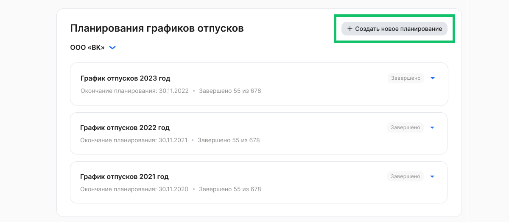
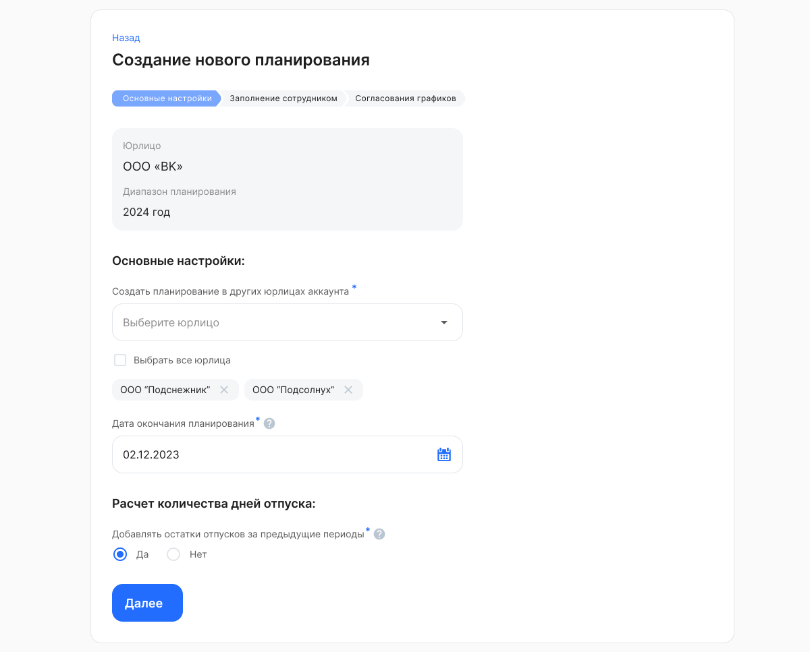
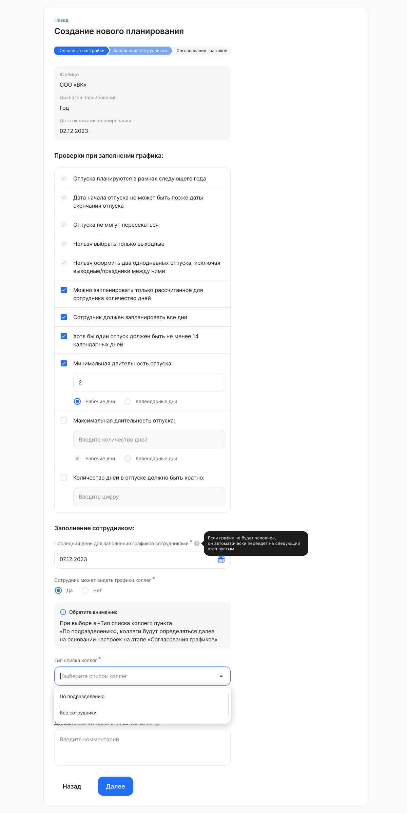
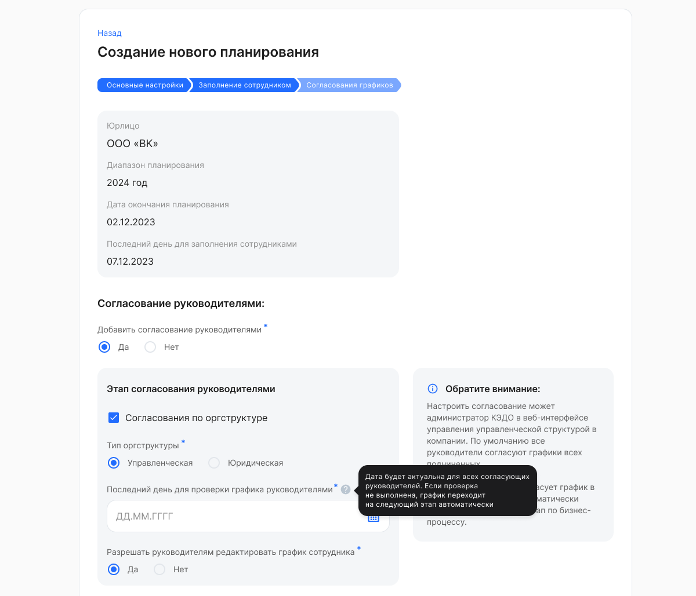
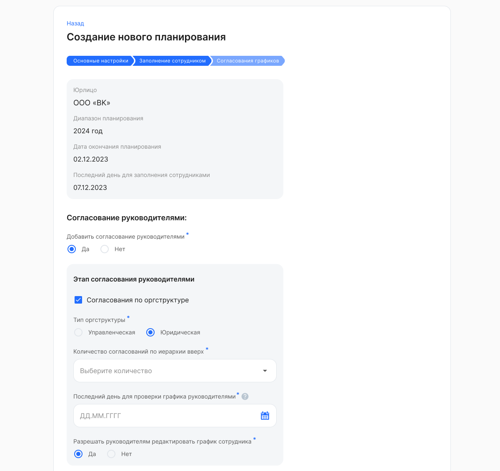
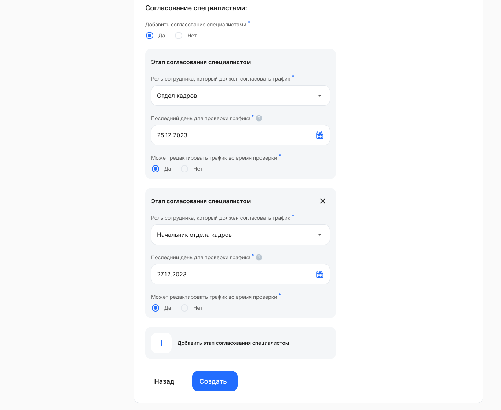
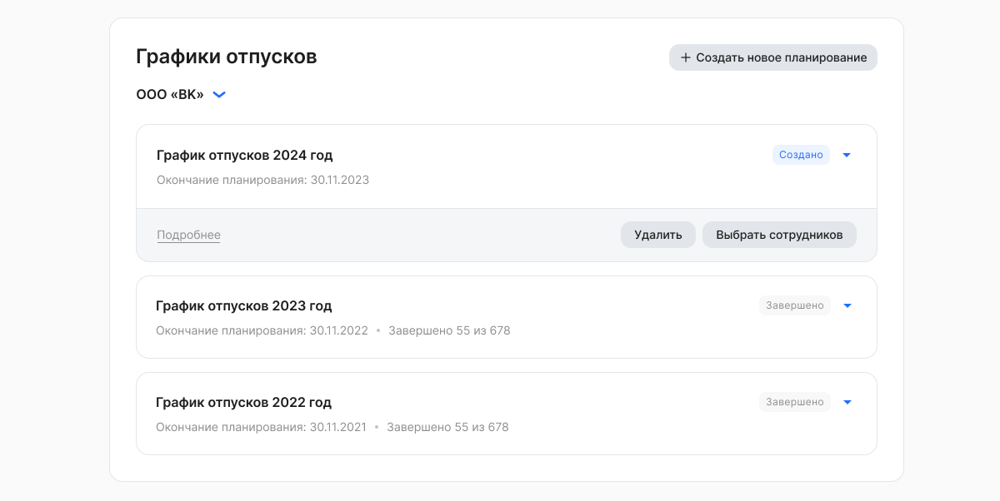

Для создания планирования графиков отпусков в **Сервисах компании → Настройки → Графики отпусков** нажмите кнопку **Создать новое планирование**.

Можно создать только одно планирование на следующий год.

## Основные настройки
В форме **Создание нового планирования** заполните:

1. **Основные настройки** — **Дата окончания планирования**

   Указанная дата  будет использована для расчета дедлайнов этапов планирования.
1. **Расчет количества дней отпуска** — **Добавлять остатки отпусков за предыдущие периоды**

   Выберите вариант *Да*, если хотите просматривать неиспользованные дни отпуска сотрудников за прошедшие годы, иначе выберите *Нет.* Дни отпуска, запланированные до конца года, будут вычитаться из суммы остатков.

Нажмите кнопку **Далее**.

Для компании, в которой несколько юрлиц объединены в один аккаунт, помимо даты окончания планирования и расчета количества дней отпуска можно выбрать несколько или все компании аккаунта в списке **Создать планирование в других юрлицах аккаунта**.

Обратите внимание, что выбрать сотрудников и запустить создание задач для них нужно будет вручную в каждой компании отдельно.

## Заполнение сотрудником
В блоке **Проверки при заполнении графика** кадровый сотрудник может задать правила проверки, которые будут срабатывать при заполнении графика сотрудниками.

Обязательные правила проверки заполнения:

- Отпуска планируются в рамках следующего года.
- Дата начала отпуска не может быть позже даты окончания отпуска.
- Отпуска не могут пересекаться.
- Нельзя выбрать только выходные.
- Нельзя оформить два однодневных отпуска, исключая выходные/праздники между ними.

По умолчанию установлены проверки, которые можно убрать или скорректировать:

- Можно запланировать только рассчитанное для сотрудника количество дней, т.е. нельзя запланировать больше дней отпуска, чем доступно сотруднику.
- Сотрудник должен запланировать все дни, что ему доступны, но может дополнительно указать и больше дней.
- Хотя бы один отпуск должен быть не менее 14 календарных дней.
- Минимальная длительность отпуска. 
  Введите минимальное число рабочих или календарных дней, которое сотрудник сможет указать при планировании графика.

Другие опциональные проверки:

- Максимальная длительность отпуска. 
  Введите максимальное число рабочих или календарных дней, которое сотрудник сможет указать при планировании графика.
- Количество дней в отпуске должно быть кратно. 
  Введите цифру, которой должно быть кратно количество дней в одном отпуске. 

В блоке **Заполнение сотрудником** заполните поля:

- **Последний день для заполнения графиков сотрудниками**. Укажите дату, до которой сотрудник должен заполнить график отпусков. Дата заполнения сотрудником не должна совпадать с датой окончания планирования, так как еще будут этапы согласования. Если график не будет заполнен сотрудником вовремя, задача автоматически перейдет на следующий этап с пустым графиком.
- **Сотрудник может видеть графики коллег**. Выберите вариант *Да*, если разрешаете сотрудникам просматривать графики коллег, иначе выберите *Нет*. Настройка позволит планировать отпуск сотрудникам, ориентируясь на закрепленные календари коллег.
- **Тип списка коллег**. Если в поле **Сотрудник может видеть графики коллег** был выбран вариант *Да*, то из списка выберите пункт *По подразделению* или *Все сотрудники*. При выборе пункта *По подразделению* коллеги будут определяться по настройкам на этапе [Согласования графиков](/ru/hr/company/vacation/create/settings#soglasovanie_grafikov).
- **Сотрудник может оставить комментарий при заполнении графика**. Выберите вариант *Да*, если хотите разрешить комментарии от сотрудников, иначе выберите *Нет.*
- **Добавьте комментарий от лица компании**. Этот комментарий будут видеть участники планирования при работе с графиком.

Нажмите кнопку **Далее**.

## Согласование графиков
Согласовывать графики отпусков в компании могут руководители и/или представители компании. Для этого в поле **Добавить согласование руководителями** и/или **Добавить согласование специалистами** выберите вариант «Да».

Если для компании в VK HR Tek выгружена или создана оргструктура (управленческая или юридическая), то по умолчанию будет выставлен флаг **Согласования по оргструктуре**. Если есть обе, выберите один тип оргструктуры: *Управленческая* или *Юридическая*, по которому будут согласовываться графики отпусков сотрудников. 

Если нужно согласование непосредственным руководителем сотрудника, указанным ему в 1С, то снимите флажок **Согласования по оргструктуре** и укажите, на сколько уровней вверх (от 1 до 3) должно пойти согласование.

<warn>

Если руководитель подразделения, который согласовывал планирование своих сотрудников, уволился или перевёлся в другое подразделение, то Администратор может включить настройку смены руководителя в **Сервисах компании → Настройки → Настройки компании**, и тогда в действующем планировании предыдущий руководитель сменится на нового.

Для сотрудника, который перевёлся в другое подразделение, график отпусков будет согласовывать предыдущий руководитель подразделения, который был назначен согласующим на момент старта действующего планирования.

</warn>

### *Согласование руководителями по управленческой оргструктуре* 

При выборе управленческого типа оргструктуры укажите дату в поле **Последний день для проверки графика руководителями**. Дата будет актуальна для всех согласующих руководителей. Если проверка не будет выполнена в указанный срок, график автоматически перейдет на следующий этап.

Количество уровней согласований по управленческой структуре может настроить Администратор КЭДО в **Сервисах компании →  Компания** (аналогично другим типам заявок). По умолчанию все руководители согласуют графики всех подчиненных. 
Обратите внимание, что эта настройка будет применена к задачам на сотрудников, только если сделать ее после создания планирования и ДО создания задач на сотрудников.

### *Согласование руководителями по юридической оргструктуре* 

При выборе юридического типа оргструктуры необходимо:

- выбрать **Количество согласований по иерархии вверх**;
- указать дату в поле **Последний день для проверки графика руководителями.** Дата будет актуальна для всех согласующих руководителей. Если проверка не выполнена, график автоматически перейдет на следующий этап.

Руководителям  можно разрешить [редактировать](/ru/hr/company/vacation/edit) графики отпусков. Для этого в поле **Разрешать руководителям редактировать график сотрудника** выберите вариант «Да».

### *Согласование специалистами*

При добавлении этапа согласования необходимо:

- выбрать **Роль сотрудника, который должен согласовать график**;
- указать дату в поле **Последний день для проверки графика.** Если проверка не выполнена, график автоматически перейдет на следующий этап.

Чтобы разрешить специалисту [редактировать](/ru/hr/company/vacation/edit) графики отпусков, в поле **Может редактировать график во время проверки** выберите вариант «Да».

Также можно добавить дополнительные этапы согласования специалистом по нажатию кнопки , если этого требует бизнес-процесс.

После заполнения всех обязательных полей нажмите кнопку **Создать**.

Новое планирование графиков отпусков перейдет в статус *Создано.* 

Для просмотра деталей созданного планирования нажмите кнопку **Подробнее**.

