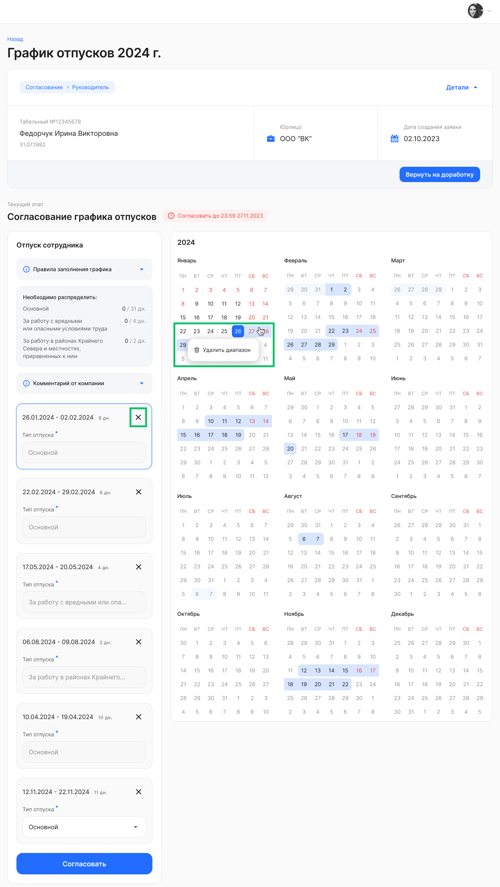

Редактирование графиков отпусков доступно руководителям и/или специалистам, если в настройках планирования на шаге *Согласование графиков* было разрешено редактировать график отпусков на [этапе согласования](/ru/hr/company/vacation/create/settings#soglasovanie_grafikov).

Откройте нужный график сотрудника на этапе «Согласование» в **Сервисах компании →** **Графики отпусков**.

Руководители и представители компании могут удалять и выбирать новые диапазоны дат отпусков в календаре, а также оставлять текстовые комментарии. Можно распределить только рассчитанное для сотрудника количество дней. 

В один момент времени редактирование доступно только текущему исполнителю. На этапе редактирования графиков есть локальное автосохранение на компьютере пользователя, без дополнительного информирования об этом.

После изменения дат в календаре согласно правилам заполнения графика (слева от календаря), нажмите кнопку **Согласовать**. График перейдет на следующий этап.

<warn>
Если график вернуть на доработку сотруднику, то все вносимые изменения в календаре от руководителя/специалиста не сохранятся, а сотрудник получит комментарий от согласующего и должен будет распределить периоды отпуска заново. 
</warn>

