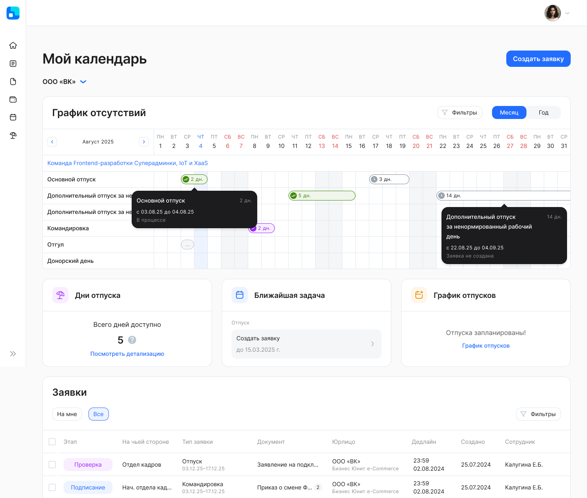
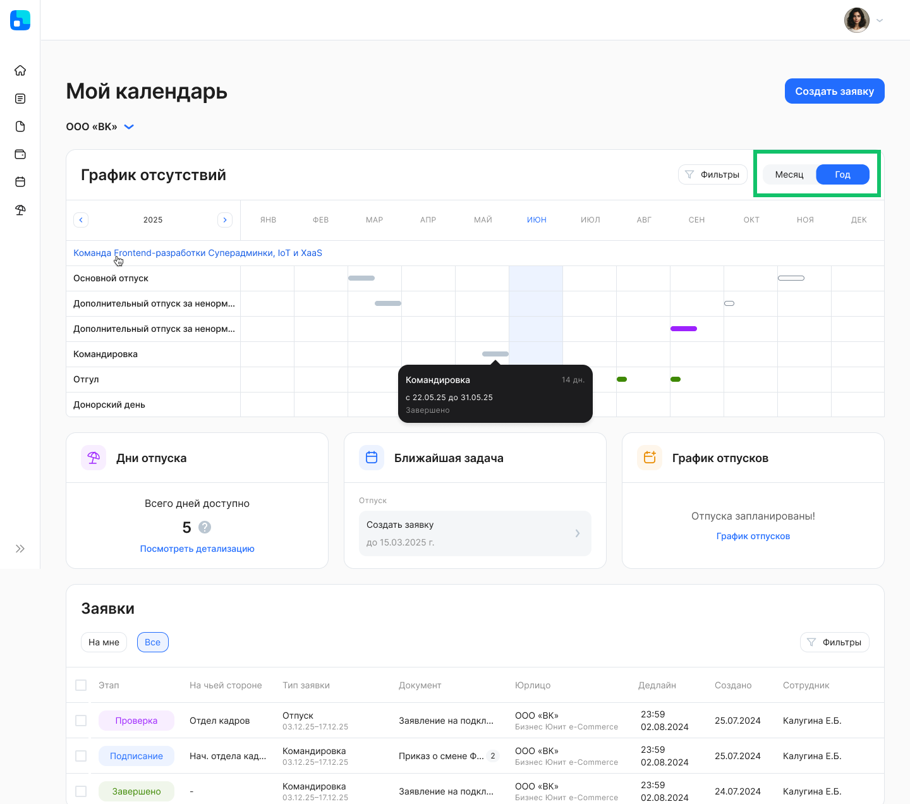
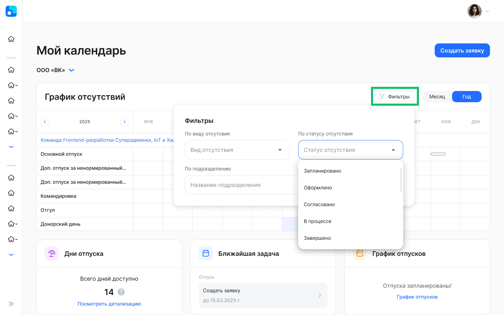
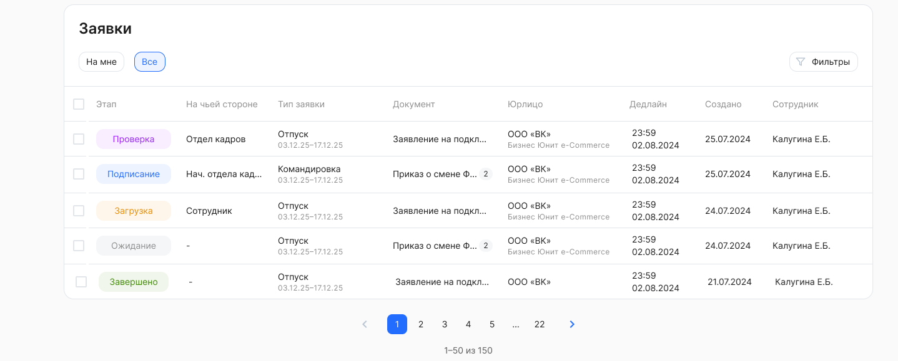
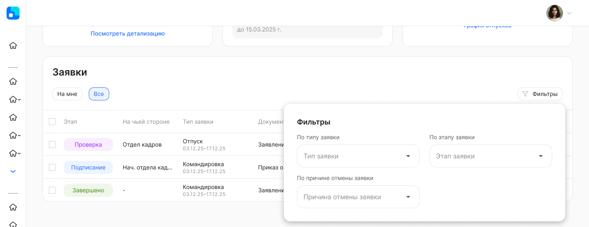
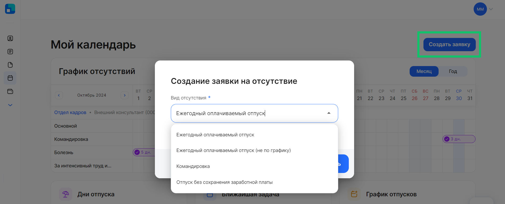
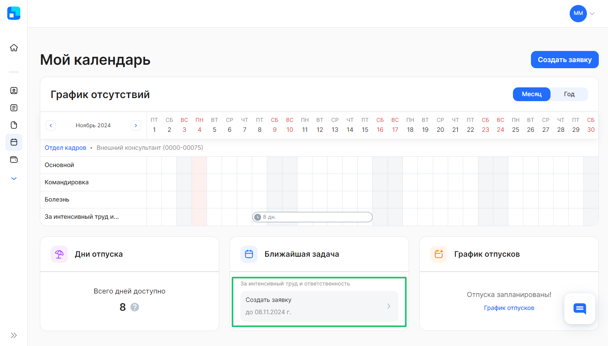
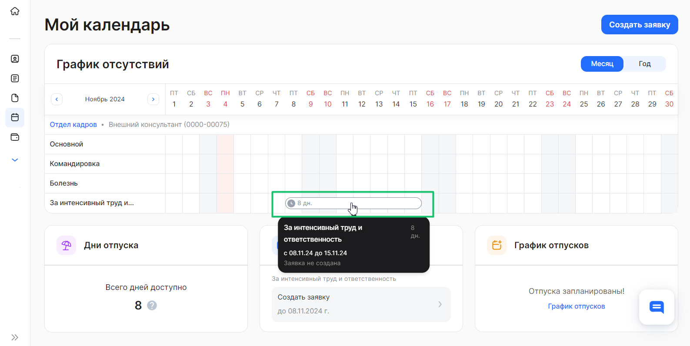
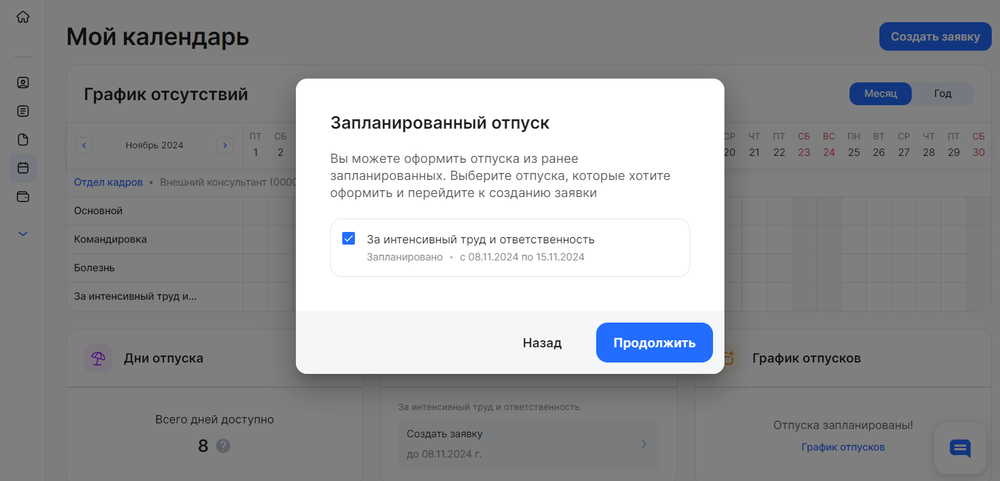
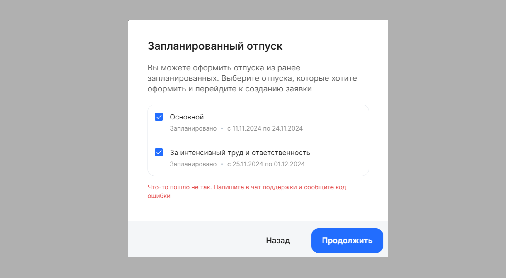

В разделе **Мой календарь** сотрудники могут просматривать календарь с периодами своих отсутствий: отпуск, командировка, больничный и др. Также они могут посмотреть или создать заявку, связанную с отсутствиями.

Если пользователь является сотрудником в нескольких компаниях, нужно будет выбрать название юрлица, в котором он хочет посмотреть календарь и заявки по отсутствиям.

## График отсутствий
В **Графике отсутствий** содержится информация о фактических и запланированных днях отсутствия с разбивкой по видам.

Отсутствия в сервисе VK HR Tek создаются только на основании данных, которые передаются из 1С:ЗУП по согласованным или прошедшим отсутствиям. Передача происходит автоматически по каждому сотруднику после проведения отсутствия. Соответственно, отсутствия могут быть разных видов: отпуска/командировки/болезни и все другие, которые заведены и используются в 1С:ЗУП клиента.

Информация об отсутствии отправляется в момент создания/изменения/отмены отсутствия *(сейчас реализовано только в интеграции с 1С:ЗУП, но планируется добавить метод и в public-api).*

Информация по отсутствиям отображается с группировкой по подразделениям по управленческой или юридической (в случае отсутствия управленческой) структуре.

Чтобы узнать информацию о руководителе подразделения сотрудника, нажмите на название подразделения в **Графике отсутствий**.

Цветовая схема обозначений отсутствий:

 белый — запланированный отпуск по графику;

 фиолетовый — запланированный отпуск по графику, для оформления которого создана заявка или другой вид отсутствия, созданный и проведенный в системе управления персоналом (без заявки КЭДО);

 зеленый — отсутствие, созданное по заявке из КЭДО и проведенное в системе управления персоналом (текущее или запланированное);

 серый — проведенное отсутствие в прошлом;

 заштриховано — пересечение отсутствий. 

В календаре также подсвечиваются даты праздников (федеральные и региональные, если компания использует и передает региональные календари).

Статус, тип, даты отсутствия указываются в подсказке при наведении на закрашенную ячейку в календаре.

Есть возможность выбрать период отображения данных: месяц или год. При просмотре календаря в формате месяца можно увидеть детализацию по дням и типам отсутствия, а в формате года — по месяцам и типам отсутствия. 

В календаре есть возможность фильтровать отсутствия:

- **По виду отсутствия** — выбор одного значения из предложенных вариантов: основной/дополнительный отпуск, командировка и т.д.
- **По статусу отсутствия** — выбор одного значения из предложенных вариантов: *запланировано, оформлено, согласовано, в процессе, завершено*.
- **По подразделению** — выбор одного значения из предложенного списка с возможностью текстового поиска.

### **Дни отпуска**
В виджете **Дни отпуска** отображена сводная информация о доступном количестве дней отпуска для сотрудника в указанном подразделении. 
Для просмотра доступных дней отпуска перейдите в **Детализацию отпускных дней**.

### **Ближайшая задача**
В виджете **Ближайшая задача** указаны сведения о заявке на ближайшую запланированную дату отсутствия. Дата "до" определяется на основании ближайшей даты начала запланированного отсутствия.

### **График отпусков**
Если у сотрудника есть активное планирование, то в виджете **График отпусков** будет указано название планирования с ссылкой для переход на страницу «Планирование графиков отпусков» и срок заполнения планирования.

Если есть завершенное планирование, то в виджете указано название планирования и текст «Отпуска запланированы!» с ссылкой для просмотра заполненных графиков.  

Если у сотрудника отсутствует планирование, то виджет не отображается.

## **Заявки, связанные с рабочим временем**
В листинге показаны заявки бизнес-процессов с тегом *Отсутствия*.

К заявкам применимы фильтры:

- **По типу заявки** — выбор одного значения из предложенных вариантов бизнес-процессов, которые есть в компании.
- **По этапу заявки** — выбор любого количества значений из предложенных вариантов: Загрузка, Подписание, Проверка, Успешно закрыты, Отменены, В бумаге.
- **По причине отмены заявки** — выбор любого количества значений из предложенных вариантов: По дедлайну, Отменено сотрудником, Отменено представителем компании, Изменен порядок оформления, Сотрудник уволен. 

### **Создание заявки**
Сотрудник может создать новую заявку, связанную с рабочим временем, указав тип отсутствия, период и компенсации. Для этого нажмите кнопку **Создать заявку**.

 

Если у сотрудника есть запланированные отпуска в календаре, то в виджете **Ближайшая задача** будет указано предложение для оформления ближайшего запланированного отпуска с ссылкой для создания заявки.

 

Также сотрудник может оформить заявку по запланированному отпуску прямо из **Графика отсутствий**. Для этого необходимо выбрать запланированный отпуск (статус *Запланировано*) и нажать на него, после чего сотрудник перейдет на страницу оформления выбранного отпуска по графику.

В процессе оформления запланированного отпуска есть возможность объединить несколько видов отпусков, если они запланированы последовательно. Например:

Основной отпуск: с 1.10.24 по 14.10.24

Дополнительный отпуск: с 15.10.24 по 21.10.24

Если при оформления отпуска из **Графика отсутствий** у вас возникла ошибка, это может быть связано с тем, что функционал еще не был настроен.

