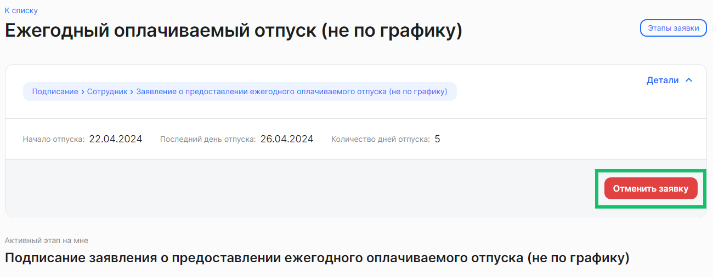

Чтобы отменить заявку, откройте необходимую заявку на этапе *Загрузка* и проверьте в ней корректность данных. Если указаны неверные данные, нажмите на кнопку **Отменить заявку**.

Заявка перейдет на этап *Отменено*.

Кнопка отмены заявки доступна в определенных бизнес-процессах, где такая отмена со стороны сотрудника возможна, и настраивается по запросу компании.
