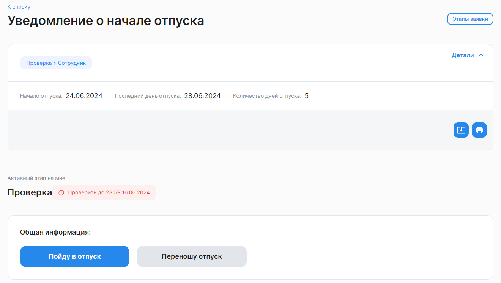

Чтобы быстрее найти заявки на этапе подписания в списке, примените фильтр **По этапу заявки** *= Проверка.* 

Откройте необходимую заявку, например, «Уведомление о начале отпуска». Если сведения указаны корректно, нажмите на кнопку **Пойду в отпуск**.

Заявка перейдет на следующий этап.

