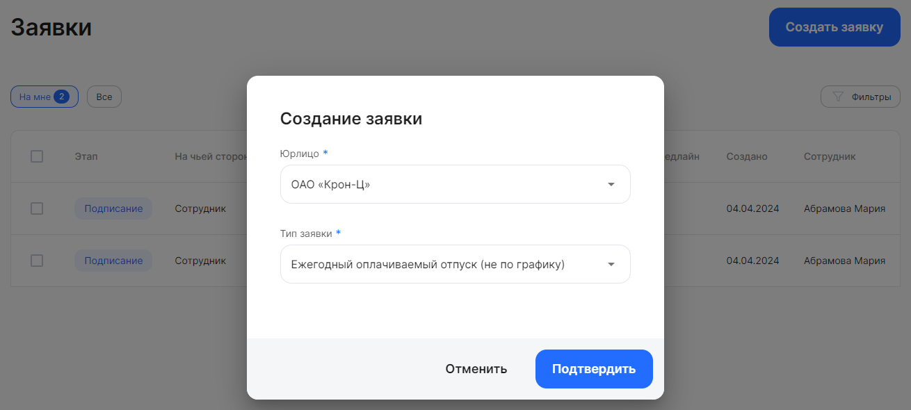
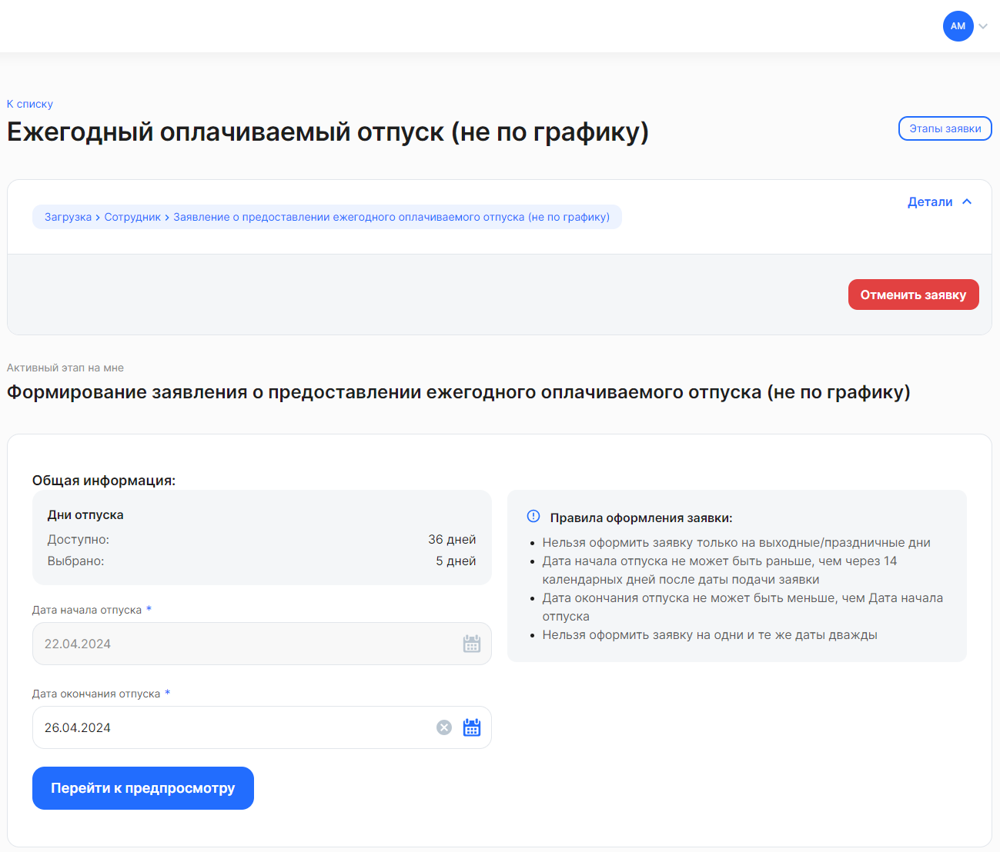
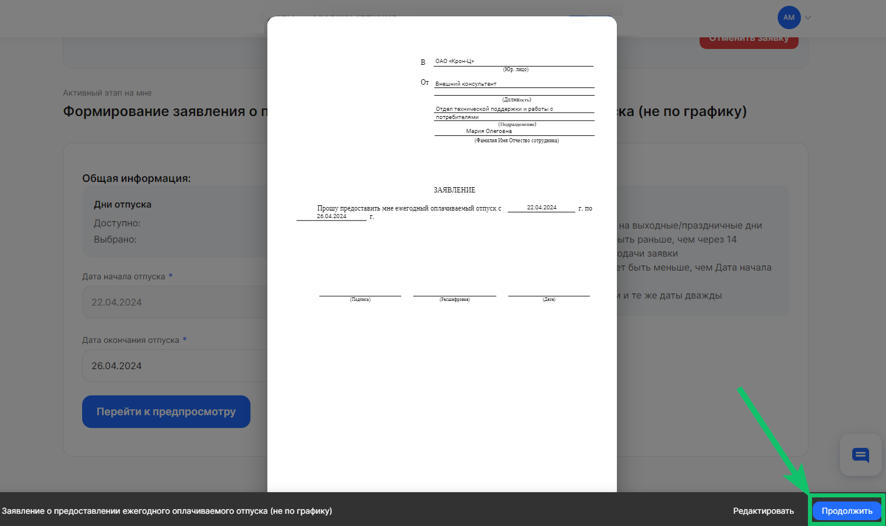

Чтобы создать новую заявку:

1. Перейдите в *Сервисы сотрудника → Заявки* и нажмите на кнопку **Создать заявку**.
1. В форме **Создание заявки** заполните следующие поля:
- **Юрлицо**. Выберите название своей компании из списка. Поле доступно для сотрудника, который устроен как внешний совместитель.
- **Должность**. Выберите название должности (или табельный номер). Поле доступно, если сотрудник устроен как внутренний совместитель.
- **Тип заявки**. Из выпадающего списка выберите название бизнес-процесса, по которому будут загружаться/подписываться/согласовываться документы в создаваемой заявке. 
3. Нажмите кнопку **Подтвердить**.

 

После создания заявка сразу же перейдет на этап *Загрузка*. 

 

На этом этапе заполните поля, требующиеся для данного процесса, и нажмите кнопку **Перейти к предпросмотру**. Если документ сформирован корректно, то нажмите **Продолжить** внизу экрана. Если в документе есть ошибки, нажмите на кнопку **Редактировать** и исправьте данные в заявке.

Заявка перейдет на следующий этап.

