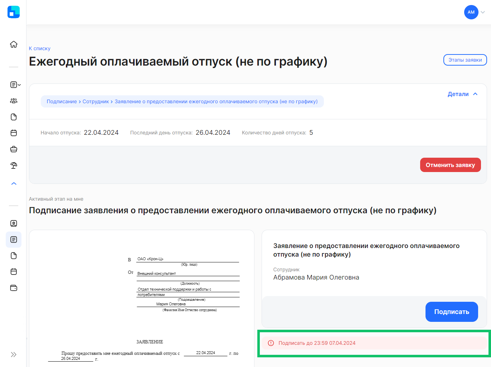

Каждый этап заявки может иметь срок окончания — дедлайн. 

У определённых типов заявок могут быть проставлены ограничения по времени, до которого документ (информация по заявке) должен быть загружен, подписан или проверен. По истечении этого срока заявка автоматически отменится и её можно будет подписать только в бумажном виде (заявка перейдёт в статус **В бумагу**).

<warn>

Важно отслеживать дедлайны, чтобы заявка не отменилась

</warn>

