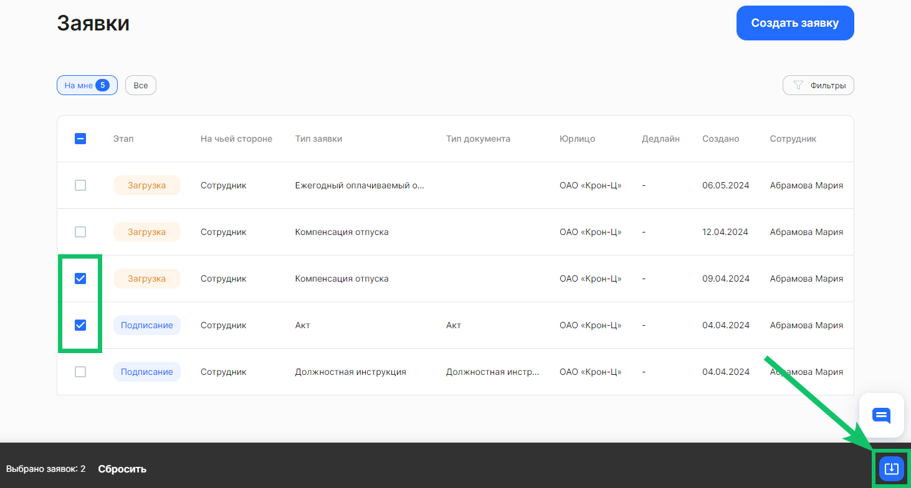
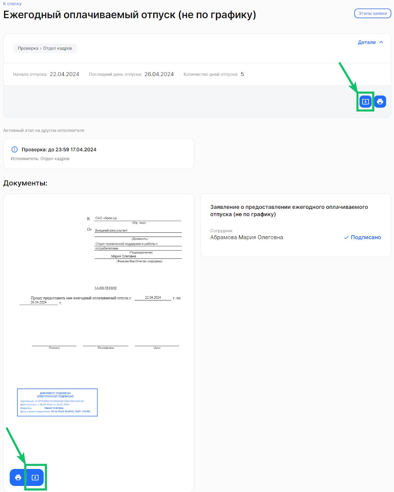

В списке заявок можно выбрать любое количество заявок из отображаемых на текущей странице и скачать их. Для этого проставьте галочки в чекбоксах в строках с нужными заявками и нажмите на значок скачивания в правом нижнем углу. Архив с документами будет выгружен на ваш компьютер.

 

Чтобы выгрузить все документы из заявки, откройте нужную заявку и нажмите на кнопку скачивания в верхнем блоке заявки.

Для выгрузки определенного документа из заявки нажмите на кнопку скачивания в превью документа.

