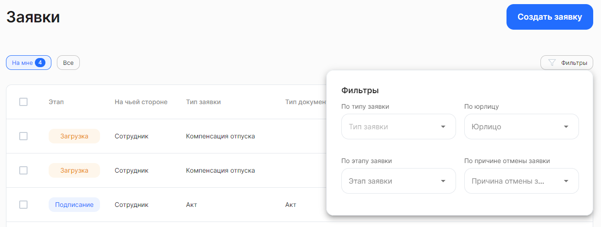

Для вашего удобства предусмотрена более тонкая настройка отображения списка заявок. Нажмите на кнопку **Фильтры**. Откроются поля для редактирования фильтра с выбором значений из выпадающего списка.

Рассмотрим фильтры подробнее:

**По типу заявки** — выбор одного бизнес-процесса из предложенных вариантов, которые есть в компании.

**По этапу заявки** — выбор любого количества значений из предложенных вариантов: *Загрузка, Подписание, Проверка, Успешно закрыты, Отменены, В бумагу, В бумаге, Отказ от подписания*.

**По юрлицу** — как правило, здесь уже указано название вашей компании и поле недоступно для редактирования. В случае если к вашему аккаунту привязано несколько юридических лиц, то в этом фильтре можно выбрать все юрлица или одно из них.

**По причине отмены заявки** — выбор любого количества значений из предложенных вариантов: *По дедлайну, Отменено сотрудником, Отменено представителем компании, Изменен порядок оформления, Сотрудник уволен*. 

В момент применения фильтров происходит поиск заявок и список заявок автоматически обновляется.

Чтобы сбросить сразу все параметры фильтра, нажмите кнопку **Сбросить** в правом верхнем углу формы.

Для выхода из формы установки фильтра нажмите на любое место на странице за пределами этой формы. Список заявок на странице будет отображаться с учётом настроенного фильтра.

<warn>

Фильтр может применяться только к текущему списку, выбранному для просмотра. Если поиск по фильтру не дал ожидаемых результатов, убедитесь в правильности выбора списка — **Все** или **На мне**.

</warn>