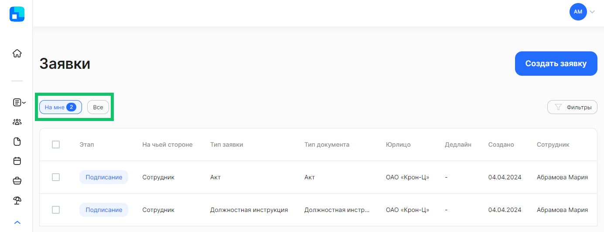

Все заявки, к просмотру/редактированию которых у вас есть доступ, отображаются списком в **Личном кабинете**, в разделе **Заявки**. По умолчанию список отфильтрован по заявкам, активный этап которых на вас (кнопка **На мне**).

Вы можете открыть полный список доступных заявок, нажав на кнопку **Все**.

Заявка содержит следующие сведения:

- **Этап**. Этапы, которые может проходить заявка: *Загрузка, Подписание, Проверка, Завершено, Отменено, В бумагу, В бумаге*. Чтобы просмотреть, сколько дней заявка находится на текущем этапе, наведите указатель мыши на метку этапа.
- **На чьей стороне**. Этап заявки может быть в работе либо на *Сотруднике,* либо на представителе компании с такими ролями, как *Отдел кадров, Руководитель отдела кадров, Бухгалтерия* и др.
- **Тип заявки**. Название бизнес-процесса, в рамках которого обрабатывается заявка на стороне сотрудника и компании. Для некоторых заявок указаны периоды. Это те заявки, у которых есть даты начала и окончания события, например, Уведомление о начале отпуска.
- **Тип документа**. Название типа документа, который предусмотрен в текущем типе заявки.
- **Юрлицо**. Наименование компании, для которой была создана заявка.
- **Дедлайн**. Присутствует в некоторых заявках, в которых предусмотрен дедлайн. Время и дата окончания текущего этапа заявки. 
- **Создано**. Дата создания заявки.
- **Сотрудник**. Фамилия и имя сотрудника, для которого была создана заявка. При наведении указателя мыши на имя можно посмотреть карточку с ФИО, датой рождения и табельным номером сотрудника.
