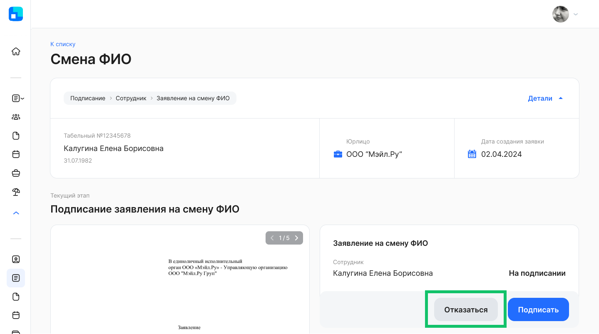
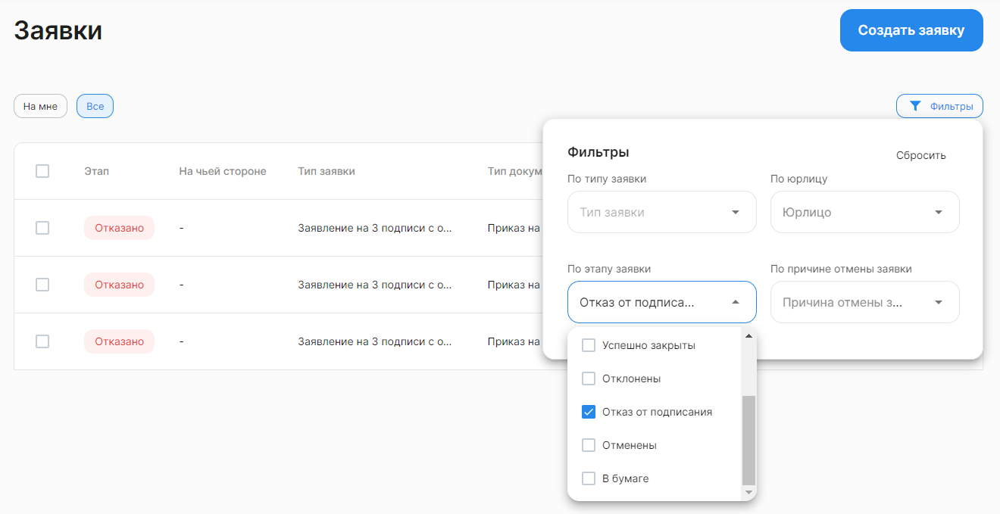

Сотрудник может отказаться от подписания документа в заявке, если он ознакомился с документом, но по какой-то причине не согласен с подписанием. Для этого нажмите  кнопку **Отказаться** и укажите причину отказа в комментарии. 

 

Чтобы найти заявки с этапом *Отказано*, перейдите на вкладку **Все** и примените фильтр **По этапу заявки** = *Отказ от подписания*.

