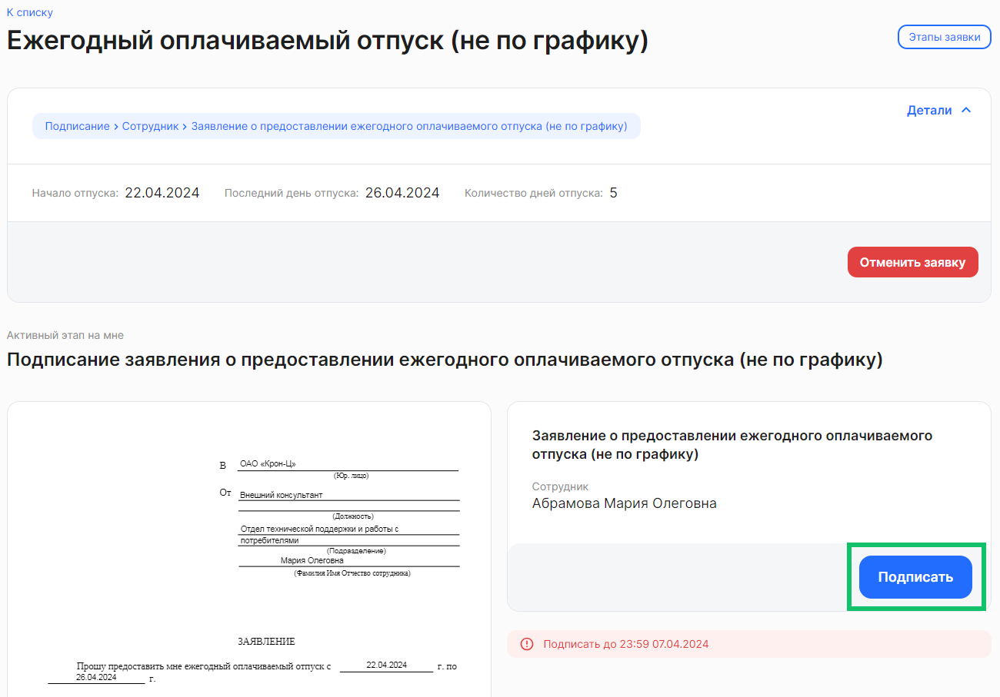
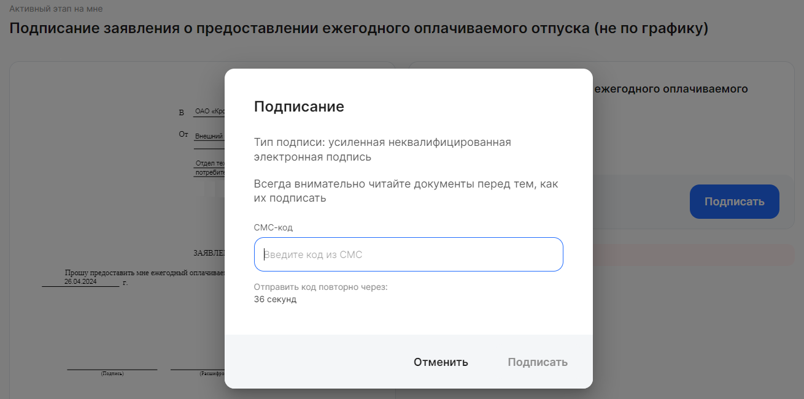

Чтобы быстрее найти заявки на этапе подписания в списке, примените фильтр **По этапу заявки** *= Подписание.* 

Откройте необходимую заявку. Если данные в заявке указаны верно, подпишите документ. Для этого нажмите на кнопку **Подписать**.

 

Сотрудник подписывает документы в заявках с помощью усиленной неквалифицированной электронной подписи (УНЭП), если работодателем не был установлен другой вариант подписания заявок (например, ПЭП).

Чтобы подписать документ через УНЭП, введите цифровой код из СМС от kontur и нажмите на кнопку **Подписать**.

 

 

После подписания заявка перейдет на следующий этап бизнес-процесса.