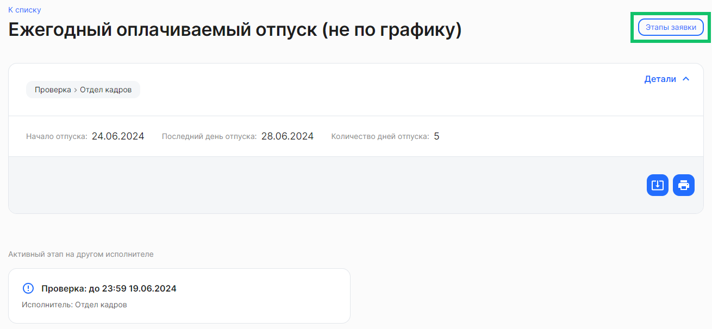
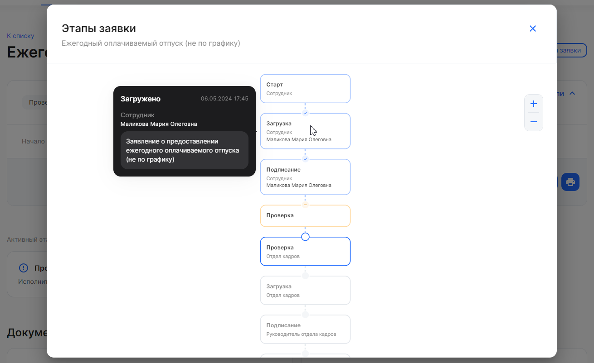
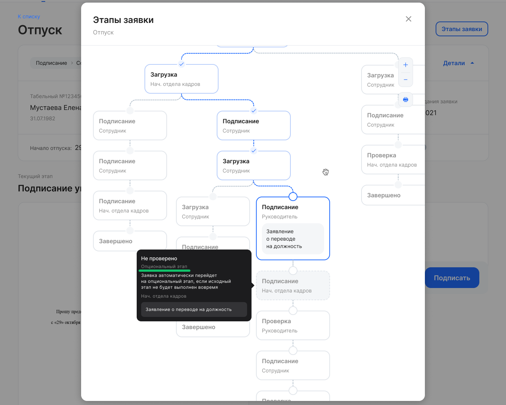
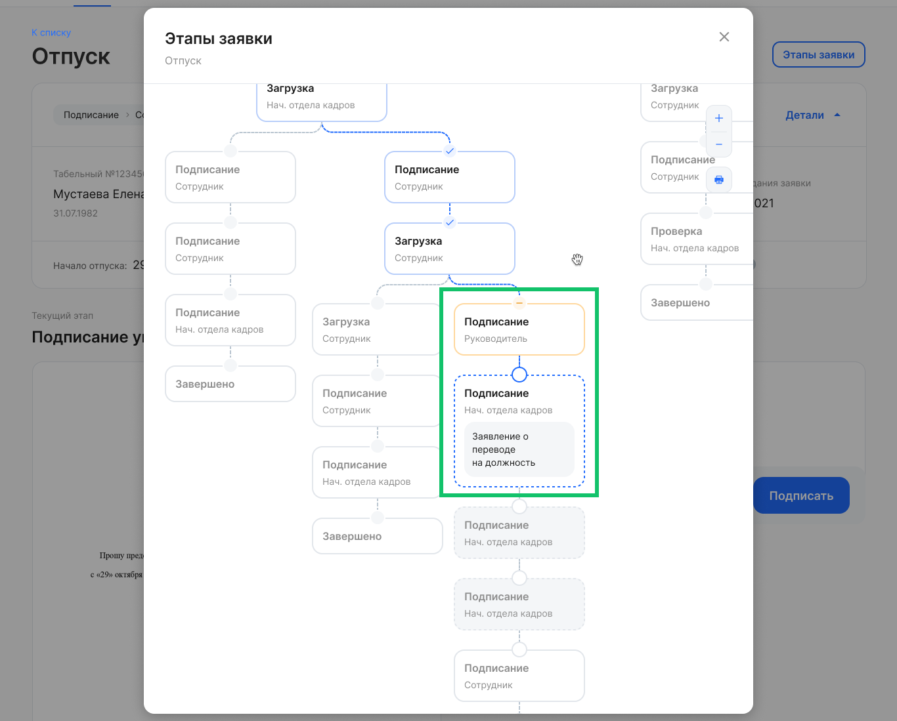
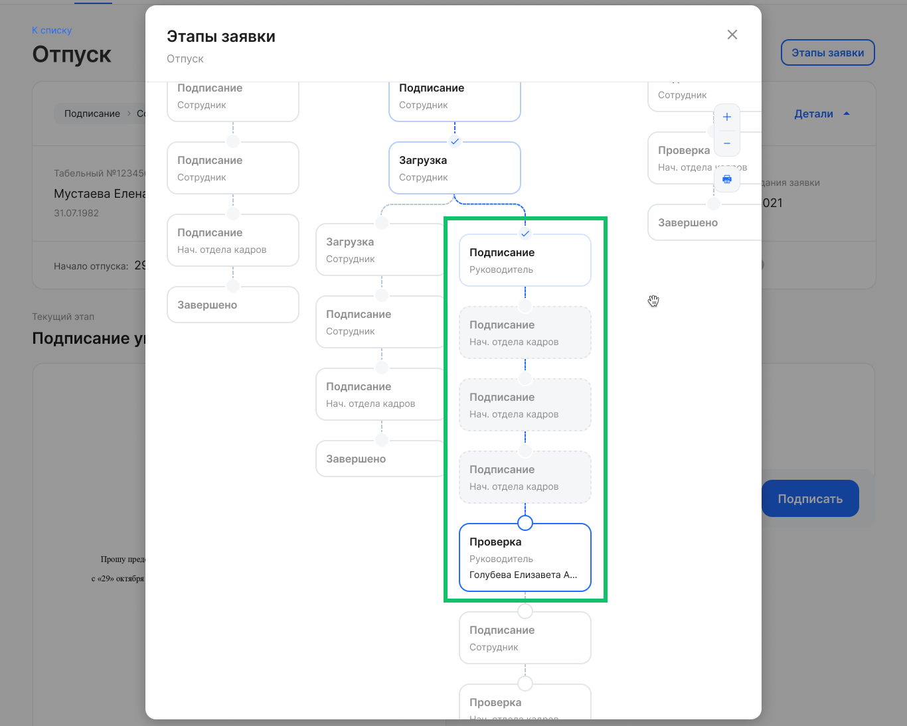
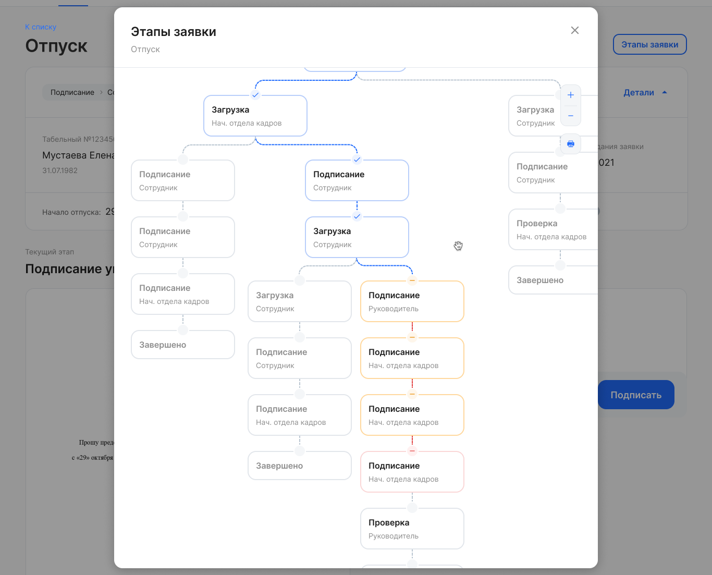

Чтобы посмотреть этапы заявки, откройте необходимую заявку и нажмите кнопку **Этапы заявки**.

 

Откроется схема с последовательностью этапов в заявке. Схема может быть изначально почти не видна в том случае, если процесс имеет большое количество развилок. Тогда можно максимально приблизить схему — много раз нажать на кнопку .

Чтобы изменить масштаб схемы, нажмите на кнопку  или  справа от схемы.

При наведении указателя мыши на любой этап заявки появляются подсказки о деталях этапа: статусе этапа; дате и времени получения статуса; роли и ФИО сотрудника, обрабатывающего заявку на текущем этапе; типе заявки / типе документа. 

Блок этапа состоит из элементов:

1. Название этапа. Доступны этапы с названиями: **Загрузка**, **Подписание**, **Проверка**.
1. Исполнитель на этапе. Доступны этапы с исполнителями: **Сотрудник**, представитель или роль компании — например, **Отдел кадров, Руководитель отдела кадров, Руководитель**.
1. Название типа документа / типа заявки. 

## Опциональный этап в заявке

Для случаев, когда руководитель не успел подписать (или согласовать) заявку до наступления дедлайна этапа, в бизнес-процессе используется опциональный этап, который перейдет на второго руководителя. Опциональный этап будет активирован, только когда исходный этап подписания не будет исполнен первым руководителем. 

 

Исполнителем опционального этапа может быть как любой руководитель в иерархии, так и следующий руководитель после того, кто является исполнителем исходного этапа.

В случае если руководитель (или его заместитель) не успел подписать (согласовать) этап и этап завершился по дедлайну, то заявка переходит на этап со следующим руководителем. 

 

Если же первый руководитель подписал заявку вовремя, то заявка идет по флоу без участия второго руководителя.

 

Если в заявке не будут пройдены все опциональные этапы, то заявка отменится.

