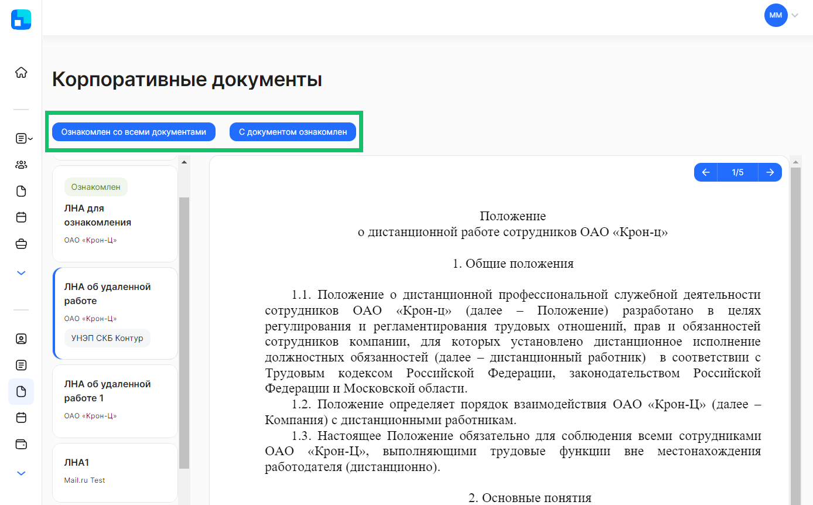
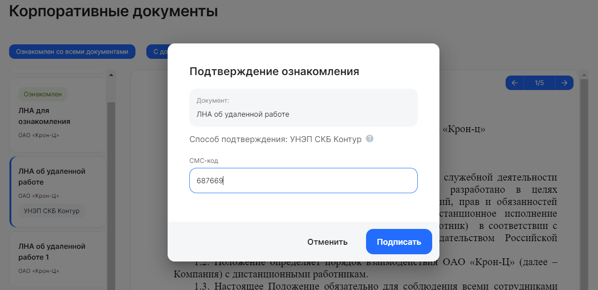

Корпоративные документы — раздел КЭДО для внутренних документов компании, с которыми должны быть ознакомлены сотрудники (**Сервисы сотрудника → Корп. документы**).

 

Актуальная версия документа может быть доступна для просмотра и ознакомления всем сотрудникам компании, сотрудникам определенного подразделения или сотрудникам, занимаемым конкретные должности. После ознакомления с документом в КЭДО сохраняются данные сотрудника, дата и время ознакомления.

Чтобы подписать все ЛНА и другие внутренние документы компании, нажмите кнопку **Ознакомлен со всеми документами**. 

Для подписания отдельного документа выберите необходимый документ из списка, изучите содержимое его страниц и нажмите кнопку **С документом ознакомлен**.

Документы, с которыми вы ознакомились, перейдут в статус *Ознакомлен*.

Подписывать документы можно простой электронной подписью (ПЭП) или усиленной неквалифицированной электронной подписью (УНЭП). Это зависит от того, какой тип подтверждения был выбран компанией на этапе создания документа.

Чтобы подписать документ УНЭПом, из списка выберите документ с меткой «УНЭП СКБ Контур» и нажмите кнопку **С документом ознакомлен**.

Для подтверждения ознакомления с документом введите цифровой код из СМС от kontur и нажмите на кнопку **Подписать**.

 

 

После подписания документ перейдет в статус **Проверка подписи**, а через некоторое время в статус **Ознакомлен**. Обычно проверка подписи занимает несколько секунд.

<info>
После истечения срока ознакомления с версией ЛНА (когда версия становится прошлой), документ перестает быть доступным в Личном кабинете сотрудника.
</info>