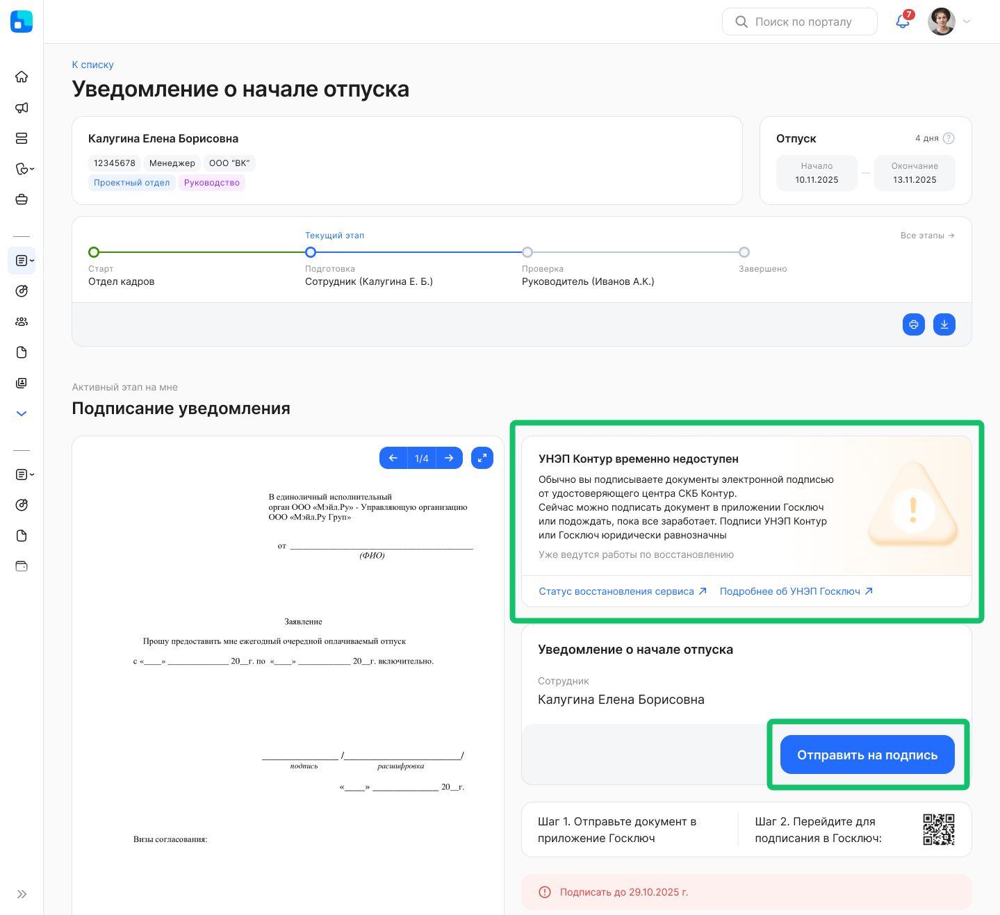
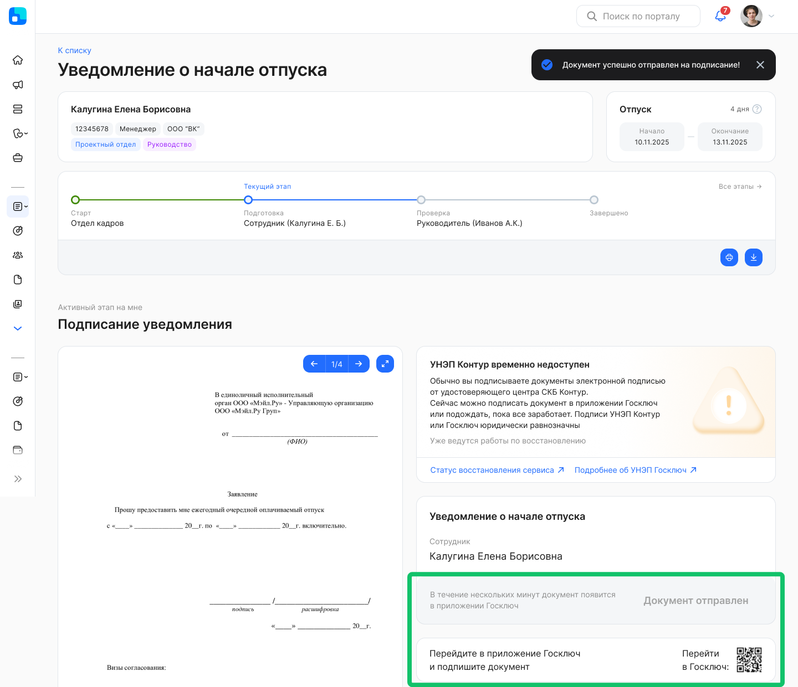
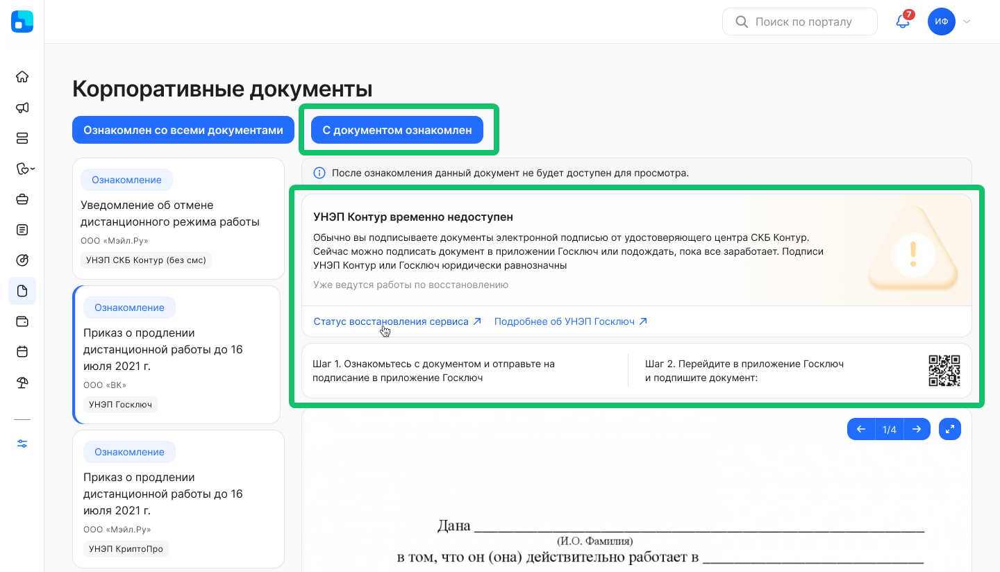
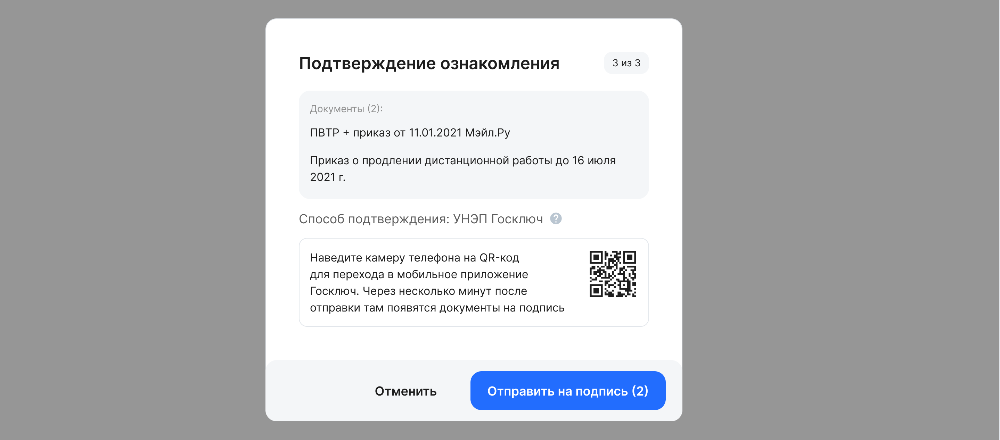
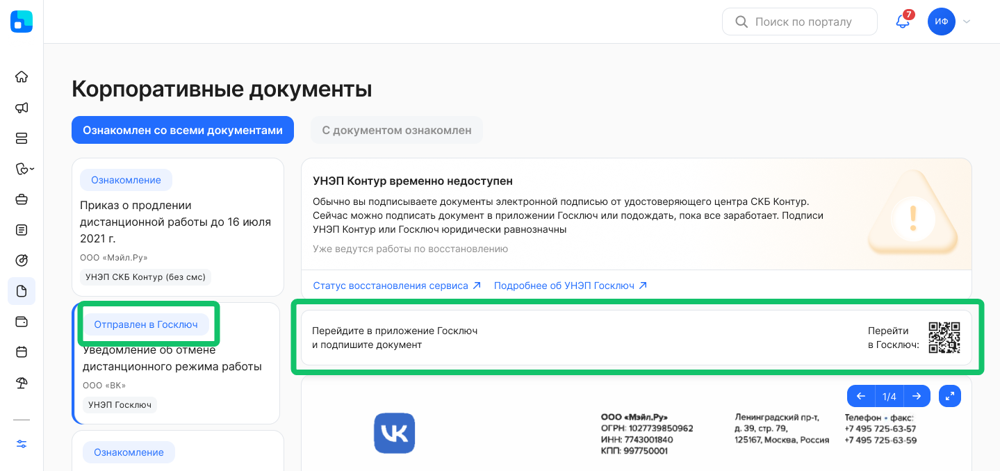
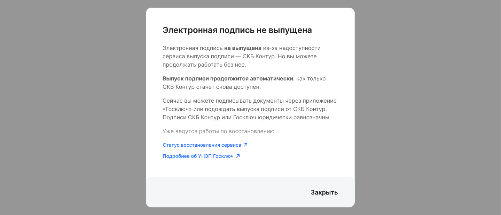

VK HR Tek позволяет сотрудникам подписывать кадровые документы усиленной неквалифицированной электронной подписью (УНЭП). Наш основной сервис для выпуска такой электронной подписи — удостоверяющий центр «СКБ Контур».  

Если «Контур» временно недоступен — например, из-за технического сбоя или регламентных работ — подписание документов не останавливается. На время недоступности система переключает сотрудников на подписание через приложение «Госключ». Подпись «Госключа» — это тоже УНЭП, и она юридически равнозначна подписи, выпущенной «Контуром». 

<info>

Как получить сертификат через «Госключ» — [https://www.gosuslugi.ru/help/faq/state_key/284254](https://www.gosuslugi.ru/help/faq/state_key/284254)  

</info>

Переключение работает автоматически и не требует действий от сотрудников или отдела кадров. Пока «Контур» работает в штатном режиме, подписание идёт как обычно — ничего не меняется.  

<warn>

Переключение на «Госключ» уже доступно всем клиентам. Мы будем вводить его в эксплуатацию поэтапно: в этом релизе автоматически включим для части клиентов, для остальных — в следующих обновлениях. 

</warn>

## **Когда действует переключение**

Переключение автоматически включается на стороне VK HR Tek на время, пока удостоверяющий центр «Контур» недоступен. Возможны два режима, которые действуют независимо и могут включаться по отдельности или одновременно:

| Режим | Для кого действует | Что происходит |
| ----- | ----- | ----- |
| Недоступно подписание | Сотрудники с уже выпущенным  сертификатом УНЭП «Контура» | На время сбоя сотрудники подписывают документы через «Госключ» |
| Недоступен выпуск | Сотрудники, у которых сертификат  УНЭП «Контура» ещё не выпущен | Сотрудники не теряют доступ к сервису и подписывают документы через «Госключ», а выпуск сертификата «Контура» откладывается до восстановления сервиса |
|  | Сотрудники с уже выпущенным  сертификатом УНЭП «Контура» | Сотрудники подписывают документы УНЭП «Контура» как обычно. |

## **Как проходит подписание**

Когда «Контур» недоступен и действует переключение, на странице подписания заявки и при ознакомлении с локальными нормативными актами (ЛНА) сотрудник видит уведомление о том, что «Контур» временно недоступен, и предложение подписать документ через «Госключ».  

Подписание заявки
 
 
Сотрудник нажимает кнопку **Отправить на подпись**. Отправка документа в приложение «Госключ» может занять некоторое время.  

После появления отметки о том, что документ отправлен, сотрудник переходит в приложение «Госключ» для подписания документа.  

Ознакомление с корпоративным документом
 

Сотрудник нажимает кнопку **Ознакомлен со всеми документами** или выбирает в списке один доступный для ознакомления документ и нажимает кнопку **С документом ознакомлен**.  

Сотрудник подтверждает ознакомление с документом(-ами) и отправляет их на подпись в приложение «Госключ».  

После появления отметки о том, что документ отправлен, сотрудник переходит в приложение «Госключ» для подписания документа.  

Подписание через «Госключ» выполняется в мобильном приложении «Госключ»: сотрудник нажимает кнопку на странице подписания, документ отправляется в приложение «Госключа», где сотрудник подтверждает подписание. После этого VK HR Tek получает подписанный документ и сохраняет подпись. Так как подпись «Госключа» юридически равнозначна подписи, выпущенной «Контуром», документ считается подписанным надлежащим образом.  

Документы, подписанные через «Госключ» в период недоступности «Контура», остаются валидно подписанными и после восстановления сервиса, и после удаления приложения «Госключ» с телефона сотрудника.

## **Сотрудники без выпущенного сертификата**

Если сертификат УНЭП «Контура» у сотрудника ещё не выпущен, а в этот момент действует режим «недоступен выпуск», сотрудник получает доступ к сервису без выпуска УНЭП «Контур» и может подписывать документы через «Госключ».  

Когда «Контур» восстанавливается, такие сотрудники возвращаются к процессу выпуска сертификата УНЭП «Контура».

## **О подписании кадровых документов электронными подписями типа УНЭП, в том числе «Госключ»**

Доступность типа электронной подписи «УНЭП» в системе КЭДО для подписания документов, включая ознакомление с ЛНА означает, что работником могут использоваться любые УНЭП от удостоверяющих центров (не только от СКБ «Контур»), в том числе УНЭП «Госключа».  

Для использования «Госключа» работнику не требуется оформлять дополнительные документы с работодателем или вендором системы.  

В случае решения о подписании документов «Госключом» работнику необходимо самостоятельно нажать соответствующую кнопку. Персональные данные и пароли работника системой КЭДО автоматически никуда не отправляются.  

Работник вправе не использовать «Госключ» и дождаться восстановления работы УЦ «Контур».  

Для подписания документов «Госключом» необходимо установить соответствующее приложение на мобильный телефон. При удалении приложения «Госключ» из телефона – подписанные документы остаются в сервисе VK HR Tek без изменений.

### **С точки зрения законодательства**

Пунктом 25 Правил создания и использования сертификата ключа проверки усиленной неквалифицированной электронной подписи в инфраструктуре, обеспечивающей информационно-технологическое взаимодействие информационных систем, используемых для предоставления государственных и муниципальных услуг в электронной форме, утвержденных Постановлением Правительства РФ от 01.12.2021 № 2152 установлено, что электронная подпись типа «Госключ» — это УНЭП, выданная с использованием инфраструктуры электронного правительства.  

В соответствии с частью 2 и пунктом 3 части 4 статьи 22.3 Трудового кодекса Российской Федерации для подписания кадровых документов работником может использоваться УНЭП, сертификат ключа проверки которой создан и используется в инфраструктуре, обеспечивающей информационно-технологическое взаимодействие информационных систем, используемых для предоставления государственных и муниципальных услуг в электронной форме (далее – «Госключ» или УНЭП, выданная с использованием инфраструктуры электронного правительства). 

В этой связи использование «Госключа» юридически равнозначно использованию любой другой подписи типа УНЭП, например от удостоверяющего центра СКБ «Контур».  

«Госключом» работник может подписывать любые кадровые документы, включая трудовые договоры.
