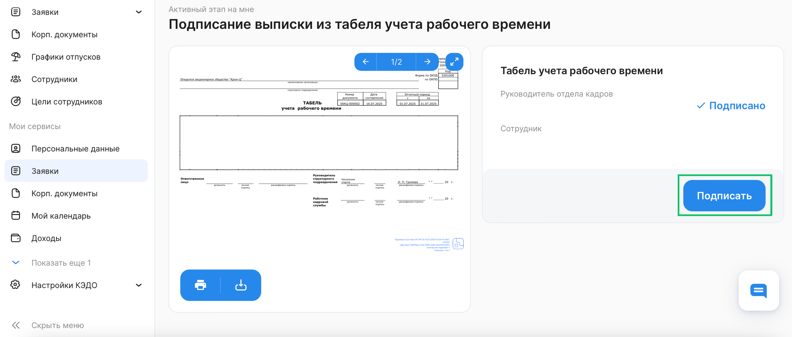
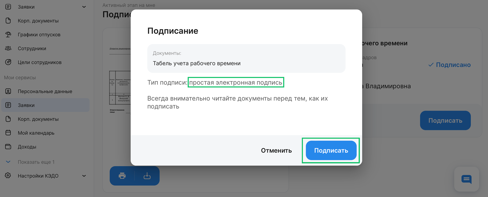
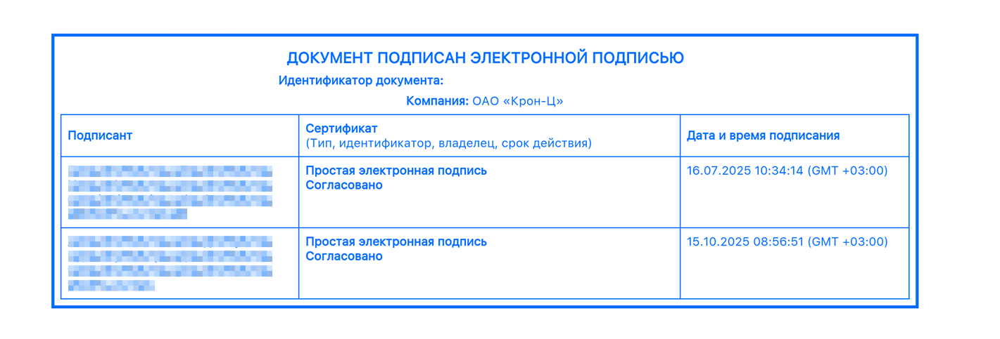
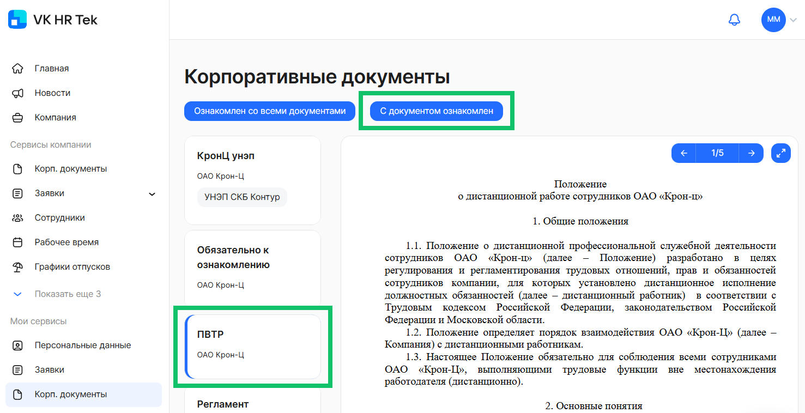

Согласно Федеральному закону от 06.04.2011 № 63-ФЗ «Об электронной подписи»:

> Простая электронная подпись (ПЭП) — это электронная подпись, которая посредством использования кодов, паролей или иных средств подтверждает факт формирования электронной подписи определенным лицом.

 

Любой документ, подписанный ПЭП, по умолчанию не равнозначен документу на бумажном носителе, подписанному собственноручно. Это своего рода заявление о намерении, которое означает согласие стороны с условиями сделки, но не участие в ней.

Но если стороны заключат соглашение о признании электронной подписи аналогом собственноручной при личной встрече, то такие документы могут приобрести юридическую значимость.

ПЭП в рамках КЭДО — это подпись, которая формируется с помощью вашей учётной записи КЭДО. ПЭП подтверждает, что документы подписаны конкретным пользователем, но не гарантирует их неизменность после этого.

Пользователи КЭДО применяют ПЭП по соглашению с работодателем.

С помощью ПЭП документы в КЭДО могут подписывать сотрудники, руководители и представители компании.

Если Администратор КЭДО добавил пользователя в список сотрудников, которым не требуется выпуск УНЭП, то этот пользователь сможет подписывать документы только ПЭП (подробнее о настройке в [статье](/ru/admin_actions/users_without_unep/select_source#vybor_tipa_unep_v_veb_interfeyse)).

<info>

Подписание документа ПЭП доступно в заявках, в бизнес-процессах которых указан тип подписи ПЭП.

Если для бизнес-процесса не указаны типы подписи на этапах, то по умолчанию руководители подписывают документы через ПЭП, представители компании — УКЭП, сотрудники — УНЭП (если в настройке использования ЭП не указано иное). 

</info>

## Подписание заявок 

Чтобы подписать документ в заявке, нажмите кнопку **Подписать**. Для подписания документа через ПЭП не требуется вводить код из СМС, как в случае с УНЭП.

 

Перед подписанием внимательно ознакомьтесь с документом и подтвердите действие. 

 

После подписания в документе появится штамп с информацией о подписанте, сертификате ПЭП, дате и времени подписания.  

## Ознакомление с корпоративными документами

Чтобы ознакомиться с корпоративным документом, выберите этот документ (без пометки УНЭП) в списке для ознакомления и нажмите кнопку **С документом ознакомлен**. Для ознакомления с документом через ПЭП не требуется вводить код из СМС. 

## Ограничения использования ПЭП

ПЭП нельзя использовать для подписания следующих документов:

* Приказы о дисциплинарных взысканиях (требуется УНЭП, УКЭП или «Госключ»).  
* Приказы об увольнении (оформляются только на бумаге с собственноручной подписью).  
* Документы в модуле «Кандидаты».  
* Документы на этапах согласования с развилкой (альтернативными маршрутами).  
* Документы из заявок, которые выбраны для массового подписания (выбор нескольких заявок в листинге и одновременное подписание).