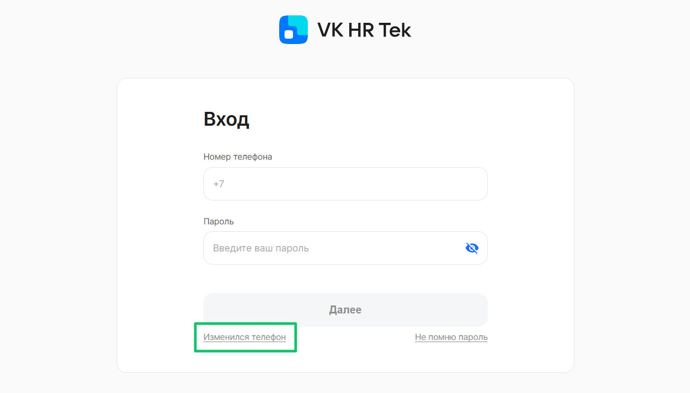

## Смена номера телефона

Если у сотрудника изменился номер телефона, необходимо сообщить новый номер Отделу кадров. После этого перейдите в Личный кабинет VK HR Tek.

Для изменения номера телефона, который вы указывали при регистрации в сервисе VK HR Tek, перейдите на страницу входа и нажмите на ссылку **Изменился телефон**.

 

Далее заполните свой СНИЛС и действующий пароль, нажмите кнопку **Продолжить**.

 

<info>

Если вы забыли пароль, который задавали при регистрации, необходимо обратиться в техническую поддержку с помощью электронной почты (support@hrtek.ru). Специалисты поддержки восстановят учётную запись и направят уведомление для повторной регистрации.

В случае возникновения ошибки при вводе данных, необходимых для смены номера, обратитесь в службу поддержки VK HR Tek.

</info>

Если вы указали корректные данные, ссылка на изменение номера поступит на электронную почту (её указывает ваш работодатель) и по СМС на новый номер телефона.

 

Перейдите по ссылке из уведомления. Введите ваш номер СНИЛС, новый номер телефона и задайте пароль от Личного кабинета VK HR Tek. Далее вам необходимо выпустить УНЭП на новый номер стандартным способом. Подробнее в статье [Регистрация в VK HR Tek и выпуск УНЭП](/ru/hr/employee/registration). 

## Смена пароля

Для изменения пароля перейдите на страницу входа и нажмите на ссылку **Не помню пароль**.

Заполните свой СНИЛС и укажите номер телефона, который вы указывали при регистрации в сервисе VK HR Tek. Нажмите кнопку **Продолжить**.

СНИЛС и номер телефона будут проверены на соответствие тем данным, которые были указаны при регистрации в сервисе VK HR Tek. При обнаружении ошибки система сообщит об этом. Исправьте обнаруженную ошибку для продолжения процесса изменения пароля.

Если СНИЛС и номер телефона указаны верно, задайте новый пароль. Обратите внимание на требования к паролю. Укажите новый пароль повторно и нажмите кнопку **Готово**.

На указанный номер телефона придёт СМС-код, введите его в поле **СМС-код**. Нажмите кнопку **Подтвердить**.

Процесс смены пароля завершён.