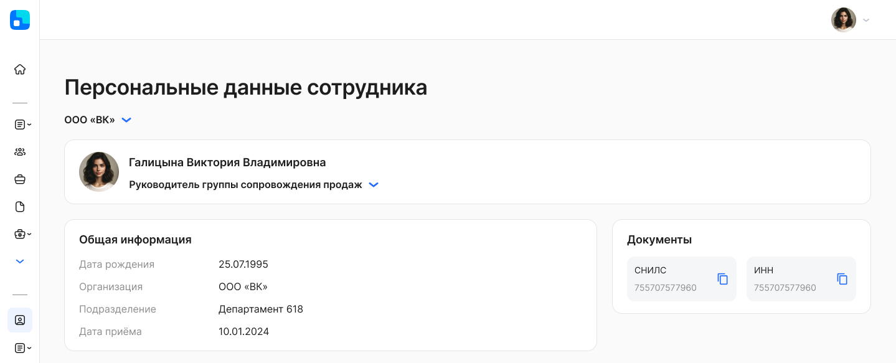
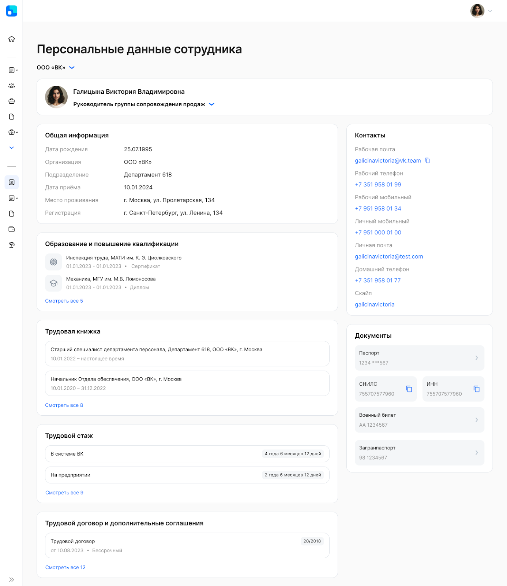

В разделе **Персональные данные** информация пользователя разбита на модули. 

Есть набор данных, которые обязательны для каждого пользователя и/или сотрудника, поэтому они всегда отображаются в разделе. Список дополнительных модулей фиксирован в рамках сервиса. Включение передачи данных для каждого модуля настраивается в рамках компании. 

Соответственно, в персональных данных будут только те сведения, которые внесены в систему управления персоналом, и работодатель согласен передавать их в сервис VK HR Tek.

На данный момент реализована интеграция для обмена данных с 1С:ЗУП.

Персональные данные сотрудников обновляются в HR Tek при обновлении их в системе управления персоналом.

**Обязательные данные**: ФИО, Организация, Подразделение, Должность, Дата найма, ИНН, СНИЛС, Дата рождения.

**Модули, которые можно включить для обмена данными:**

1. **Общая информация**: Адрес регистрации, Адрес места проживания, Фотография
1. **Контакты**: Мобильный телефон, Рабочий мобильный телефон, Рабочий телефон, Рабочая электронная почта, Домашний телефон, Личная электронная почта
1. **Паспортные данные**
1. **Заграничный паспорт** 
1. **Военный билет**
1. **Образование**: Вид образования, Учебное заведение, Начало обучения, Окончание обучения, Специальность, Квалификация, Наименование курса, Документ об образовании (Серия, Номер, Дата выдачи)
1. **Трудовая деятельность**
- Трудовая книжка: Начало и Окончание работы, Организация, Должность, Адрес организации
- Трудовой стаж: Наименование (тип), срок (Лет, Месяцев, Дней)
8. **Трудовой договор**: Номер, Дата подписания, Тип, Дата окончания действия договора

Пример страницы с обязательными данными сотрудника:

Пример, когда влючен обмен по всем модулям и заполнены все персональные данные сотрудника:

