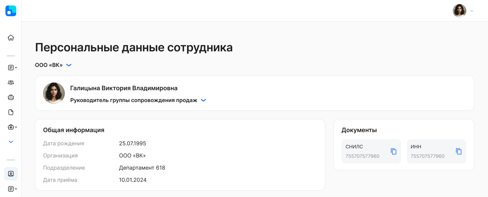
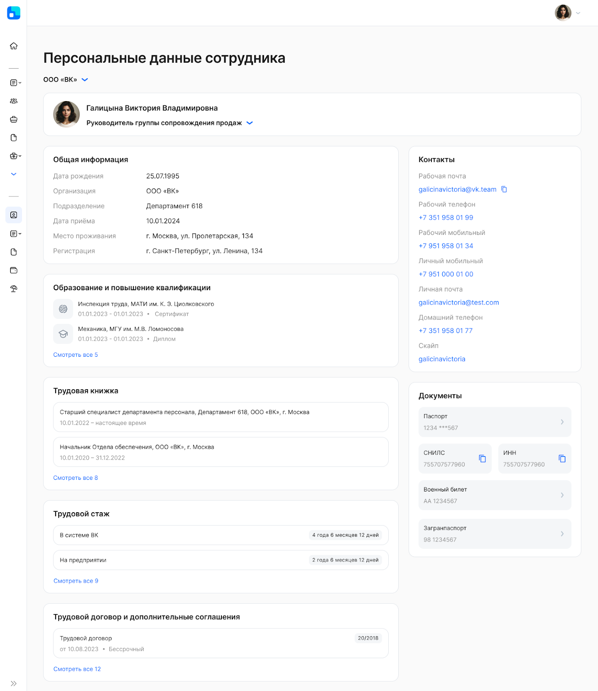

В разделе **Персональные данные** информация пользователя разбита на модули. 

Есть набор данных, которые обязательны для каждого пользователя и/или сотрудника, поэтому они всегда отображаются в разделе. Список дополнительных модулей фиксирован в рамках сервиса. Включение передачи данных для каждого модуля настраивается в рамках компании. 

Соответственно, в персональных данных будут только те сведения, которые внесены в систему управления персоналом, и работодатель согласен передавать их в сервис VK HR Tek.

На данный момент реализована интеграция для обмена данных с 1С:ЗУП.

Персональные данные сотрудников обновляются в VK HR Tek при обновлении их в системе управления персоналом.

**Обязательные данные**: Фамилия, Имя, Организация, Подразделение, Должность, Дата найма, ИНН, СНИЛС.

**Модули, которые можно включить для обмена данными:**

1. **Общая информация**: Адрес регистрации, Адрес места проживания, Фотография
1. **Контакты**: Мобильный телефон, Рабочий мобильный телефон, Личный мобильный телефон, Рабочий телефон, Рабочая почта, Домашний телефон, Личная почта
1. **Паспортные данные**
1. **Заграничный паспорт** 
1. **Военный билет**
1. **Образование**: Вид образования, Учебное заведение, Начало обучения, Окончание обучения, Специальность, Квалификация, Наименование курса, Документ об образовании (Серия, Номер, Дата выдачи)
1. **Трудовая деятельность**
- Трудовая книжка: Начало и Окончание работы, Организация, Должность, Адрес организации
- Трудовой стаж: Наименование (тип), срок (Лет, Месяцев, Дней)
8. **Трудовой договор**: Номер, Дата подписания, Тип, Дата окончания действия договора
9. **О семье**. Статус о семейном положении, Родственники: ФИО, Дата рождения, Степень родства.

Пример страницы с обязательными данными сотрудника:

Пример, когда включен обмен по модулям и заполнены персональные данные сотрудника:

## Соответствие полей КЭДО полям в 1С

Каждому объекту данных, которое отображается в разделе **Персональные данные**, соответсвует заполненное в 1С поле. Например, чтобы в КЭДО у сотрудника отобразились данные поля «Мобильный телефон», в 1С должно быть заполнено поле «Мобильный телефон» в 1С.

Соответствие объектов данных КЭДО и полей 1С приведено в таблице ниже.  

| Данные сотрудника в КЭДО | Источник данных из 1С |
| :---- | :---- |
| Имя и фамилия  | Полное имя (карточка сотрудника) |
| Отчество | Полное имя (карточка сотрудника) |
| Организация | Организация (карточка сотрудника) |
| Должность  | Должность (карточка сотрудника) |
| Табельный номер | Таб. номер (карточка сотрудника) |
| Фотография | Поле для фото (карточка физического лица) |
| Подразделение  | Подразделение (карточка сотрудника) |
| Мобильный телефон | Мобильный телефон (карточка сотрудника: Личные данные) |
| Рабочий мобильный телефон | Рабочий мобильный телефон (регистр «Персональные данные сотрудника») |
| Рабочий телефон | Рабочий телефон (карточка сотрудника: Личные данные) |
| Личный мобильный телефон | Мобильный телефон (карточка сотрудника: Личные данные) |
| Домашний телефон | Домашний телефон (карточка сотрудника) |
| Личная почта | Личная электронная почта (регистр «Персональные данные сотрудника») |
| Рабочая почта | Рабочая электронная почта (регистр «Персональные данные сотрудника») |
| Email | Email (карточка сотрудника: Личные данные) |
| Дата рождения | Дата рождения (карточка сотрудника) |
| Место рождения | Место рождения (карточка сотрудника: Личные данные) |
| Гражданство | Гражданство (карточка сотрудника: Личные данные) |
| Адрес временной регистрации | Адрес временной регистрации (карточка сотрудника: Личные данные) |
| Адрес регистрации | Адрес по прописке (карточка сотрудника: Личные данные) |
| Адрес места проживания | Адрес места проживания (карточка сотрудника: Личные данные) |
| Адрес рабочего места | Адрес рабочего места (карточка сотрудника: Личные данные) |
| ИНН | ИНН (карточка сотрудника) |
| СНИЛС | СНИЛС (карточка сотрудника) |
| Паспорт | Документ, удостоверяющий личность – Паспорт гражданина РФ (карточка сотрудника: Личные данные) |
| Загранпаспорт | Документ, удостоверяющий личность – Загранпаспорт гражданина РФ (карточка сотрудника: Личные данные) |
| Виза | Визы (регистр «Персональные данные сотрудника») |
| Трудовой договор | Реквизиты документа «Приём на работу»: «Номер трудового договора», «Дата трудового договора», «Дата приёма» (дата начала), «Дата окончания», признак «Срочный договор» |
| Трудовая книжка | Сведения о стажах, Места работы (карточка сотрудника: Трудовая деятельность) |
| Трудовой стаж | Сведения о стажах (карточка сотрудника: Трудовая деятельность) |
| Награды | Награды (карточка сотрудника: Трудовая деятельность) |
| Образование  | Образование (карточка сотрудника: Образование, квалификация) |
| Семейное положение | Состояние в браке (карточка сотрудника: Семья) |
| Родственники | Состав семьи (карточка сотрудника: Семья) |

