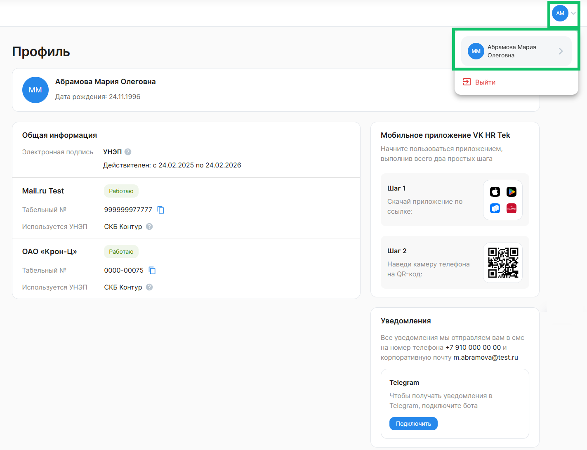

Профиль сотрудника предназначен для отображения информации, необходимой для работы в сервисе. 

Чтобы перейти в **Профиль**, нажмите на аватар с первыми буквами вашего имени или текущим фото, а затем на ссылку с ФИО.

В блоке **Общая информация** указаны:
- тип электронной подписи со сроком действия сертификата;
- одно или несколько названий компаний, в которых работает представитель;
- статус работы в компании: *Работаю* или *Уволен*;
- табельный номер сотрудника в компании;
- тип УНЭП для подписания документов в заявках.

Сотрудник, который не является представителем работодателя, подписывает документы в заявках усиленной неквалифицированной электронной подписью (УНЭП). 

 

Сотрудник получает базовые уведомления о кадровых процессах на электронную почту и телефон, указанные в **Профиле**. 

Если для компании настроены дополнительные уведомления, то их можно получать в мессенджере Telegram. Чтобы получать уведомления в Telegram, в блоке **Уведомления** нажмите кнопку **Подключить**.

Если компания не настроит дополнительные уведомления, то сотрудник не сможет получать эти уведомления в Telegram. 

