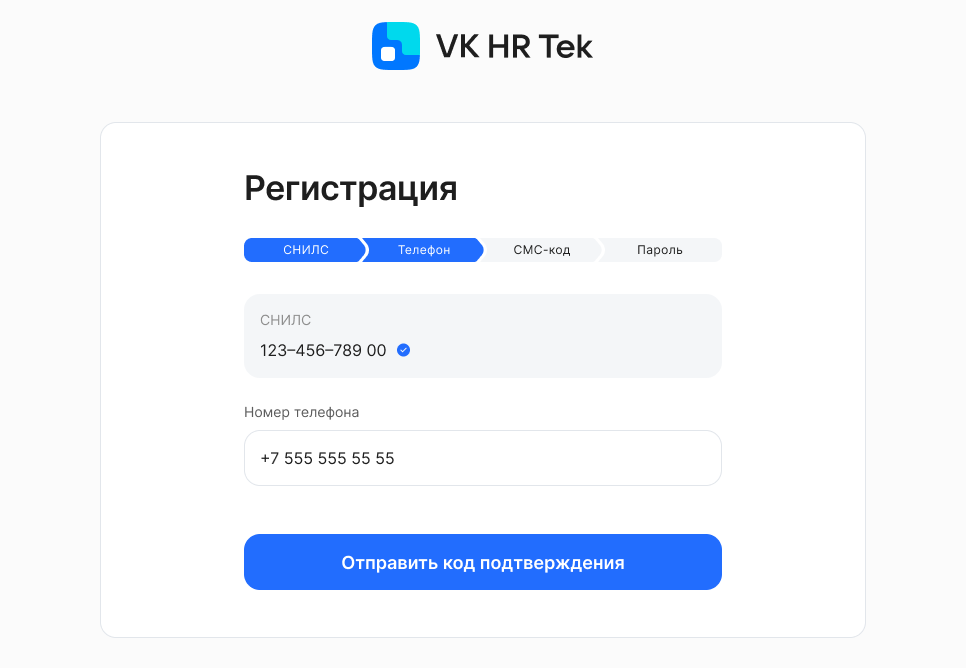
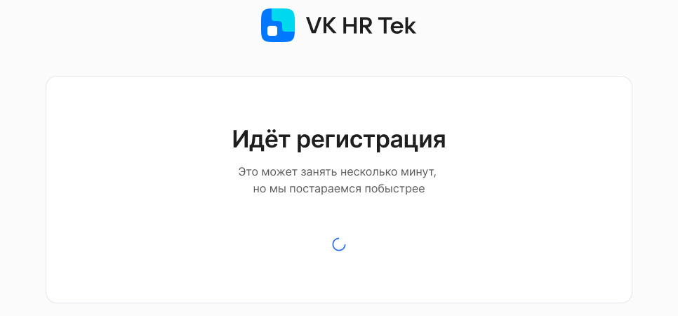

Для регистрации в сервисе пройдите по ссылке-приглашению, которую вы получили на адрес своей электронной почты или в СМС. 

 

Приглашение действует один месяц. Если не пройти регистрацию в течение этого срока, то на экране будет сообщение о том, что ссылка устарела. Сотруднику в таком случае необходимо обратиться в отдел кадров, чтобы получить новое приглашение.

## Ввод персональных данных

**СНИЛС** является вашим основным уникальным идентификатором в VK HR Tek. Сервис запрашивает его, чтобы убедиться, что вы тот человек, которому предназначалась ссылка с приглашением. По номеру СНИЛС в сервисе будут найдены ваши данные, которые передал работодатель при подключении.

Введите номер СНИЛС и нажмите кнопку **Продолжить**:

 

**Номер телефона** — используйте номер, к которому у вас есть постоянный доступ. Вы будете использовать его для входа в VK HR Tek, на него будут приходить важные уведомления и коды в СМС.

<warn>
В случае изменения номера телефона рекомендуем сообщать об этом в отдел кадров, чтобы специалисты изменили его в своей системе учета кадров, так как СМС для подписания через УНЭП будут поступать на этот номер.
</warn>

Введите номер телефона и нажмите кнопку **Отправить код подтверждения**:

 

Дождитесь получения СМС на указанный номер телефона, введите полученный код и нажмите кнопку **Подтвердить**:

## Создание пароля

В поле **Пароль** есть подсказки, что пароль должен содержать для соответствия требованиям безопасности. Они окрашиваются в зеленый цвет по мере ввода пароля, чтобы вам было понятно, какие еще символы нужно добавить.

Придумайте пароль, удовлетворяющий всем требованиям, и введите его в поля **Пароль** и **Повторите пароль**:

 

<warn>
Важно запомнить созданный пароль, т.к. вы будете использовать его для входа в личный кабинет в VK HR Tek вместе с номером мобильного телефона.
</warn>

Дождитесь окончания регистрации. Процесс регистрации может занять несколько минут, в это время на экране будет крутиться индикатор загрузки.

 

При желании вы можете покинуть эту страницу — на процессе регистрации это никак не отразится.

В ряде случаев процедура регистрации (индикатор загрузки после генерации пароля) может быть завершена фактически раньше, чем демонстрирует веб-интерфейс. В таких случаях пользователь может проверить, нет ли проблем с кэшированием страницы, попробовав зайти в сервис VK HR Tek в режиме «Инкогнито».

После успешной регистрации вы автоматически перейдете к выпуску электронной подписи. 

## Выпуск электронной подписи

Чтобы подписывать документы в системе электронного документооборота, выпустите электронную подпись. Использование сервиса VK HR Tek возможно только после выпуска ЭЦП.

На этом шаге вы можете ознакомиться с автоматически сформированным заявлением на выпуск УНЭП и отправить заявление в Удостоверяющий центр (УЦ), нажав по кнопке **Выпустить**.

 

Дальнейшие действия зависят от того, какой способ выпуска электронной подписи указал работодатель.

## Выпуск электронной подписи через Госуслуги

Сотрудникам, у которых нет очного удостоверения личности, потребуется пройти удаленное подтверждение выпуска электронной подписи через ЕСИА. 

Перейдите на сайт Госуслуг, авторизуйтесь и убедитесь, что у вас подтвержденная учетная запись.

 

<warn>

Уровень учетной записи указан под вашими ФИО в разделе «Профиль» на Госуслугах. Если у вас упрощенная или стандартная учетная запись, то подтвердите ее в соответствии с [инструкцией на портале ](https://www.gosuslugi.ru/help/faq/login/2003).

</warn>

Кликните на свое имя в правом верхнем углу и выберите «Уведомления»:

 

Найдите сообщение от «СКБ Контур» и откройте его. Подтвердите, что это именно вы выпускаете электронную подпись:

 

Ссылка в уведомлении от «СКБ Контур» будет действовать 24 часа. По истечении этого срока, если подпись не была выпущена, сотруднику необходимо будет вернуться в сервис VK HR Tek и повторно нажать на кнопку **Выпустить**.

Если в течение суток вы не получили уведомление от «СКБ Контур» на Госуслугах, обратитесь к своему работодателю для решения проблемы. Попросите сначала проверить ваши данные в системе работодателя (написание ФИО, ИНН, СНИЛС, паспортные данные, дату рождения) или обратиться в службу поддержки VK HR Tek.

Электронная подпись обычно выпускается в течение нескольких минут после подтверждения личности, но иногда это занимает больше времени. Длительный выпуск УНЭП может быть связан с задержками в системе СМЭВ, запрос к которой поступает от УЦ. Рекомендуем подождать сутки, прежде чем обращаться в службу поддержки.

На сайт Госуслуг придет уведомление от «СКБ Контур»:

 

Когда электронная подпись будет создана, вы получите уведомление на Госуслугах от «СКБ Контур» с данными о выпущенном сертификате электронной подписи:

 

Откройте сервис VK HR Tek, чтобы начать работу с заявками.
