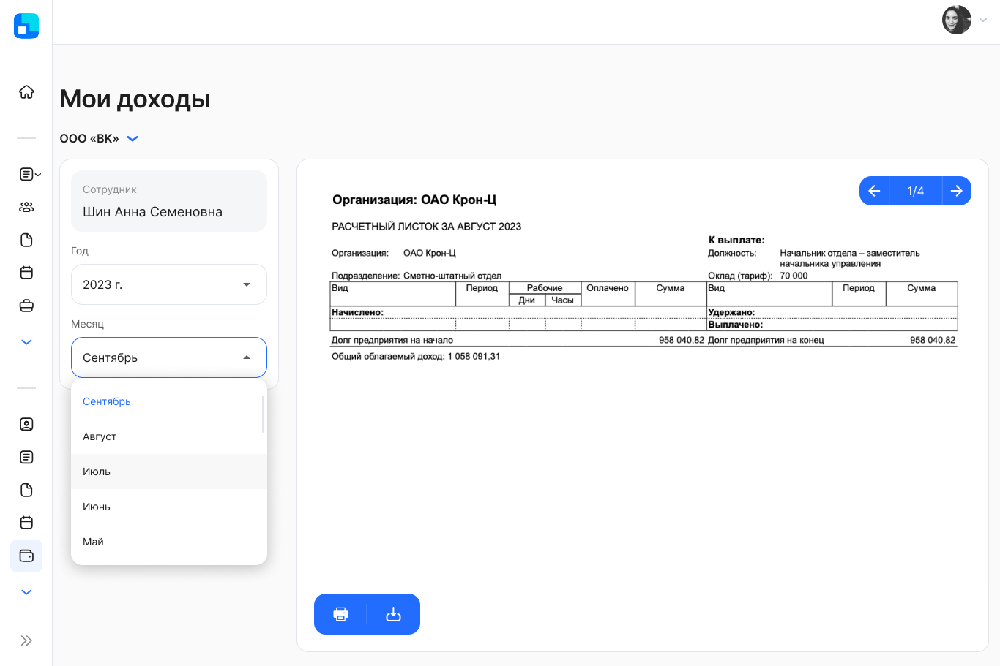

Компании могут отправлять расчетные листки своим сотрудникам. Отправкой листков управляет кадровый сотрудник в модуле 1С:ЗУП.

Подключить функцию получения расчетных листков может Администратор КЭДО в настройках компании.

Чтобы просмотреть свои расчетные листки, перейдите в раздел **Доходы**. Расчетные листки можно посмотреть за выбранный месяц и год, скачать или отправить на печать.

