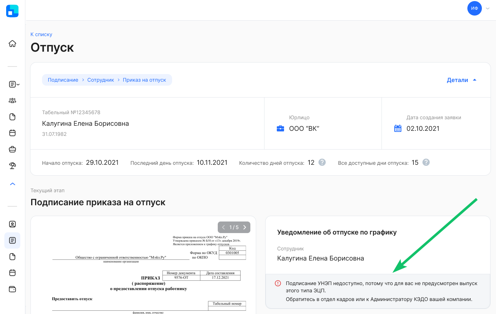
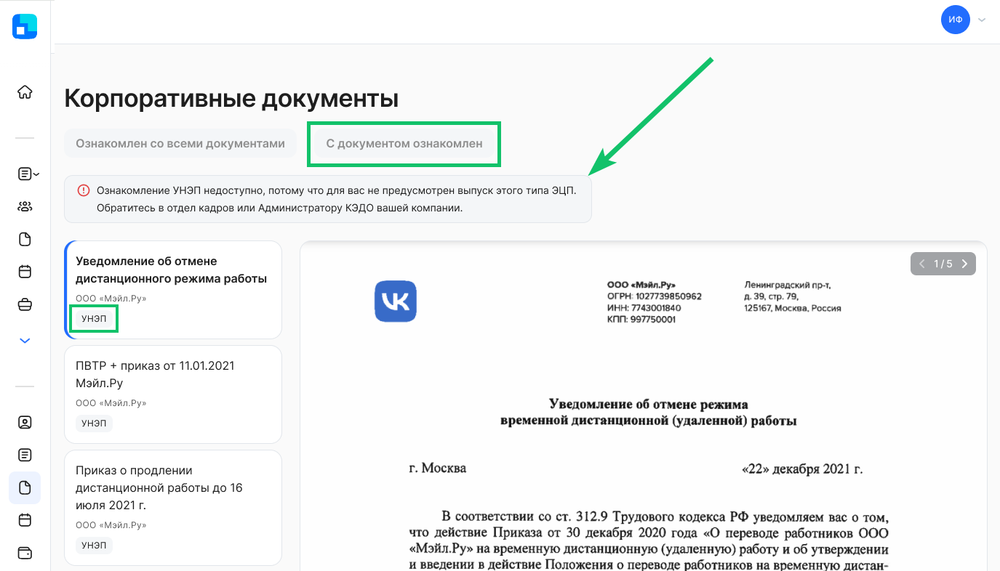

## Подписание заявок 
Сотрудники (руководители, представители компании), у которых УНЭП не подключен, могут пользоваться сервисом без выпущенного сертификата, но подписание документов УНЭПом в заявках для них будет недоступно. Для выпуска УНЭП сотрудник может обратиться в отдел кадров или к Администратору КЭДО своей компании.

## Ознакомление с корпоративными документами
Если у сотрудника не выпущен УНЭП, то об этом его предупредит сообщение, что ознакомление УНЭП недоступно. Для выпуска УНЭП сотрудник может обратиться в отдел кадров или к Администратору КЭДО своей компании.

Карточки корпоративных документов, которые нужно подписывать УНЭПом, содержат отметку «УНЭП».

Если в разделе **Корпоративные документы** представлены документы, которые надо подписывать УНЭПом, то при открытии этого документа сотруднику без УНЭП будет недоступна кнопка **С документом ознакомлен**. 

