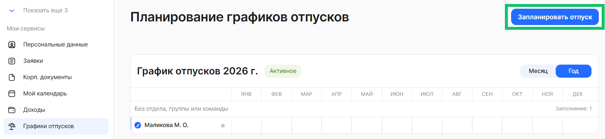
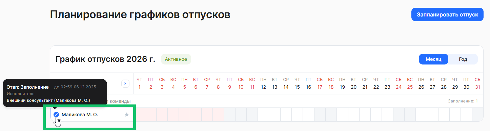
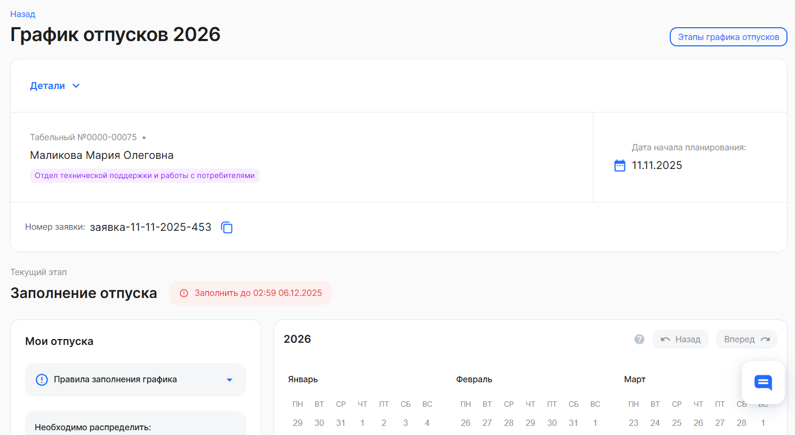
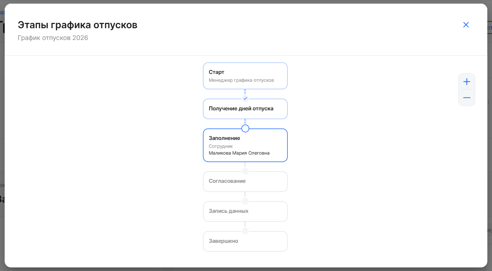
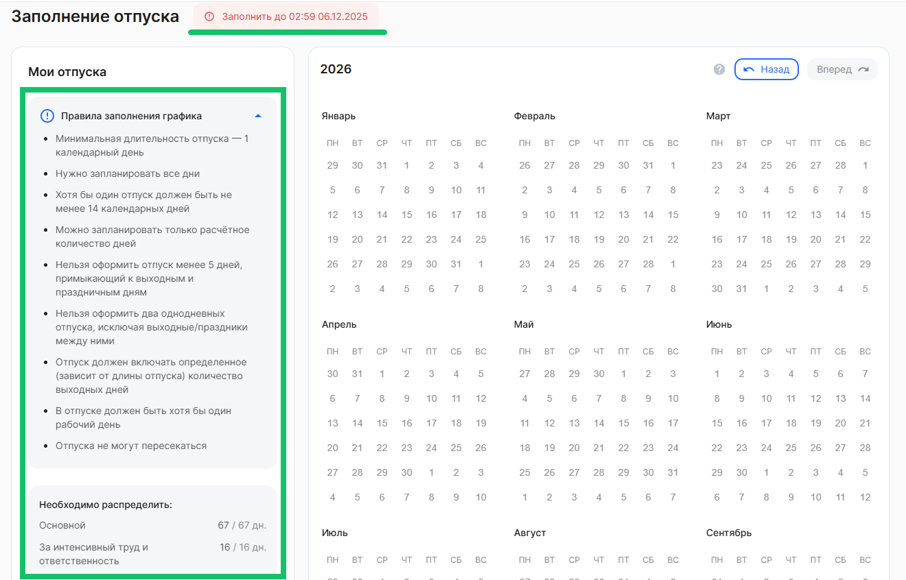
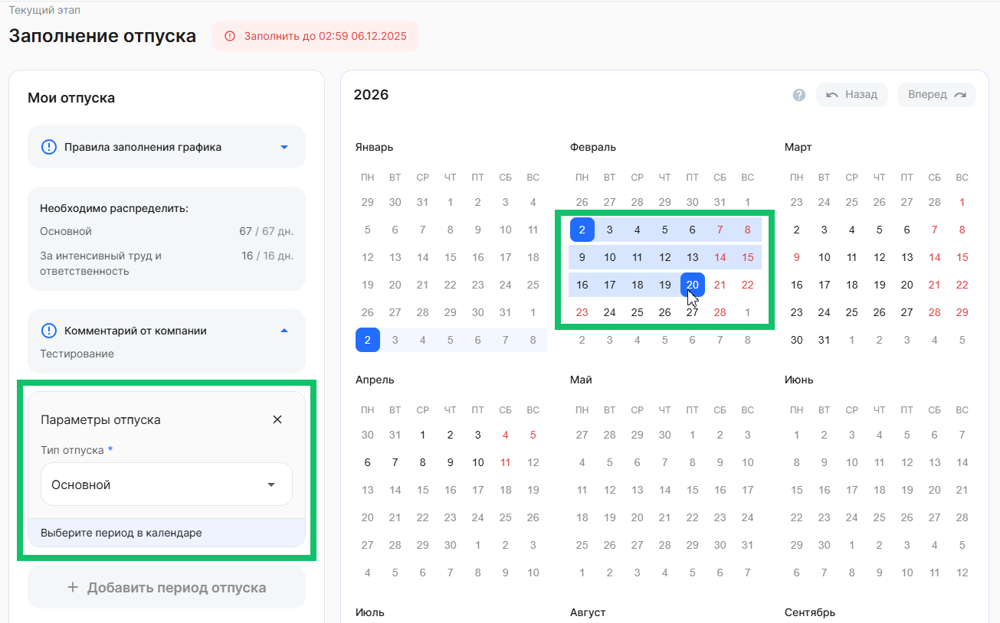
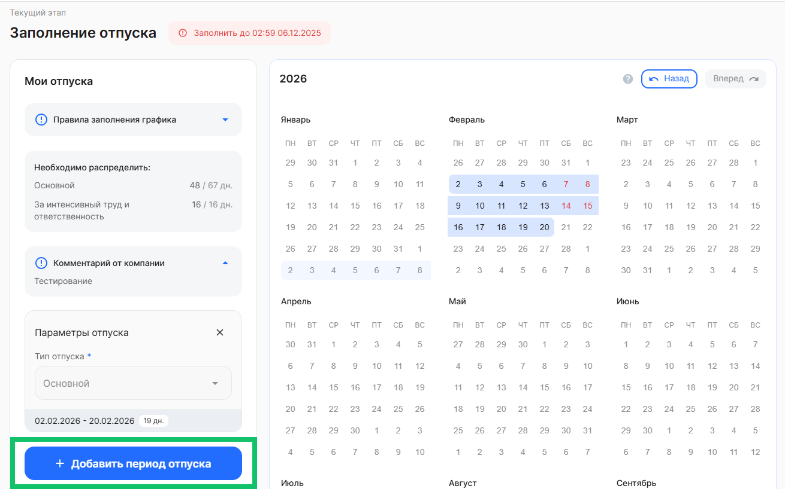
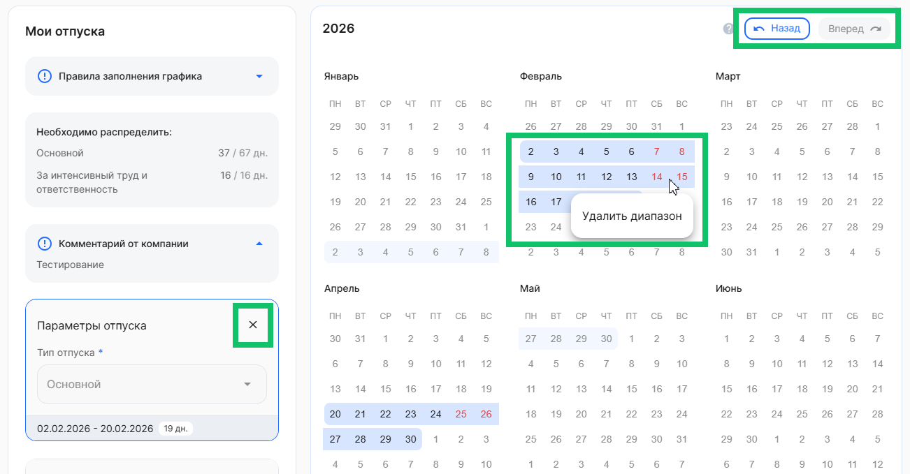
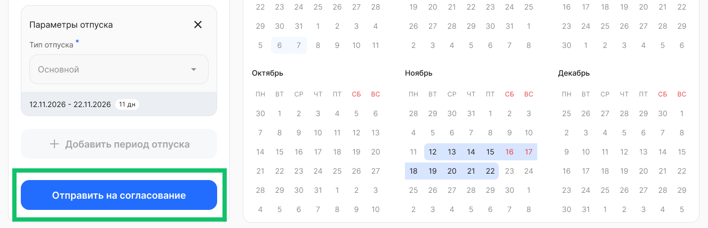
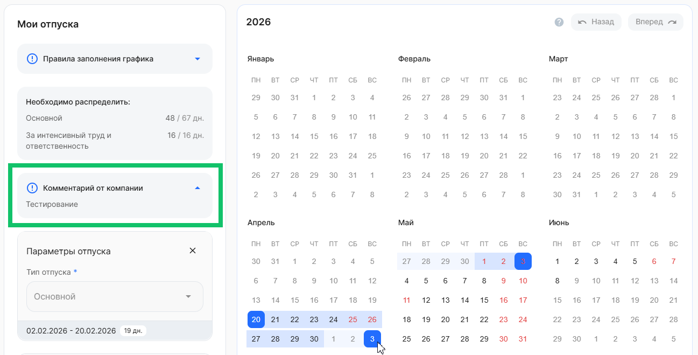

<info>

Планирование графика отпусков недоступно в мобильном приложение VK HR Tek. График отпусков можно заполнить в веб-сервисе или мобильной версии сервиса (вход через браузер).

</info>

Для заполнения графика отпусков на следующий год перейдите в **Мои сервисы → Графики отпусков** и нажмите кнопку **Запланировать отпуск**.

 

Или нажмите на свое ФИО в графике, если график сотрудника находится на этапе **Заполнение** с отметкой .

 

В деталях заявки доступна информация о сотруднике, дате начала планирования и номере заявки (если компания включила [нумерацию заявок](/ru/release_notes/saas/20250900Core#skvoznye_nomera_zayavok_f1227861)).

 

Информацию о текущем и последующих этапах заявки на отпуск можно просмотреть, нажав кнопку **Этапы графика отпусков**.

 

Перед заполнением графика отпусков ознакомьтесь:

- с датой окончания заполнения графика, чтобы вовремя успеть заполнить график;
- с количеством дней, которые необходимо распределить в календаре по доступным видам отпусков (основной и/или дополнительный);
- с правилами заполнения графика. [Правила настраивает](/ru/hr/company/vacation/create/settings#zapolnenie_sotrudnikom) представитель компании.

 

Чтобы заполнить график отпусков:

1. В блоке **Параметры отпуска** выберите тип отпуска.
1. Выберите период в календаре. Для этого нажмите на доступную дату начала отпуска, а затем нажмите на дату окончания. 

 

3. После этого выбранный период будет выделен в календаре и отобразится в блоке **Параметры отпуска**.
1. Если требуется добавить еще период отпуска, то нажмите кнопку **Добавить период отпуска**.

 

5. Если период отпуска был выбран ошибочно, то нажмите на этот период в календаре → **Удалить диапазон** или на кнопку удаления в блоке **Параметры отпуска**.

 

6. Если требуется отменить добавленные или вернуть удаленные диапазоны в календаре, нажмите кнопку **Назад** или **Вернуть** соответственно. 

После окончательного распределения доступных дней отпуска в календаре, нажмите кнопку **Отправить на согласование**. Заявка на отпуск перейдет на следующий этап согласования к руководителю сотрудника / представителю компании (специалисту отдела кадров).

 

Если после проверки руководитель/специалист вернет заявку на доработку из-за каких-либо неточностей, то повторите действия по заполнению графика с учетом оставленных замечаний из блока **Комментарий от компании**.  

