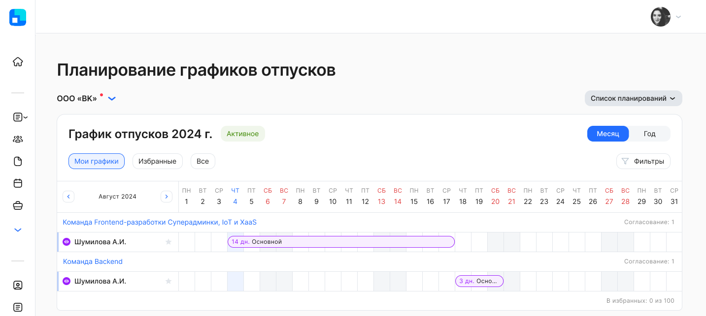

Просмотр графиков коллег настраивается при создании планирования и может быть разрешен всем сотрудникам компании или ограничен подразделением. Настройку подключает пользователь с ролью «Менеджер графика отпусков» при создании планирования (подробнее в [статье](/ru/hr/company/vacation/create/settings#zapolnenie_sotrudnikom)).

Сотрудник при заполнении своего графика отпусков параллельно может просматривать графики отпусков коллег, чтобы исключить пересечения в планах на отпуск между сотрудником и его коллегами.

Сотрудник может добавлять графики отпусков коллег в «Избранное». Избранные графики коллег будут доступны для сравнения при заполнении своего графика. 

В Личном кабинете перейдите в раздел **Графики отпусков**, откройте график отпусков со статусом *Активное* на вкладке **Мои графики**.

 

Чтобы увидеть список запланированных календарей коллег, перейдите на вкладку **Все**. Используйте фильтр для поиска конкретного сотрудника или подразделения.

 

Чтобы добавить график отпусков коллеги в избранный список, выберите строку с календарем коллеги и нажмите на .

 

Для просмотра закрепленных календарей коллег перейдите на вкладку **Избранные**. Максимальное число избранных графиков сотрудников — 100.

Чтобы удалить все избранные графики, нажмите кнопку **Сбросить избранные**.

 

Перейдите к заполнению своего графика отпусков. Для этого нажмите на строку своего календаря.

На странице заполнения графика отпусков в блоке **Избранные графики** доступны для просмотра запланированные графики закрепленных коллег и графики сотрудника по подразделениям, к которым он относится. Сотрудник сможет запланировать свой отпуск, ориентируясь на закрепленные календари коллег.

 

Соблюдайте правила заполнения графика и распределите доступное количество дней по периодам. После заполнения своего календаря отправьте график отпусков на согласование руководителю. Для этого нажмите на кнопку **Отправить на согласование**.

