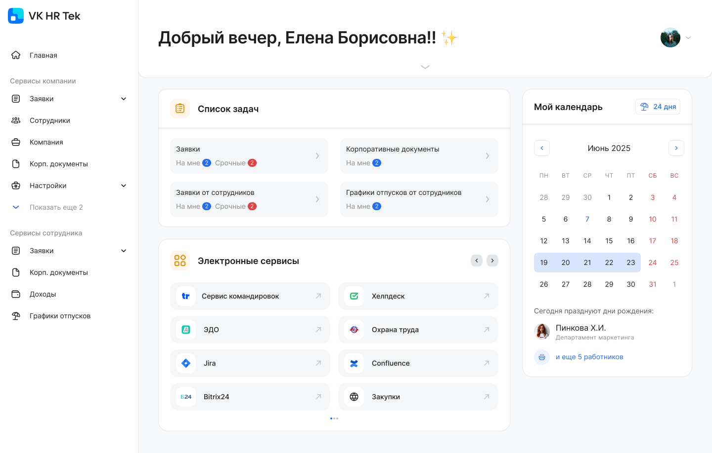
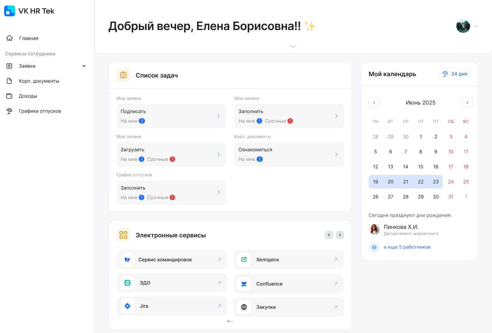
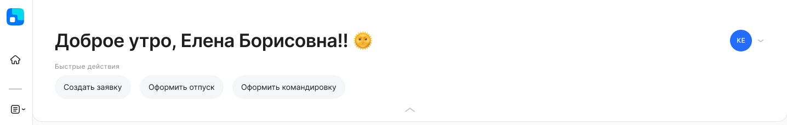
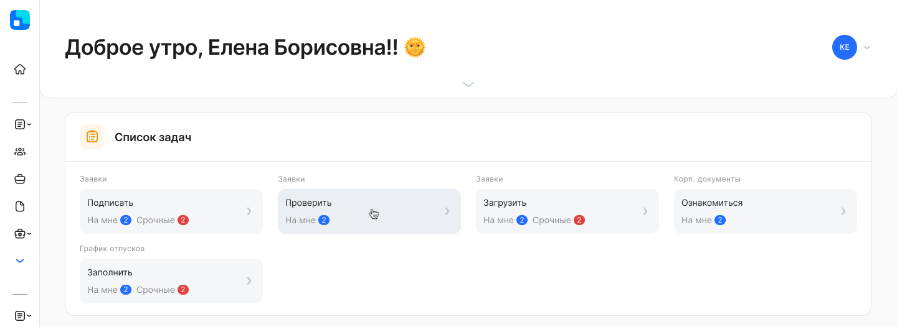
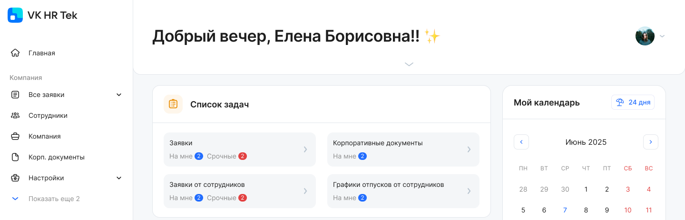
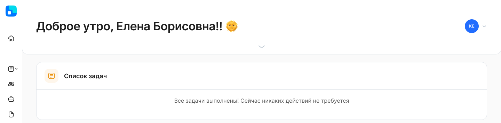
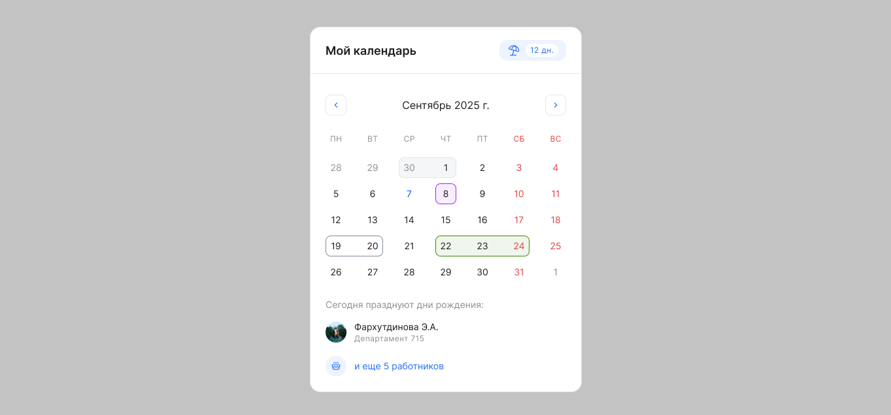
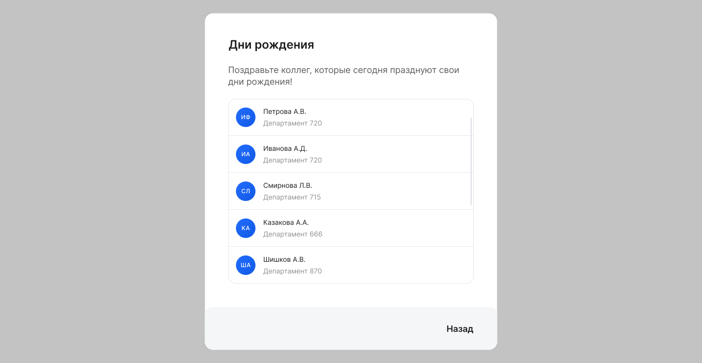

На стартовой странице больше нет переключения между Личным кабинетом сотрудника и Кабинетом компании. Все разделы представлены в боковом меню.

Ссылки и данные на главной странице собираются с учетом доступов пользователя со стороны сотрудника и со стороны компании, если сотруднику назначена роль в компании.

Виджеты — это блоки, которые включают различную информацию, например, о действующих заявках пользователя, об электронных сервисах компании и пр. 

На старте есть четыре виджета:

1. Быстрые действия;
1. Список задач;
1. Календарь;
1. Электронные сервисы.

Первое, что видит пользователь на странице — это персональное приветствие. Обращение по имени помогает быстро сориентироваться и подтверждает, что пользователь находится в своем Личном кабинете. 

Обращение и эмоджи зависит от времени суток, рассчитывается от времени на локальном устройстве пользователя.

В перспективе планируем добавить некоторые возможности для настройки приветствия.

Вид стартовой страницы с доступами представителя компании:

 

Вид стартовой страницы только с доступом сотрудника:

## Быстрые действия

Первый блок сверху после приветствия — список действий, которые чаще других совершает пользователь в сервисе. Список быстрых действий раскрыт по умолчанию, при необходимости его можно свернуть.

 

Сейчас в блоке доступны действия со стороны сотрудника: 

- переход к созданию новой заявки;
- старт заявки на отпуск;
- старт заявки на командировку. 

Создание новой заявки сотрудником — всегда доступно в быстрых действиях.

Постепенно, в том числе по входящим запросам, мы будем расширять список действий, которые можно добавить в этот виджет.

## Список задач

В виджете **Список задач** собраны все задачи, где ожидается действие пользователя. В виджете собраны действия с обеих сторон, то есть пользователь сразу видит карточки, которые относятся к нему лично, как к сотруднику компании, так и те, которые он должен обработать как руководитель или представитель компании.

Каждый блок виджета отображает количество заявок, ожидающих действия от пользователя, с возможностью перехода в листинг заявок с учетом фильтрации.

В блоках виджета предусмотрены отметки:

- Синий бэйдж (*На мне*) — общее количество задач (заявки или корп. документы), где ожидается действие сотрудника.
- Красный бэйдж (*Срочные*) — количество заявок, где для выполнения необходимого действия осталось менее 24 часов.

Виджет будет выглядеть по-разному, в зависимости от того, есть или нет у пользователя какие-то роли со стороны компании (руководитель, представитель).

Когда у пользователя нет ролей в компании, в **Список задач** входят карточки только для сотрудника(ов):

1. *Заявки*, где ожидается действия сотрудника, распределены по карточкам по типу действия: *Подписать, Проверить, Загрузить.*
1. *Корп. документы* — корпоративные документы, которые ожидают ознакомления сотрудником.
1. *График отпусков* — графики отпусков, которые ожидают заполнения или редактирования сотрудником.

Когда у пользователя есть роли со стороны компании, то **Список задач** дополняется карточками в соответствии с доступами пользователя:

1. *Заявки от сотрудников* — заявки, в которых пользователь участвует как руководитель или представитель компании.
1. *Графики отпусков от сотрудников* — графики отпусков, которые доступны руководителям и представителям компании для согласования или редактирования.

 

В случае если у пользователя нет активных заявок, то виджет будет пустой: «Все задачи выполнены».

## Календарь

С помощью **Календаря** пользователь быстро получает информацию о своем рабочем месяце — он видит свои фактические и запланированные на ближайший месяц отсутствия, может переключаться между месяцами.

### Календарь: отображение отсутствий

В календаре отображаются отсутствия (фактические, текущие, запланированные), полученные из системы управления персоналом. 

Сейчас реализована интеграция с 1С ЗУП. Календарь синхронизируется с 1С в режиме реального времени: если отсутствие будет отменено в 1С, но в календаре оно также исчезнет.

При наведении на дату откроется подсказка с указанием типа и периода отсутствия.

Цветовая схема обозначений отсутствий:

 белый — запланированный отпуск по графику;

 фиолетовый — запланированный отпуск по графику, для оформления которого создана заявка или другой вид отсутствия, созданный и проведенный в системе управления персоналом (без заявки КЭДО);

 зеленый — отсутствие, созданное по заявке из КЭДО и проведенное в системе управления персоналом (текущее или запланированное);

 серый — отсутствие в прошлом, проведенное  в системе управления персоналом;

 заштриховано — пересечение отсутствий. 

В календаре также подсвечиваются даты праздников (федеральные и региональные, если компания использует и передает региональные календари). 

### Количество дней отпуска

В виджете сотрудник видит количество доступных ему дней отпуска. При наведении на число откроется подсказка с должностью и табельным номером сотрудника.

### Дни рождения

Отображается ФИО сотрудника, у которого день рождения в текущий день. Собственный день рождения сотрудника исключен из списка именинников. Можно настроить отображение дней рождений: по подразделению или компании, по умолчанию отображение отключено.

Для настройки виджета на стартовой странице обратитесь к вашему менеджеру VK HR Tek.

Если на текущую дату дни рождения у нескольких коллег, то появляется ссылка на их список. Коллеги для списка выбираются из подразделений, в которых работает сотрудник, или из компании в целом (в зависимости от настройки компании).

### Настройки

Если у пользователя подключено к КЭДО несколько сотрудников в одной или разных компаниях, то он увидит блок с настройками, где сможет указать одного или нескольких сотрудников, для которого(ых) хочет просмотреть данные.

По умолчанию выбраны все должности сотрудника.

## Электронные сервисы

В виджете **Электронные сервисы** компания может разместить ссылки на другие внутренние сервисы, которые сотрудники и представители компании  используют в своей работе. 

Пользователю отображается полный набор ссылок, доступных ему в рамках ролей и юрлиц.

Уникальность каждой размещенной ссылки на электронный сервис проверяется по связке *<URL + Название>* (с учетом регистра). Если эта связка будет уникальной, то ссылка дублироваться не будет.
