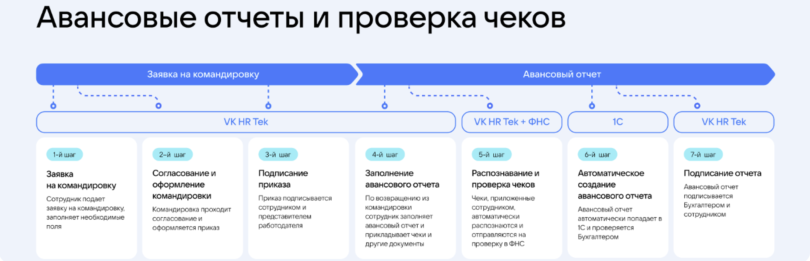
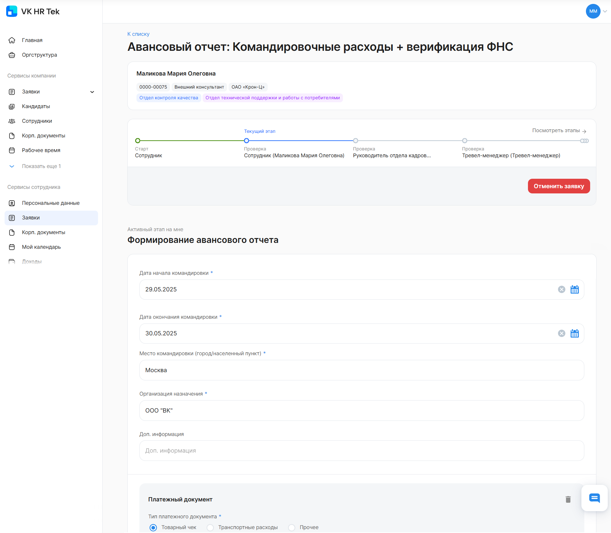
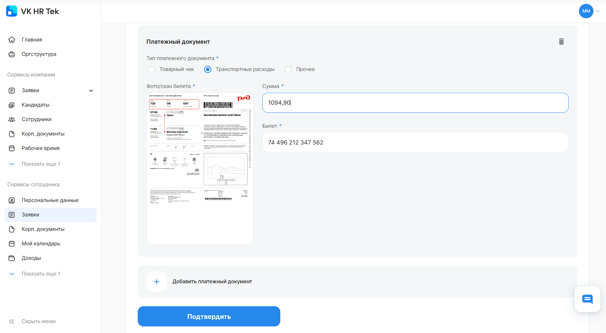
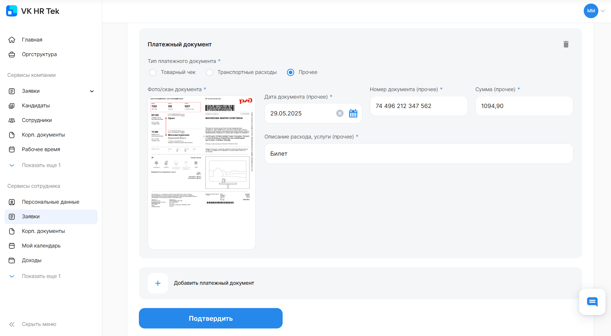
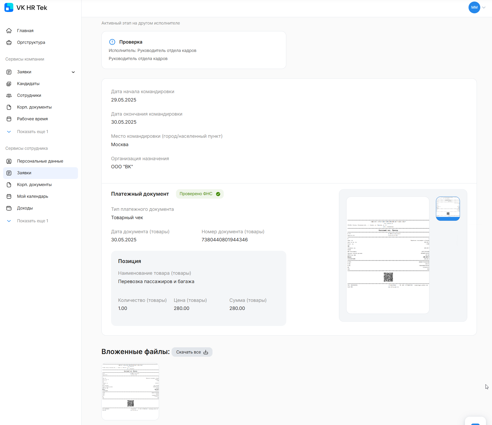
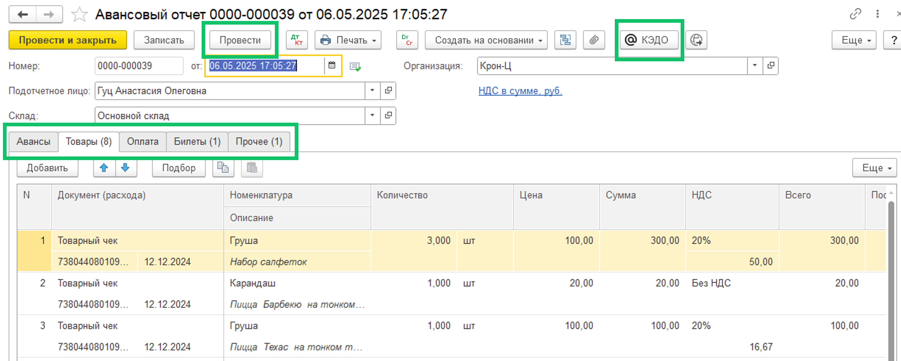
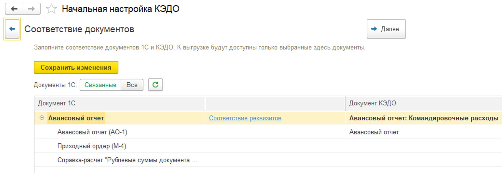
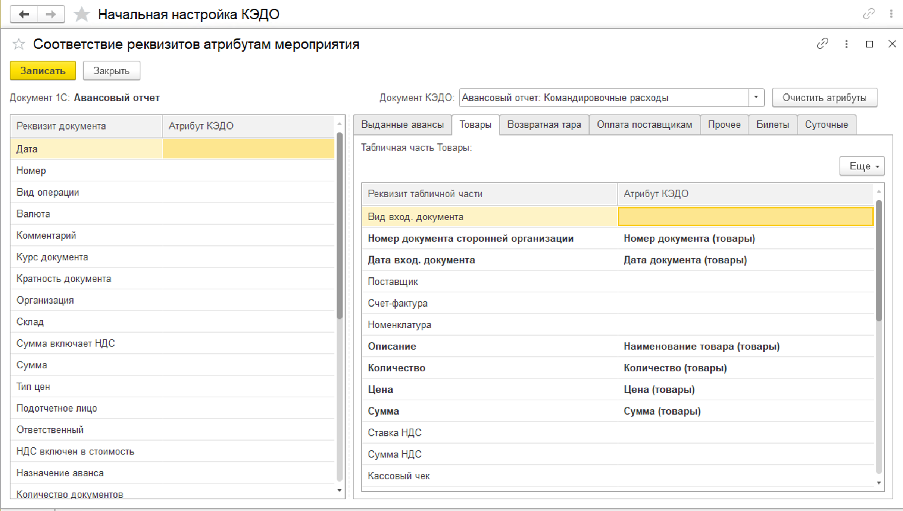
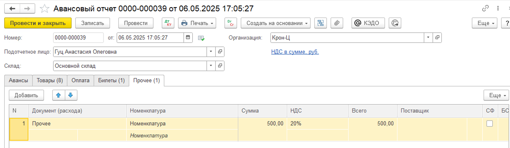
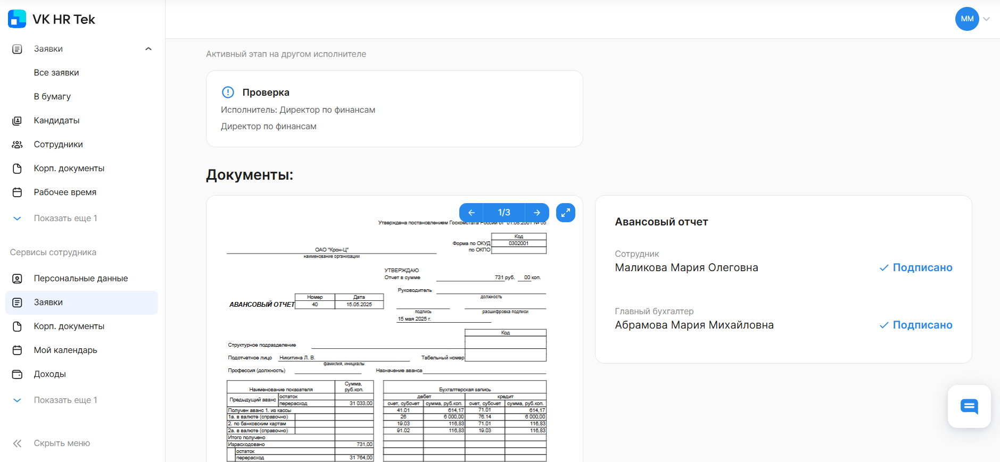

<info>

Подключение модуля «Авансовый отчёт» является платным и настраивается индивидуально для каждого клиента. Для настройки обратитесь к вашему менеджеру VK HR Tek.

</info>

Модуль «Авансовый отчёт» используется для учёта:

- командировочных расходов;
- представительских расходов;
- оплаты товаров, услуг и работ.

Возможности модуля:

1. Пользователи могут создавать заявки для работы с авансовым отчётом. Заявки могут быть разных видов в зависимости от сценариев и видов расходов, которые приняты в компании.
1. На этапе заполнения заявки и загрузки платежных документов, подтверждающих расходы, доступно распознавание чека ФНС по QR-коду и его отправка на проверку, автозаполнение атрибутов в заявке КЭДО на основании содержания чека.
1. Автоматическое создание документа 1С «Авансовый отчёт» на основании заявки КЭДО.
1. Подписание печатной формы авансового отчёта в КЭДО.

<warn>

Чтобы модуль «Авансовый отчёт» корректно работал в системе, выполните подготовительные настройки в вашей базе 1С УХ или 1С ERP (потенциально должен подойти для 1С Бухгалтерии).

Подробнее о настройках 1С в [статье](/ru/hr/module_expense_report/settings_1C).

При использовании с другими конфигурациями потребуются отдельная проверка и ресурсы на адаптацию.

</warn>

## Пример процесса по командировке

Пример процесса по командировке может включать следующие этапы:

1. Заполнение данных о командировке от сотрудника.
1. Согласование и оформление командировки руководителем и кадровым специалистом. 
1. Подписание приказа о командировке.

После завершения заявки о командировке сотрудник переходит к созданию заявки с авансовым отчётом. Также заявка с авансовым отчётом может быть создана автоматически после завершения заявки о командировке.

Пример процесса с авансовым отчётом может включать следующие этапы:

1. Заполнение авансового отчёта с загрузкой платежных документов от сотрудника.
1. Распознавание и проверка прилагаемых чеков о расходах.
1. Автоматическое создание авансового отчёта в 1С.
1. Подписание авансового отчёта.

<info>
Для автоматического создания заявки после завершения заявки о командировке обратитесь в поддержку VK HR Tek support@hrtek.ru
</info>

## Начало работы с авансовым отчётом в веб-сервисе

Чтобы создать заявку на формирование авансового отчёта, перейдите в **Сервисы сотрудника →** раздел **Заявки**, нажмите кнопку **Создать заявку** и в открывшейся форме выберите нужное наименование типа заявки. 

Заполните обязательные поля в заявке, например **Дата начала командировки**, **Дата окончания командировки**, **Место командировки**, **Организация назначения** и др.

Выберите тип платёжного документа. В одну заявку может быть добавлено несколько платежных документов разных видов. 

<info>

Название вида платежных документов определяет компания при настройке бизнес-процесса.

В одну табличную часть документа «Авансовый отчёт» в 1С попадает один вид платежного документа.

</info>

Преднастроенные виды платёжных документов:

- **Товарный чек**. Вид документа, в который прикрепляется чек — фото/ скан в формате JPEG, PNG, GIF не более 20 Мб. Чек распознается через QR-код, проверяется в ФНС, после происходит автозаполнение полей в блоке **Платёжный документ.**
- **Транспортные расходы**. Вид документа, в который прикрепляется любой чек (без проверки в ФНС), связанный с транспортными расходами и возможностью заполнять поля самостоятельно.
- **Прочее**. Вид документа, в который можно вложить любые расходы (чек без проверки ФНС), например представительские расходы с возможностью заполнять поля самостоятельно.

<info>

Атрибуты (поля) в заявке определяются при настройке процесса.

Компания самостоятельно управляет настройкой полей, которые будут заполняться в авансовом отчёте в 1С.

</info>

### Товарный чек

Прикрепленный чек распознается по QR-коду, после его данные проверяются в ФНС.

В поля платежного документа автоматически проставляются данные из чека по позициям, без возможности редактирования.

<info>

Список полей (атрибутов), которые распознаются ФНС ограничены.

[Остальные поля](/ru/hr/module_expense_report/expense_report#primery_atributov_poley_dlya_zayavki_s_avansovym_otchyotom) для платёжного документа могут быть расширены по запросу компании.

</info>

Если чек не распознался, то сотрудник сможет заполнить данные по нему вручную, а на следующем шаге проверяющий (например, бухгалтер) увидит отметку о том, был ли чек верифицирован в ФНС или был заполнен вручную.

Данный вид документа можно добавить в любую табличную часть документа 1С «Авансовый отчёт», которую выберет компания.

А также этот вид платежного документа должен попадать в табличную часть «Авансового отчёта», в которую НЕ попадают никакие другие платежные документы, т.е. каждый документ попадает в свою табличную часть.

Сотрудник может удалить позицию из чека, если не хочет её подавать на авансовый отчёт, или удалить чек полностью.

Также можно включить настройку модуля, при которой платёжный документ не будет передаваться в 1С.

Пример заполнения блока с **Товарным чеком**:

### Транспортные расходы/Прочее

Данные из этого вида документа не отправляются на проверку в ФНС.

Сотрудник самостоятельно проставляет и редактирует в документе данные.

Данный вид документа попадает в любую табличную часть документа 1С «Авансовый отчёт», которую выберет компания.

А также этот вид платежного документа должен попадать в табличную часть «Авансового отчёта», в которую НЕ попадают никакие другие платежные документы, т.е. каждый документ попадает в свою табличную часть.

Возможна передача справочников билетов из 1С в заявку КЭДО, чтобы сотрудник выбирал из уже существующих значений, и подстановка соответствующего значения справочника в авансовый отчёт в 1С.

Пример заполнения документа **Транспортные расходы**:

 

Пример заполнения документа **Прочее**:

 

После заполнения данных о командировке и загрузки платёжных документов перейдите на следующий этап заявки, нажав кнопку **Подтвердить**. Заявка перейдет на проверку представителю компании. 

В блоке **Платёжный документ** появится статус **Проверено ФНС**.

Представитель компании может подтвердить или вернуть на доработку заявку сотруднику, либо может сам скорректировать значения в полях, в том числе удалить некоторые расходы — это будет зависеть от настройки всего процесса.

## Работа с авансовым отчётом в 1С

На основании данных, которые были заполнены сотрудником и проверены представителем компании в заявке КЭДО, автоматически будет сформирован документ 1С «Авансовый отчёт». 

После проверки документа 1С «Авансовый отчёт» кадровый специалист проводит авансовый отчёт и отправляет его из 1С в КЭДО.

 

Вид авансового отчёта в 1С КЭДО изменяется в зависимости от настроек.

Данные платёжного документа из заявки КЭДО попадают в один из разделов: **Товары**, **Оплата**, **Билеты**, **Прочее**.

Сопоставляется каждый атрибут из заявки КЭДО с соответствующим реквизитом документа 1С в той табличной части, куда он должен заполниться.

Для корректной настройки в разделе **КЭДО → Начальная настройка → Соответствие документов** выполните:

1. Сопоставление документа 1С «Авансовый отчёт» с необходимым процессом в КЭДО.

 

2. Сопоставление реквизитов табличной части авансового отчёта с атрибутами из платежного документа.

 

В случае сопоставления со справочником номенклатуры возможно оставлять поле номенклатуры незаполненным и добавлять содержание товара в поле **Комментарий**, чтобы специалист самостоятельно указывал номенклатуру на основании информации из комментария.

Можно использовать справочники из 1С (но справочник должен быть «плоским»).

Если номенклатура сопоставляется, то при заполнении платёжного документа сотрудник самостоятельно выбирает из выплывающего списка номенклатуру. Исключение — вид документа «Товарный чек».

## Продолжение работы с авансовым отчётом в веб-сервисе

1. Представитель компании проводит и отправляет авансовый отчёт из 1С в КЭДО.
1. Сотрудник подписывает авансовый отчёт в Личном кабинете VK HR Tek.
1. Представитель компании подписывает авансовый отчёт.

<info>

Количество этапов в заявке не ограничено. Компания может настроить согласование/подписание документов согласно своим внутренним процессам.

</info>

## Примеры атрибутов (полей) для заявки с авансовым отчётом

<info>

Поля бизнес-процесса с авансовым отчётом могут быть расширены по запросу компании

</info>

|**Название атрибута в КЭДО**|**Тип данных**|**Раздел в документе 1С**|**Поле в документе 1С «Авансовый отчёт»**|
| :- | :- | :- | :- |
|Вид документа (прочее)|текст|Прочее|Вид документа|
|Номер документа (прочее)|текст|Прочее|Номер документа|
|Дата документа (прочее)|дата|Прочее|Дата документа|
|Описание расхода, услуги (прочее) |текст|Прочее|Содержание|
|Сумма (прочее)|текст|Прочее|Сумма|
|Билет №|текст|Билеты|Билет|
|Сумма|текст|Билеты|Сумма|
|Вид документа (товары (номенклатура))|текст|Товары|Вид документа|
|Номер документа (товары (номенклатура))|текст|Товары|Номер документа|
|Дата документа (товары (номенклатура))|дата|Товары|Дата документа|
|Наименование товара (товары (номенклатура))|текст|Товары|Номенклатура|
|Количество (товары (номенклатура))|текст|Товары|Количество|
|Цена (товары (номенклатура))|текст|Товары|Цена|
|Сумма (товары (номенклатура))|текст|Товары|Сумма|

