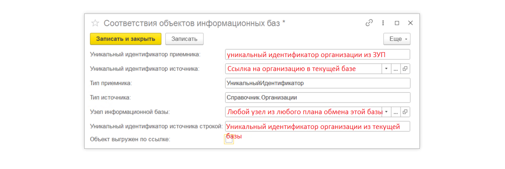
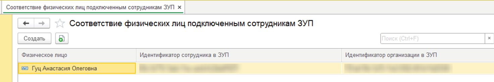
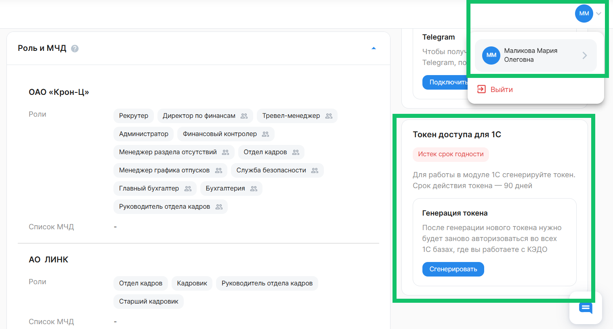
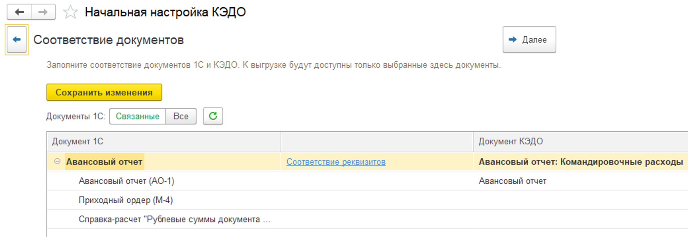
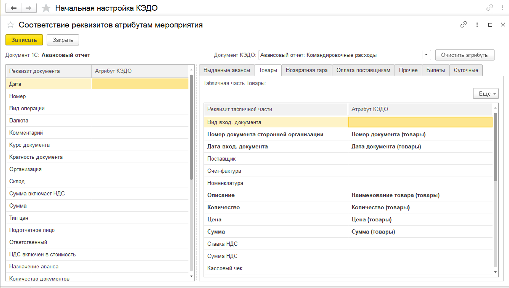
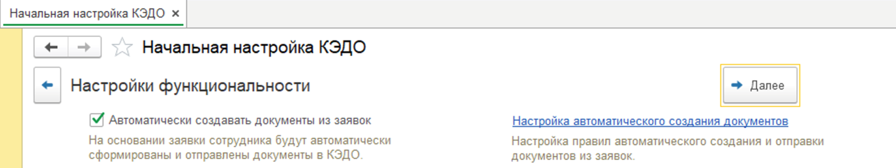
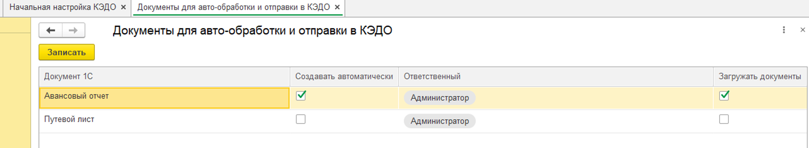
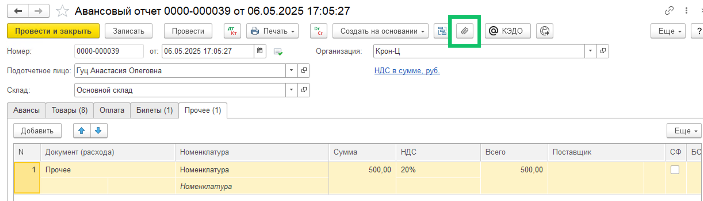
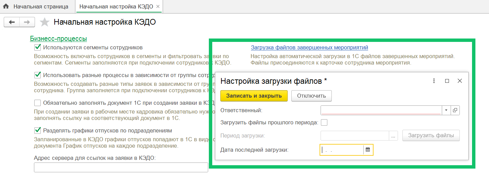

## Шаг 1. Установка расширения 1С КЭДО

1. Установите расширение 1С КЭДО на вашу базу 1С УХ или 1С ERP.
1. После установки расширения напишите вашему менеджеру VK HR Tek и получите токен интеграции для подключения расширения к КЭДО.
1. Введите токен и дождитесь информации об успешном подключении.
1. Проверьте, что в базе 1С разрешено действие регламентных заданий КЭДО.
1. Пользователь с ролью «Администратор» должен заполнить регистр **Соответствия объектов информационных баз.**

## Шаг 2. Подключение пользователей

1\. Настройте регистр сопоставления идентификаторов сотрудников из 1С ЗУП и физических лиц из 1С УХ. Сделать это необходимо в разделе **КЭДО → Соответствие физических лиц подключенным сотрудникам ЗУП**.

 

2\. Пользователь с ролью «Администратор» должен выдать роли пользователям, участвующим в бизнес-процессе «Авансовый отчёт», в разделе **Настройки → Роли сотрудников** веб-сервиса. 

3\. Пользователям должны быть выданы соответствующие группы доступа к КЭДО (выполняется в разделе **КЭДО → Начальная настройка → Настройки функциональности →** настройка **Пользователи подсистемы КЭДО**).

4\. Пользователь, от имени которого будет автоматически создаваться документ «Авансовый отчёт», должен зайти в **КЭДО → Рабочее место кадровика** и ввести туда свой личный токен.

У этого пользователя должна быть роль, которая указана на этапе автоматического создания «Авансового отчёта». 

Рекомендуем указывать одну роль в качестве ответственного лица в момент настройки автосоздания документа «Авансовый отчёт».   

Каждый пользователь получает токен в Личном кабинете КЭДО в своём **Профиле**. 

## Шаг 3. Начальная настройка КЭДО

1\. Перейдите в **КЭДО → Начальная настройка** и выполните настройку соответствия документов 1С и бизнес-процессов КЭДО. Принцип следующий: 

1\) Сопоставьте документ 1С и бизнес-процесс в КЭДО (жирные строчки).

 

2\) Выполните сопоставление печатной формы 1С и документа из бизнес-процесса в КЭДО. Эта настройка нужна для отправки печатной формы в заявку в КЭДО.
   
3\) Заполните соответствие реквизитов 1С и атрибутов из заявки, на основе которых будет заполняться автоматически создаваемый документ 1С. 

<warn>

Проверьте, что сопоставлены все поля из всех табличных частей, необходимых для заполнения документа «Авансовый отчёт».

Каждый вид платежного документа должен попадать в табличную часть «Авансового отчёта», в которую НЕ попадают никакие другие платежные документы, т.е. каждый документ попадает в свою табличную часть.

</warn>

 

2\. Перейдите к следующему разделу начальных настроек **Настройки функциональности** и включите флаг «Автоматически создавать документы из заявок».

 

3\. Перейдите к **Настройке автоматического создания документов**, установите флаг **Создавать автоматически** напротив документа «Авансовый отчёт» и укажите ответственное лицо. Ответственным должен быть пользователь 1С с ролями, участвующими в бизнес-процессе КЭДО, с введенным токеном пользователя в **Рабочем месте кадровика**. 

Рекомендуем указывать одну роль в качестве ответственного лица. 

 

Если включить опцию **Загружать документы** напротив документа «Авансовый отчёт», то для просмотра в автосозданном документе 1С «Авансовый отчёт» станут доступны вложенные платёжные документы из заявки «под скрепкой».

 

4\. Для автоматической загрузки подписанных документов «под скрепку» к документу 1С можно включить настройку **Загрузка файлов завершенных мероприятий**, указав в форме ответственного.

<warn>

Автоматическое создание авансового отчёта происходит на этапе загрузки авансового отчёта ролью «Финансовый контролер». На этом этапе из сохраненного и проведенного документа 1С «Авансовый отчёт» можно нажать кнопку **КЭДО** и выполнить отправку печатной формы в заявку.

</warn>