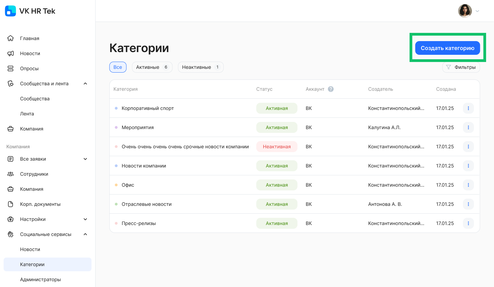
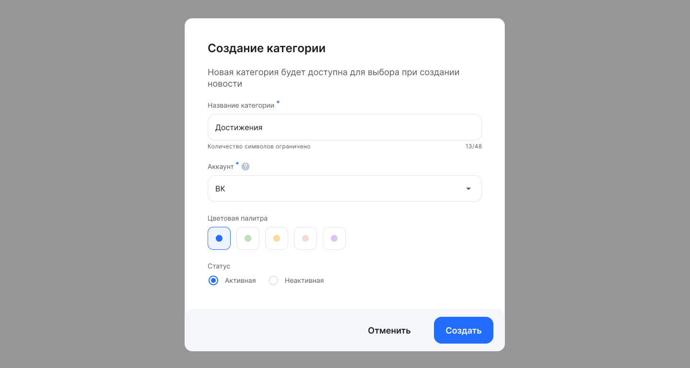
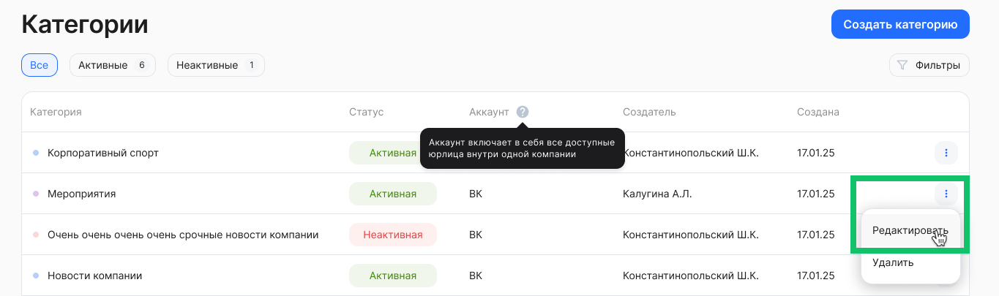
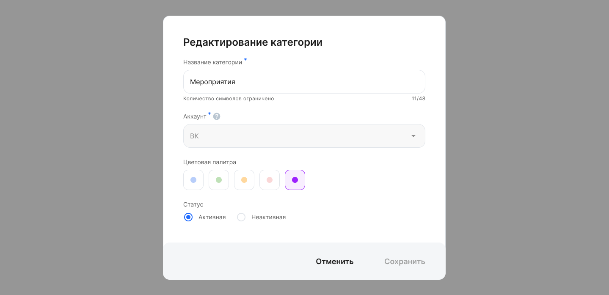
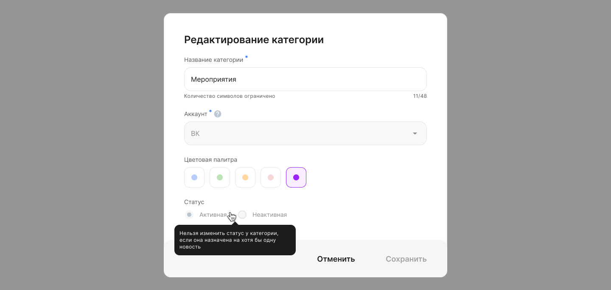
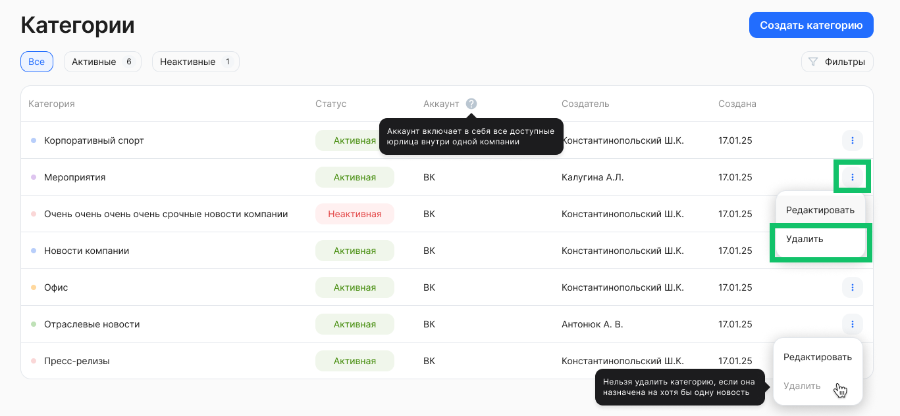
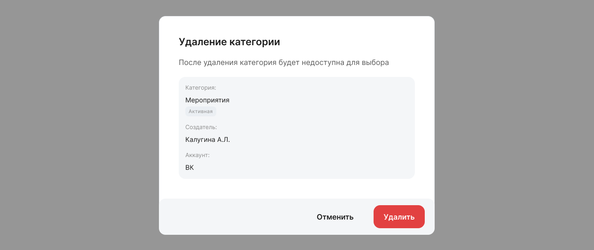
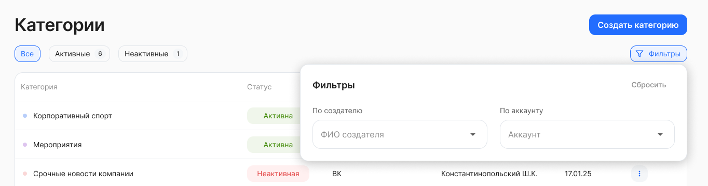

Пользователи с ролями «Администратор модуля Портал» и «Автор новостей» могут создавать, редактировать и удалять категории новостей в разделе **Социальные сервисы → Категории**.

<warn>

Перед тем как создать новость, обязательно создайте хотя бы одну категорию. 

</warn>

## Создание категории

Чтобы создать категорию, перейдите в раздел **Социальные сервисы → Категории**, нажмите кнопку **Создать категорию**. Новая категория будет доступна для выбора при создании новости.

 

На форме **Создание категории** заполните следующие поля:

* **Сервис.** Выберите один социальный сервис, к которому будет относится создаваемая категория (при наличии доступа к более чем одному сервису).  
* **Название категории**. Обязательное поле. Название не должно превышать 48 символов.  
* **Аккаунт**. Обязательное поле. Если Администратор имеет доступ к нескольким аккаунтам, то выберите одно наименование аккаунта. В ином случае аккаунт будет предвыбран, если у Администратора есть доступ только к одному аккаунту.   
* **Цветовая палитра**. Обязательное поле. Выберите один из представленных цветов для категории.  
* **Статус**. Выберите один из статусов: **Активная** или **Неактивная**.

Сохраните внесённые данные.

## Редактирование категории

Чтобы отредактировать ранее созданную категорию, напротив нужной категории выберите действие **Редактировать**.

 

На форме **Редактирование категории** можно изменить значения для следующих параметров: 

* **Название категории**. Название не должно превышать 48 символов.  
* **Цветовая палитра**. Выберите один из представленных цветов для категории.  
* **Статус**. Выберите один из статусов: **Активная** или **Неактивная**. Переключение статусов будет недоступно в случае, если редактируемая категория уже назначена хотя бы на одну новость. 

После завершения редактирования, сохраните внесённые изменения.  

 

## Удаление категории

Перейдите к списку категорий и напротив категории, которую хотите удалить, нажмите кнопку   и **Удалить**. Подтвердите удаление.

Если категория уже была назначена хотя бы на одну новость, эту категорию удалить нельзя. Чтобы удаление этой категории стало доступно, при редактировании новости замените в ней эту категорию на любую другую. 

 

## Применение фильтров

Для вашего удобства предусмотрена настройка отображения списка категорий. Нажмите на кнопку **Фильтры**. Откроются поля для редактирования фильтра с выбором значений из выпадающего списка.

Доступны следующие фильтры:

* **По создателю** — выбор одного или нескольких значений из предложенного списка с возможностью текстового поиска по ФИО.  
* **По аккаунту** — в случае если у вашего пользователя есть доступ к нескольким аккаунтам, то в этом фильтре можно выбрать все аккаунты или один из них.

