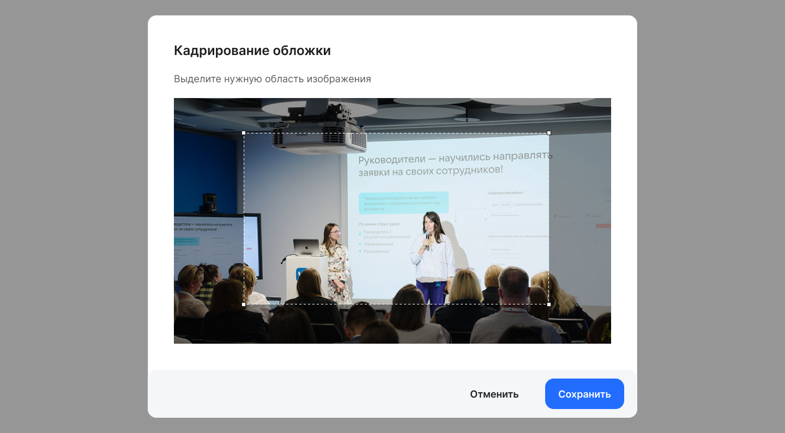

## Заполнение описания и содержания новости

Чтобы создать новость, перейдите в раздел **Социальные сервисы → Новости**, нажмите кнопку **Создать новость** и в случае если Администратору доступно управление в нескольких группах аккаунтов — выберите аккаунт, от лица которого будет опубликована новость.   

В блоке **Основная информация** заполните следующие поля:

* **Название новости**. Обязательное поле. Название не должно превышать 120 символов.  
* **Анонс новости**. Необязательное поле. Анонс не должен превышать 600 символов.  
* **Обложка**. Обязательное поле. Чтобы загрузить обложку, нажмите кнопку . Далее выделите нужную область загружаемого изображения и сохраните изменения.

<info>

Правила загрузки обложки: 
* Допустимые форматы изображений: JPEG, PNG, HEIF, WEBP, DMG.
* Изображение не должно превышать 10 МБ. 
* Соотношение сторон обложки 16:9. 
* Минимальный размер изображения 918 х 516 пикселей. 

</info>

* **Категория**. Обязательное поле. Выберите одну категорию из выпадающего списка.  
* **Теги**. Необязательное поле. Придумайте свои теги — ключевые слова, с помощью которых пользователи будут ориентироваться в теме новости. 

В блоке **Содержание новости**, в поле текстового редактора напишите текст новости и добавьте к нему необходимые сопроводительные материалы: изображения, видео, файлы, таблицы и другие элементы. Текст новости не должен превышать 20 000 символов. 

Возможности оформления содержания новости:

* Обычный текст, жирный/курсив/подчеркнутый/зачеркнутый.  
* Текст с фоном.  
* Выделенный текст и заголовки.  
* Подстрочный текст.  
* Надстрочный текст.  
* Изображения и изображения с подписью .  
* Карусель с изображениями (не более 10 штук) и изображения с подписями.  
* Видео и видео с подписью.  
* Прикрепленный файл с возможностью скачать.  
* Исходный код.  
* Маркированный список.  
* Нумерованный список.  
* Ссылка.  
* Цитата.  
* Таблица.  
* Справка.  
* Спецсимволы.

Изображения в содержимом новости должны соответствовать условиям: 

* типы файлов: JPEG, PNG, HEIF, WEBP, DMG.  
* максимальный вес файла 10 мегабайт.

Файлы в содержимом новости должны соответствовать условиям:

* типы файлов: PDF, DOCX, XLSX, CSV.  
* максимальный вес одного файла 10 мегабайт.

Чтобы просмотреть добавляемую новость так, как увидят её другие пользователи сервиса, нажмите на кнопку **Предпросмотр**.

Если в просматриваемой новости найдены какие-то ошибки или недочёты, вы можете внести изменения в блок **Основная информация** и **Содержание новости**. После этого можно сохранить черновик новости по кнопке **Сохранить как черновик** или перейти к настройкам публикации по кнопке **Далее**.

## Настройки публикации новости

После заполнения описания и содержания новости перейдите к настройкам публикации. 

В блоке **Настройки доступов** настройте следующие параметры:

* **Кто может просматривать новость**. Настройка ограничивает отображение новости у выбранных подразделений и сотрудников в новостной ленте и по ссылке.  
  * При выборе варианта **Все сотрудники** новость будет доступна всем сотрудникам аккаунта или компаний, доступ к которым разрешен Администратору.  
  * Если был выбран вариант **Некоторые сотрудники**, то новость станет доступна только отдельным **группам сотрудников** в компании или в отдельных подразделениях, доступ к которым разрешен Администратору.

В зависимости от доступа Администратора в блоке **Группа сотрудников** выберите:

* **Юрлицо**. Выберите одну компанию из списка. Если Администратор имеет доступ только к одному юрлицу, то поле будет заполнено автоматически.   
* **Тип оргструктуры**. Доступны варианты для выбора:  
  * **Все.** Новость будет доступна сотрудникам всех подразделений компании вне зависимости от типа оргструктуры.  
  * **Юридическая.** В поле **Подразделение** выберите одно подразделение. Если требуется добавить доступ для еще одного подразделения, то добавьте новый блок с группой сотрудников. Если надо назначить доступ на всю оргструктуру, то выберите верхнее в иерархии подразделение.  
  * **Управленческая.** В поле **Подразделение** выберите одно подразделение. Если требуется добавить доступ для еще одного подразделения, то добавьте новый блок с группой сотрудников. Если надо назначить доступ на всю оргструктуру, то выберите верхнее в иерархии подразделение.

При необходимости добавьте еще один блок с группой сотрудников.

Если добавлено больше одного блока **Группа сотрудников**, то любой из блоков станет доступен для удаления. Для этого нажмите кнопку . 
  

В блоке **Настройки публикации** настройте следующие параметры:

* **Показывать автора новости**. По умолчанию выбран вариант **Да**. В этом случае ФИО автора будет отображаться после контента новости.  
* **Показывать черновик авторам новостей**. По умолчанию установлено **Да**. Настройка позволяет скрывать/отображать черновик новости для остальных авторов.  
* **Выберите действие с новостью**. Для выбора доступно три варианта:   
  * **Сохранить как черновик**. После сохранения новость появится только в разделе **Социальные сервисы → Новости** и будет доступна автору новости и другим администраторам, у которых есть доступ к этой новости.

  
  
  * **Опубликовать**. Возможность публикации на портале как новой (создаваемой) новости, так и ранее сохраненного черновика новости. После публикации новость отображается в разделе **Новости**.

  

  * **Задать дату публикации**. Возможность отложенной публикации новостей. Для отложенной публикации новости указывается дата и время публикации. При наступлении указанной даты и времени новость отображается в разделе **Новости**.   
  Допустимо указывать прошедшие дату и время. В этом случае новость будет опубликована задним числом и появится в разделе **Новости** сразу же после нажатия кнопки **Сохранить и опубликовать**.

  

В блоке **Дополнительно** доступны для выбора настройки:

* **Отметить новость как важную**. Включите опцию, если требуется, чтобы новость была отмечена как важная .    
* **Разрешить комментирование**. По умолчанию опция включена. Отключите опцию, если требуется запретить комментирование и показ комментариев под новостью.   
* **Разрешить проставление реакций**. По умолчанию опция включена. Отключите опцию, если требуется запретить комментирование и показ реакций под новостью.