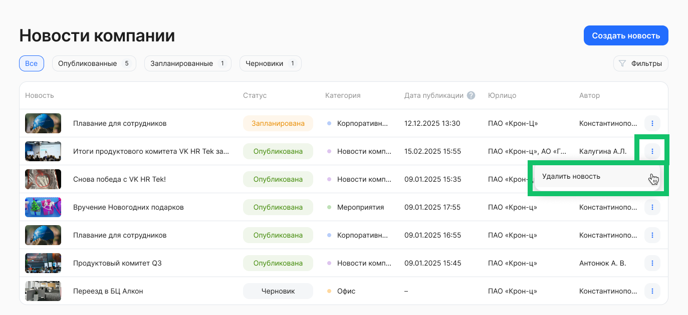
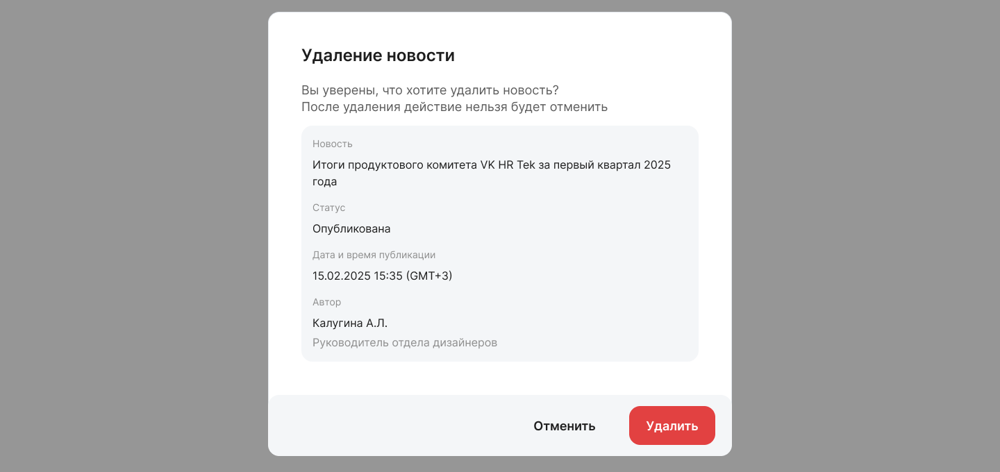
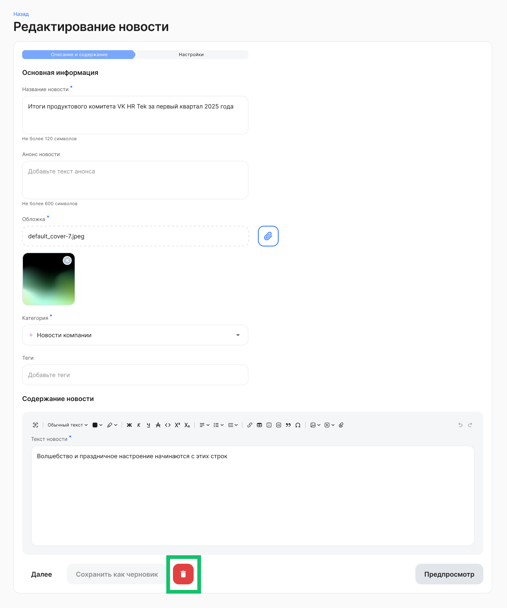
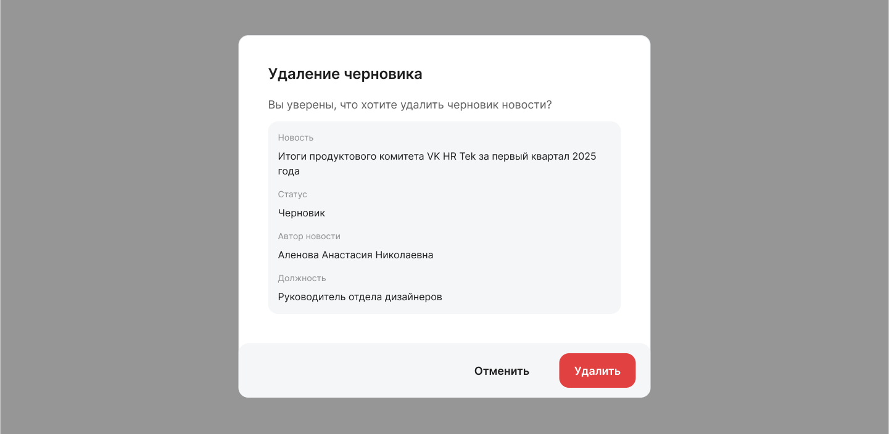

В разделе **Социальные сервисы → Новости** можно удалить новость двумя способами:

1. Перейдите к списку новостей и напротив новости, которую хотите удалить, нажмите кнопку   и **Удалить**. Подтвердите удаление.

2. Откройте новость, которую хотите удалить, нажмите кнопку . Подтвердите удаление.

