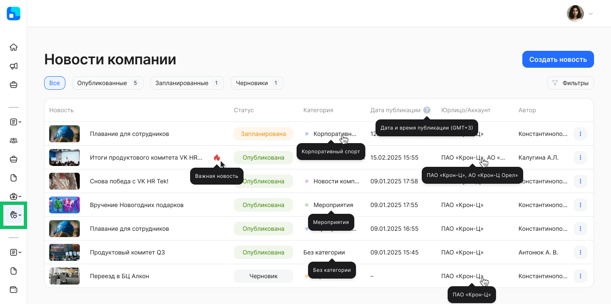
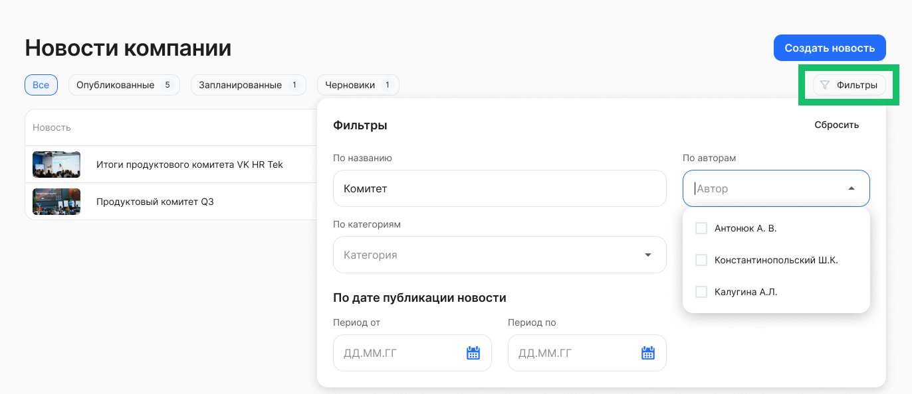

Чтобы получить доступ к разделу **Социальные сервисы → Новости**, представителю компании должна быть выдана роль **Администратор модуля Портал.** Подробнее о назначении роли см. в статье [Роли сотрудников в компании](/ru/admin_actions/settings/groups).

В разделе доступны списки для просмотра и редактирования:

* опубликованных новостей,  
* запланированных для публикации новостей,  
* черновиков новостей.

Каждая запись о новости в списке содержит следующие сведения:

* **Новость**. Название новости и отметка важности (при наличии).   
* **Статус**. У новости может быть один из трёх статусов в зависимости от того, как она была настроена и сохранена. Возможные статусы: *Опубликована, Запланирована, Черновик*.   
* **Категория**. Название категории, которая была присвоена новости.  
* **Дата публикации**. Дата и время публикации по МСК.  
* **Юрлицо/Аккаунт**. Наименование компании или группы компаний, для сотрудников которой доступна новость.  
* **Автор**. Фамилия и инициалы сотрудника, который создал первую версию новости и сохранил её. 

Чтобы просмотреть полное название новости, категории или другого значения из списка, наведите курсор на это название. 

## Применение фильтров

Для вашего удобства предусмотрена настройка отображения списка новостей. Нажмите  кнопку **Фильтры**. Откроются поля для редактирования фильтра с заполнением и выбором значений из выпадающего списка.

Для новостей доступны следующие фильтры:

* **По названию** — ввод слова от одного символа или фразы для поиска новости.  
* **По категориям** — выбор одного или нескольких значений из предложенного списка с возможностью текстового поиска по категориям.  
* **По авторам** — выбор одного или нескольких значений из предложенного списка с возможностью текстового поиска по авторам.  
* **Важность** — выбор одного значения из списка: *Все* или *Только важные*.  
* **По дате публикации новости** — выбор любой даты из открывшегося календаря. При этом нет необходимости указывать весь период: можно выбрать дату, до или после которой были опубликованы новости.

В момент применения фильтров происходит поиск новостей и список автоматически обновляется.

При необходимости вы можете сбросить любой из установленных параметров:

* если параметр предполагает одно значение, то нажмите  справа от этого значения;  
* если параметр предполагает множественный выбор, то откройте список вариантов и снимите галочки у соответствующих чекбоксов;  
* для сброса даты кликните на дату и нажмите **Сбросить** внизу открывшегося календаря.

Чтобы сбросить сразу все параметры фильтра, нажмите кнопку **Сбросить** в правом верхнем углу формы.

Для выхода из формы установки фильтра нажмите на любое место на странице за пределами этой формы. Список новостей на странице будет отображаться с учетом настроенного фильтра.