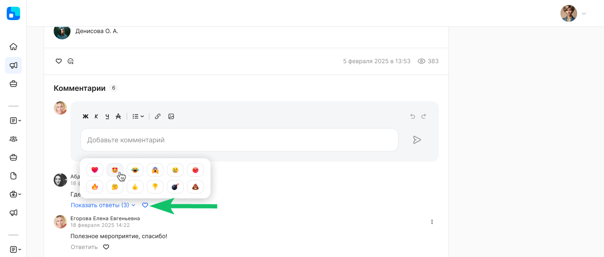

Пользователи могут обсуждать (комментировать) новости, если такая возможность разрешена Администратором. 

Чтобы добавить комментарий, перейдите в конец новости и в поле комментария введите текст, добавьте ссылку или изображение. Нажмите кнопку отправки комментария. 

<info>

Максимальное количество символов в комментарии – 3 000. После достижения максимума символов дальнейший ввод недоступен. 

</info>

Если комментарий содержит много символов, то для его полного просмотра нажмите кнопку **Показать больше**. 

Если комментариев к новости больше 20, то для просмотра следующих комментариев нажмите кнопку **Показать еще**.

Если к комментарию были оставлены ответы пользователей, то для их просмотра нажмите кнопку **Показать ответы**. 

Пользователи могут редактировать и удалять свои комментарии. 

По завершении редактирования рядом с датой комментария появится отметка «отредактирован». 

После удаления комментария вместо него будет отображаться метка «Комментарий удален», а на месте ФИО пользователя указан текст «Неизвестный сотрудник». Ответы на комментарий при наличии отображаются.

По умолчанию комментарии пользователей сортируются от старых к новым.

Если одновременно с вами другие пользователи добавили комментарии, то они отобразятся после обновления страницы с новостью. 

Чтобы написать ответ на комментарий, нажмите кнопку **Ответить** под нужным комментарием, введите текст и/или добавьте ссылку/картинку и нажмите кнопку отправки. 

Чтобы просмотреть комментарий, к которому был оставлен ответ, нажмите на отметку «Ответ сотруднику …» рядом с датой ответа.

Для просмотра и простановки реакции к комментарию наведите курсор на значок , если реакций от других пользователей еще не было проставлено, или на список уже имеющихся у комментария реакций и нажмите на нужный значок реакции.  

