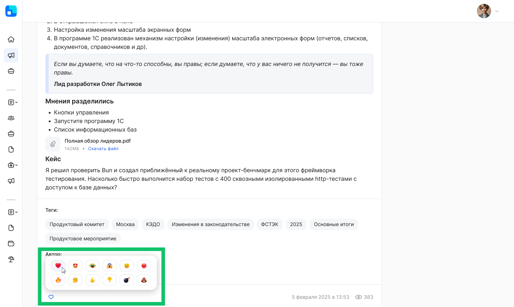
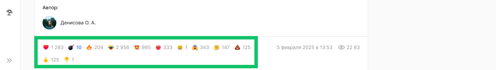
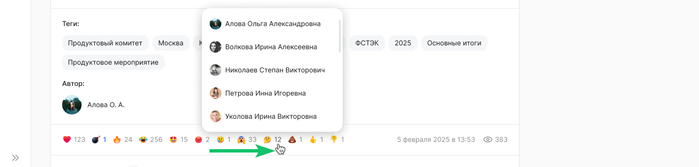

Для оценки новости пользователь может проставлять реакции, если такая возможность разрешена Администратором новостей. 

Список возможных реакций: 

<info>

Набор реакций настраивается на уровне инсталляции  

</info>

Пользователь может удалить ранее проставленную свою реакцию на новость.

Также пользователь может проставлять или удалять реакции в комментариях к новости.

<info>

Пользователь может оставить только одну реакцию на новость и комментарии 

</info>

Для просмотра и простановки реакции наведите курсор на значок , если реакций от других пользователей еще не было проставлено, или на список уже имеющихся у новости реакций и нажмите на нужный значок реакции.  

Удаление реакции происходит при повторном нажатии на проставленную реакцию.

Если пользователи уже отреагировали на новость, то около каждой реакции появится счётчик.

При наведении курсора на число около реакции появится список пользователей, которые проставили реакции, в разбивке с проставленными реакциями и количеством оставленных реакций.

