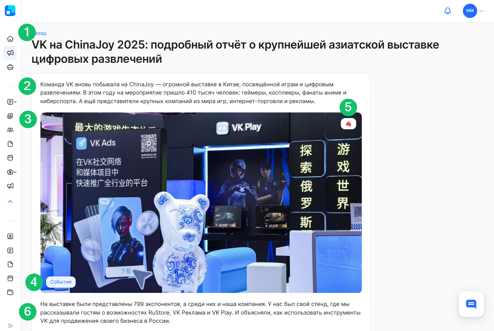
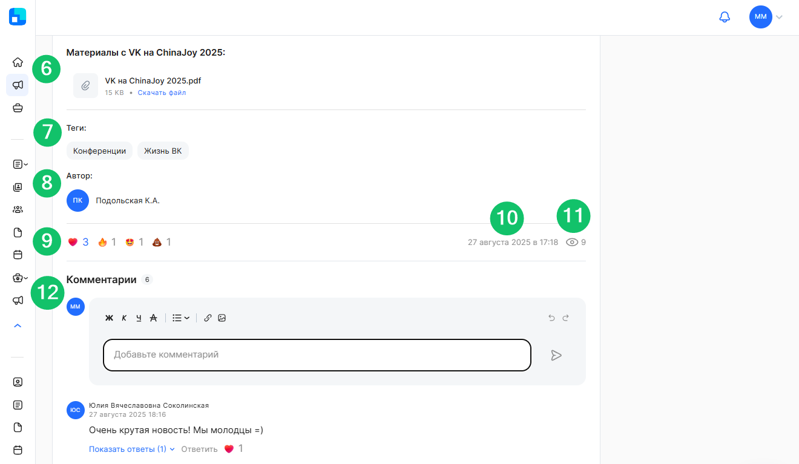
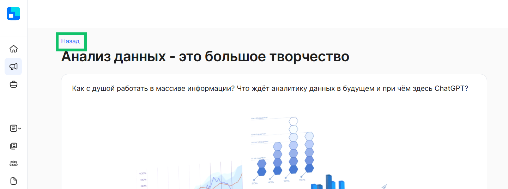
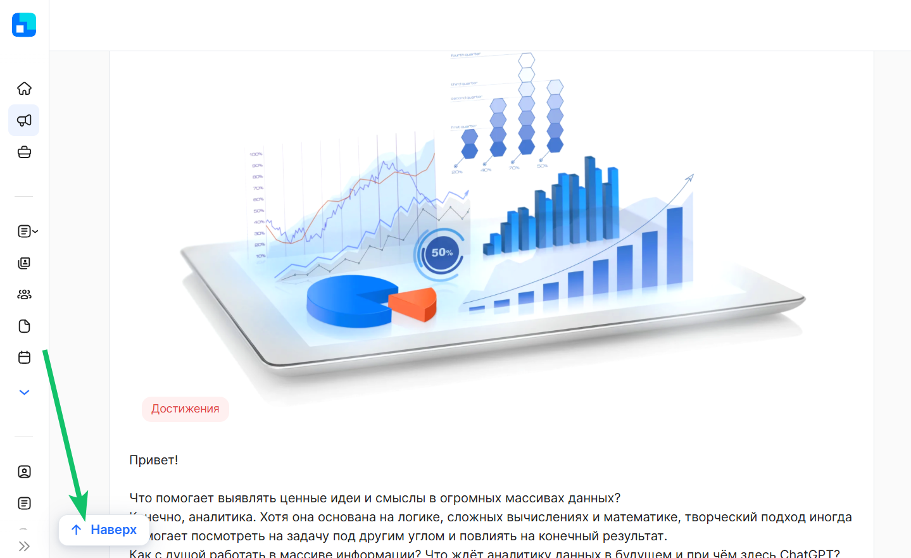

При нажатии на любую область новости в разделе **Новости** произойдёт переход на страницу выбранной новости. 

В случае перехода к новости  по прямой ссылке, если у пользователя нет прав доступа к этой новости, появится сообщение об отсутствии прав доступа.

На странице новости отображается следующая информация: 

1. Заголовок новости.  
2. Анонс новости (может отсутствовать).  
3. Обложка новости.  
4. Категория новости.  
5. Признак важности новости (если данный признак указан у новости).  
6. Содержимое новости (текст, изображение, видео, файлы).  
7. Теги новости. Может быть как несколько тегов в статье, так и отсутствовать.  
8. Автор новости. Если включена соответствующая настройка для новости, то в новости будет указано ФИО автора с аватаром.  
9. Реакции (если к новости разрешено оставлять реакцию).  
10. Дата и время публикации новости в формате «ДД месяц ГГГГ в ЧЧ:ММ». Например, «11 октября 2024 в 13:55».  
11. Количество уникальных просмотров новости.  
12. Поле для ввода комментария с редактором текста, область для просмотра ранее оставленных комментариев пользователей и количества комментариев (если разрешено комментирование статьи).

**Основной текст новости** может содержать следующий тип контента:

* Обычный текст, жирный/курсив/подчеркнутый/зачеркнутый.  
* Текст с фоном.  
* Выделенный текст и заголовки.  
* Подстрочный текст.  
* Надстрочный текст.  
* Изображения и изображения с подписью .  
* Карусель с изображениями (не более 10 штук) и изображения с подписями.  
* Видео и видео с подписью.  
* Прикрепленный файл с возможностью скачать.  
* Исходный код.  
* Маркированный список.  
* Нумерованный список.  
* Ссылка.  
* Цитата.  
* Таблица.  
* Справка.  
* Спецсимволы.

Пользователь может **вернуться назад** к просмотру списка новостей, нажав кнопку **Назад**. При переходе в конкретную новость и затем при возврате обратно в список новостей, параметры фильтрации сохранятся. Если пользователь перешёл к новости по прямой ссылке, кнопка **Назад** также отображается.

Также пользователь может вернуться к началу статьи. Если содержимое новости больше, чем предусмотрено отображением на одной странице, и пользователь прокручивает статью, то можно быстро вернуться к началу новости с помощью кнопки **Наверх**.  

