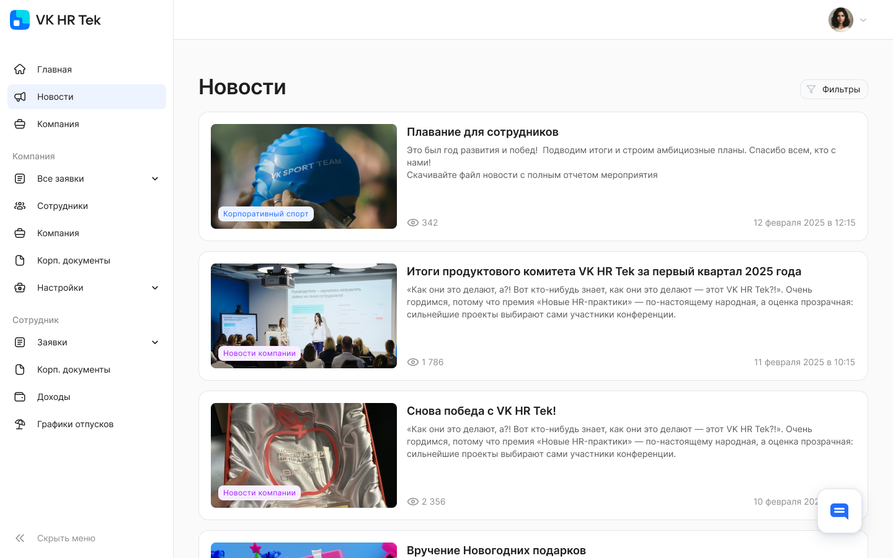
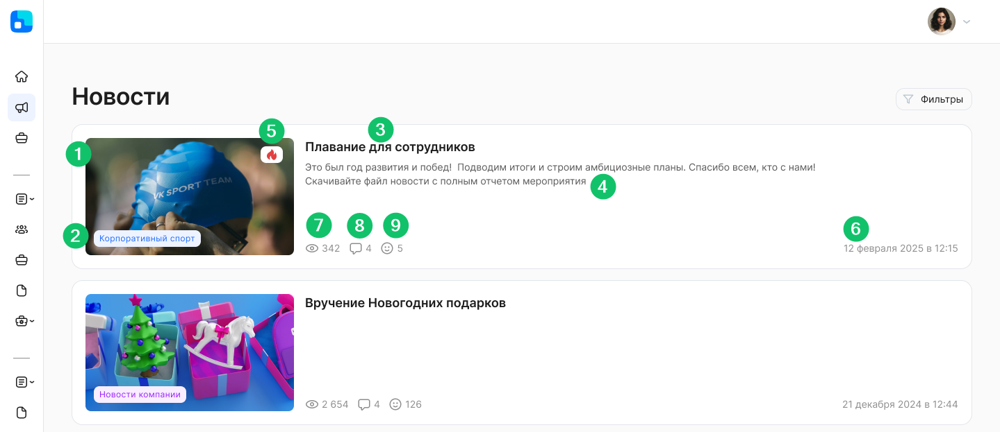
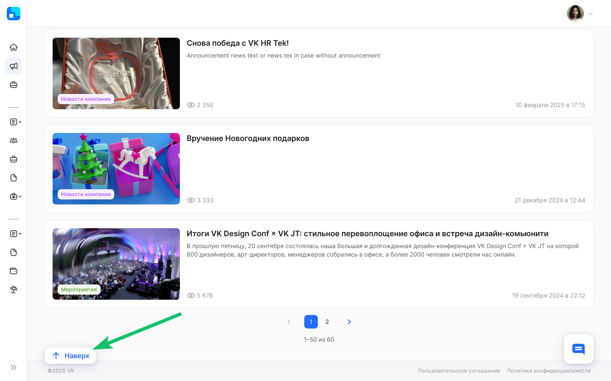
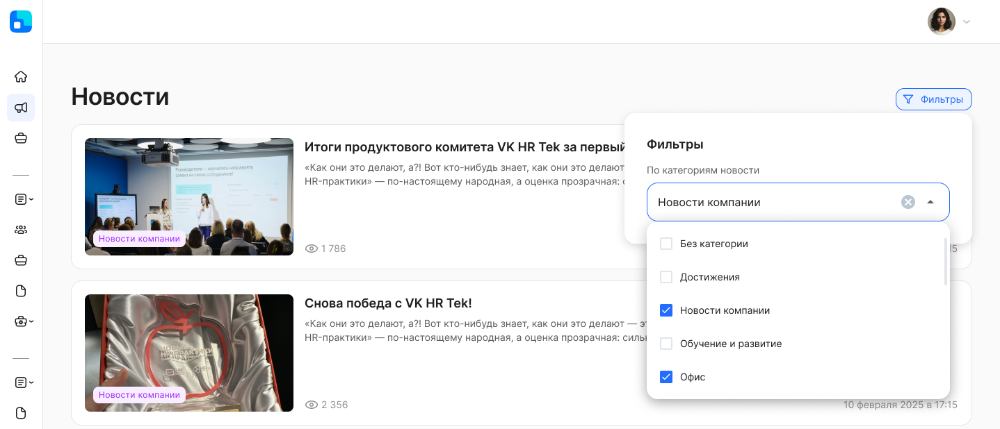

Раздел **Новости** имеет вид новостной ленты, состоящей из статей, с содержанием которых можно ознакомиться на отдельной странице.

Новостные статьи отсортированы по новизне публикации.

В списке новостей отображаются только те новости, которые доступны пользователю по правам доступа. Видимость новости настраивается на уровне компании или подразделения.

По каждой новости в списке новостей отображается следующая информация (блок краткой информации о новости):  

1. Обложка новости.  
2. Категория новости.  
3. Заголовок новости.  
4. Анонс новости (может отсутствовать).   
5. Признак важности новости (если данный признак указан у новости).  
6. Дата и время публикации новости в формате «ДД месяц ГГГГ в ЧЧ:ММ». Например, «11 октября 2024 в 13:55».  
7. Количество уникальных просмотров новости.  
8. Количество комментариев новости (если новость разрешено комментировать).  
9. Количество оставленных реакций на новость (если на новость разрешено оставлять реакцию).

Если на одной странице находится более 50 новостей, то список новостей будет разделён на несколько отдельных страниц.

Пользователю доступны следующие действия в разделе **Новости**:

1. Фильтрация новостей по категории.  
2. Просмотр страницы интересующей новости — при нажатии на любую область новости произойдёт переход на страницу выбранной новости.  
3. Возврат к началу списка новостей. Если количество опубликованных новостей в разделе больше, чем предусмотрено отображением на одной странице, и пользователь прокручивает список новостей, то можно быстро вернуться к началу списка новостей с помощью кнопки **Наверх**.

## **Фильтрация новостей по категории** 

Пользователь может фильтровать общую новостную ленту по одной или нескольким категориям.

В фильтре отображается весь список существующих категорий. Список отсортирован в алфавитном порядке (от А до Я).

В случае если пользователь выбрал несколько категорий для фильтрации, то отображаются статьи по всем этим выбранным категориям (при условии их изначального наличия в новостной ленте).

Пользователь может сбросить выбранные фильтры, если нажмёт кнопку **Сбросить** или наведёт курсор на поле со значениями и нажмёт на кнопку .

При переходе в конкретную новость, а затем при возврате обратно в список новостей по кнопке **Назад**, параметры фильтрации сохраняются.

