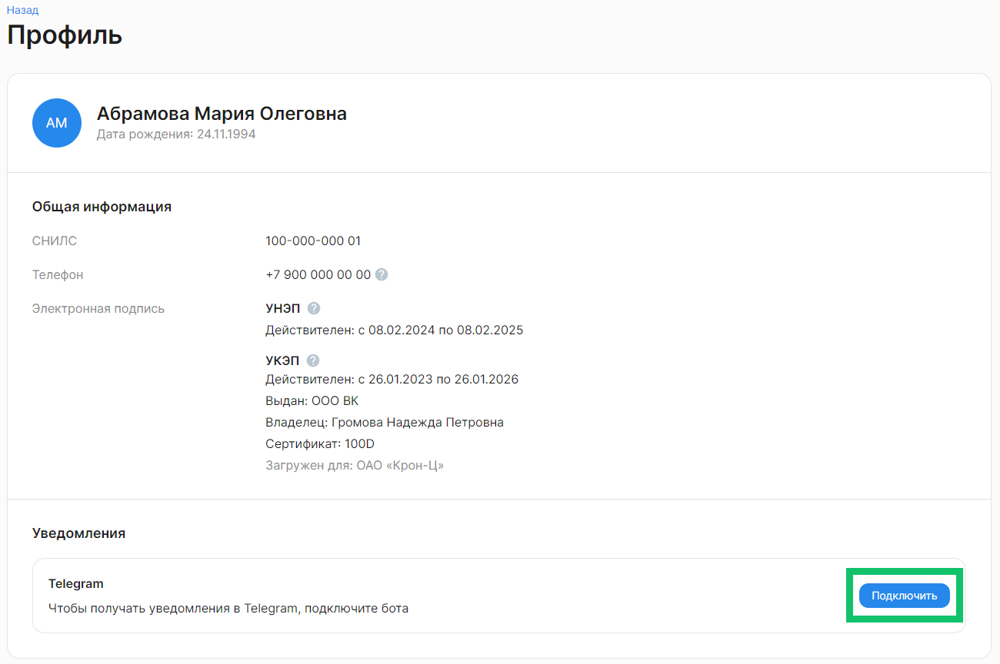

В сервисе реализована автоматическая отправка уведомлений по разным каналам связи: СМС, электронная почта, Telegram.

Уведомления, которые получают пользователи от сервиса VK HR Tek, отправляются только с электронных адресов:
- **no-reply@vkdoc.mail.ru**
- **robot@mlrmr.com**

Если уведомления от сервиса не приходят, попробуйте добавить эти адреса в список доверенных (белый список). 

Уведомления сервиса VK HR Tek могут поступать разным группам пользователей: сотрудникам, кандидатам, представителям компании, руководителям. 

## Дефолтные уведомления

По умолчанию для разных групп пользователей предусмотрены следующие уведомления:

| | | | | | |
|-|-|-|-|-|-|
|**Группа**|**Событие, предшествующее отправке уведомления**|**Тема уведомления**|**СМС**|**Email**|**Время отправки (МСК)**|
|Сотрудник|У сертификата УНЭП статус "Выпущен"|Успешный выпуск УНЭП|Да|Нет|с 9:00 до 21:00|
|Сотрудник|Изменились паспортные данные пользователя|Автоматический перевыпуск УНЭП из-за изменения паспортных данных сотрудника|Да|Нет|с 9:00 до 21:00|
|Сотрудник|Истек срок действия сертификата |Автоматический перевыпуск УНЭП из-за истечения срока годности УНЭП|Да|Нет|с 9:00 до 21:00|
|Сотрудник|Сотрудник добавлен в компанию + отправлено приглашение|Приглашение сотруднику зарегистрироваться в КЭДО|Да|Да|с 9:00 до 21:00|
|Сотрудник|	Регистрация в КЭДО: смена телефона|Изменение номера телефона в сервисе HR Tek|Да|Да|с 9:00 до 21:00|
|Сотрудник|Активный этап заявки перешел на сотрудника и действие, которое привело к этому этапу, выполнено другим пользователем|Переход активного этапа заявки на сотрудника|Да|Да, если указан email для инвайтов|с 9:00 до 21:00|
|Сотрудник|Есть заявка с активным этапом на сотруднике пользователя|Заявки на сотруднике|Да|Да, если указан email для инвайтов|10:00|
|Кандидат|Этап кандидат-заявки перешел на кандидата, анкета с оффером|Анкета с оффером отправлена на заполнение кандидату|Да|Да|с 9:00 до 21:00|
|Кандидат|Кандидат-заявка успешно завершена|Прием документов успешно завершен|Да|Да|с 9:00 до 21:00|
|Кандидат|Этап кандидат-заявки перешел на кандидата, анкета без оффера|Анкета отправлена на заполнение кандидату|Да|Да|с 9:00 до 21:00|
|Представитель компании|До конца срока действия УКЭП осталось N дней|Истечение срока действия УКЭП|Нет|Да|11:00|
|Представитель компании|Есть заявки с активными этапами на группе(ах) пользователя и/или его дочерних группах|Необходимость обработать заявки в КЭДО|Нет|Да|10:00|
|Представитель компании|Есть заявки, отмененные по дедлайну с результатом «Обработать в бумаге»|Необходимость обработать заявки в бумаге|Нет|Да|10:00|
|Представитель компании|Уволен сотрудник пользователя, у которого были группы в компании|Увольнение представителя компании|Нет|Да|с 9:00 до 21:00|
|Представитель компании|Документ был подписан Госключом после отмены заявки|Подписание Госключом после отменя заявки|Нет|Да|с 9:00 до 21:00|
|Представитель компании|Кандидат-заявка перешла на пользователя, который стартовал заявку|Необходимость обработать анкету кандидата в КЭДО|Нет|Да|с 9:00 до 21:00|
|Представитель компании|Кандидат-заявка отменена|Отмена кандидат-заявки|Нет|Да|с 9:00 до 21:00|
|Представитель компании|Есть кандидат-заявки с активными этапами на группе(ах) пользователя и/или его дочерних группах|Необходимость обработать кандидат-заявки в КЭДО|Нет|Да|с 9:00 до 21:00|
|Представитель компании|Есть заявки для планирования графика отпусков с активными этапами на представителе компании|Согласование графиков отпусков на <год планирования> год|Нет|Да|10:00|
|Представитель компании|Истек срок действия токена или осталось Х дней до истечения срока токена|Истек срок действия токена для работы в КЭДО или Токен для работы в КЭДО: осталось <количество дней>|Нет|Да|с 9:00 до 21:00|
|Руководитель|Активный этап заявки подчиненного перешел на его руководителя (по любому методу выбора руководителя)|Переход активного этапа на руководителя|Нет|Да|с 9:00 до 21:00|
|Руководитель|Этап заявки с планированием графика отпусков сотрудника перешел на его руководителя|Согласовать график отпусков на <год планирования> год: <ФИО сотрудника> |Нет|Да|с 9:00 до 21:00|

## Кастомные уведомления

Компания совместно с менеджером ВК может настроить кастомные уведомления. Для этого направьте заполненный файл [Параметры настройки уведомлений](https://cloud.mail.ru/public/2NKM/wZarRZzJK/%D0%9F%D0%B0%D1%80%D0%B0%D0%BC%D0%B5%D1%82%D1%80%D1%8B%20%D0%BD%D0%B0%D1%81%D1%82%D1%80%D0%BE%D0%B9%D0%BA%D0%B8%20%D1%83%D0%B2%D0%B5%D0%B4%D0%BE%D0%BC%D0%BB%D0%B5%D0%BD%D0%B8%D0%B9.xlsx) на адрес поддержки support@hrtek.ru.

Для заполнения файла:
1. Вносите данные в поля, выделенные только зеленым цветом.
2. Укажите название своего юрлица.
3. Выделите цветом необходимые настройки в таблицах для сотрудника, представителя компании, руководителя, корпоративных документов.
4. Для выбранной настройки укажите необходимые данные в зеленой ячейке.
5. Для отправки каждого вида уведомлений можно выбрать один или два канала связи — Email и Telegram. По умолчанию в таблице выделены оба варианта. 
6. Укажите время для рассылки уведомлений (будние дни или будни с выходными).
7. Перечислите бизнес-процессы, по которым будут приходить уведомления. 
8. Сохраните файл. 

По запросу компании разные группы пользователей могут получать по Email и Telegram дополнительные уведомления:

| | | | | | |
|-|-|-|-|-|-|
|**Группа**|**Событие, предшествующее отправке уведомления**|**Тема уведомления**|**Email**|**Telegram**|**Время отправки (МСК)**|
|Сотрудник|Активный этап заявки перешел на сотрудника и действие, которое привело к этому этапу, выполнено другим пользователем|Переход активного этапа заявки на сотрудника|Да|Да|с 9:00 до 21:00|
|Сотрудник|Активный этап заявки на сотруднике и до дедлайна этапа  ><= Х дней (включая сегодняшний день)|Этап на сотруднике До дедлайна ><=Х дней|Да|Да|Настройка времени отправки|
|Сотрудник|Заявка завершена с отменой|Заявка отменена|Да|Да|с 9:00 до 21:00|
|Сотрудник|Выполнилась финишная нода заявки сотрудника (нет активных или завершенных с отменой этапов)|Заявка успешно завершена|Да|Да|с 9:00 до 21:00|
|Сотрудник|Есть версия ЛНА, с которой должен ознакомиться сотрудник|Необходимо ознакомиться с ЛНА|Да|Да|с 9:00 до 21:00|
|Сотрудник|С публикации  версии ЛНА (active_from) прошло Х дней (исключая день публикации, включая сегодняшний) и сотрудник не ознакомился с версией|ЛНА X дней на ознакомлении|Да|Да|Настройка количества дней|
|Сотрудник|Переход активного этапа заявки с планированием графика отпусков на сотрудника|График отпусков на <год планирования> год в <Компания>|Да|Да|с 9:00 до 21:00|
|Сотрудник|Заявка с планированием графика отпусков успешно завершена|Согласован график отпусков на <год планирования> год в <Компания>|Да|Да|с 9:00 до 21:00|
|Сотрудник|Этап заявки с планированием графика отпусков на сотруднике, до дедлайна <= Х дней|Срок планирования графика отпусков подходит к концу|Да|Да|Настройка времени отправки|
|Сотрудник|До окончания срока действия МЧД осталось Х дней|Важно! Истекает срок действия МЧД|Да|Да|Настройка времени отправки|
|Сотрудник|Нет ознакомления с корп. документом|Ознакомление с корпоративными документами компании|Да|Да|с 9:00 до 21:00|
|Сотрудник|Корп. документ X дней на ознакомлении|Ознакомление с корпоративными документами компании|Да|Да|Настройка времени отправки|
|Представитель компании|Есть заявки с активными этапами на группе(ах) пользователя и/или его дочерних группах|Необходимость обработать заявки в КЭДО|Да|Да|Настройка времени отправки|
|Представитель компании|Есть заявки с активными этапами на группе(ах) пользователя|Необходимость обработать заявки в КЭДО (только свои)|Да|Да|Настройка времени отправки|
|Представитель компании|Активный этап заявки перешел на группу пользователя +дедлайн при наличии (для массовых заявок дополнительно обязательное условие — предыдущий этап был на сотруднике)|Необходимо обработать заявку|Да|Да|с 9:00 до 21:00|
|Представитель компании|Этап заявки с планированием графика отпусков перешёл на группу|Согласовать график отпусков на <год планирования> год: <ФИО сотрудника> |Да|Да|с 9:00 до 21:00|
|Представитель компании|Приближается дедлайн этапа на группе в заявке с планированием графика отпусков. Уведомление направляется только для роли «Менеджер графика отпусков» |Согласовать график отпусков на <год планирования> год: <ФИО сотрудника> |Да|Да|Настройка времени отправки|
|Представитель компании|График отпусков успешно завершен. Уведомление направляется только для роли «Менеджер графика отпусков» |Завершен сбор графиков отпусков на <год планирования> год (<Название компании>) |Да|Да|с 9:00 до 21:00|
|Представитель компании|Приближается дедлайн заявок с планированием графика отпусков. Уведомление направляется только для роли «Менеджер графика отпусков» |Сроки планирования графиков отпусков подходят к концу |Да|Да|Настройка времени отправки|
|Представитель компании|До окончания срока действия МЧД осталось Х дней. Уведомление направляется только для роли «Редактор МЧД» |Важно! Истекает срок действия МЧД (список сотрудников)|Да|Да|Настройка времени отправки|
|Представитель компании|Уволен сотрудник с МЧД. Уведомление направляется только для роли «Редактор МЧД» |Важно! Увольняется пользователь с действующей МЧД|Да|Да|с 9:00 до 21:00|
|Представитель компании|Включен доступ по профилями сотрудников|Обратите внимание: включен безопасный доступ по профилями сотрудников|Да|Нет|с 9:00 до 21:00|
|Представитель компании|Отключен доступ по профилями сотрудников|Обратите внимание: отключен безопасный доступ по профилями сотрудников|Да|Нет|с 9:00 до 21:00|
|Представитель компании|Профиль не используется представителями компании|Обратите внимание: профиль не используется представителями компании <Компания>|Да|Нет|с 9:00 до 21:00|
|Представитель компании|Отказ от подписания|Отказ от подписания заявки «<Тип заявки>»|Да|Да|с 9:00 до 21:00|
|Руководитель|Активный этап заявки подчиненного перешел на его руководителя (по любому методу выбора руководителя)|Этап перешел на руководителя|Нет|Да|с 9:00 до 21:00|
|Руководитель|Активный этап заявки подчиненного перешел на его руководителя (по любому методу выбора руководителя) и до дедлайна ><= Х дней (включая сегодняшний)|Этап на руководителе  До дедлайна ><= Х дней|Да|Да|Настройка времени отправки|
|Руководитель|Этап заявки с планированием графика отпусков сотрудника перешел на его руководителя|Согласовать график отпусков на <год планирования> год: <ФИО сотрудника> |Нет|Да|с 9:00 до 21:00|
|Руководитель|Приближается дедлайн подчинённых в заявках с планированием графика отпусков|Сроки заполнения графиков отпусков на <год планирования> год подходят к концу|Да|Да|с 9:00 до 21:00|
|Руководитель|Создано планирование графиков отпусков|Создано планирование графиков отпусков|Да|Да|с 9:00 до 21:00|

 

Чтобы сотрудник смог получать уведомления в Telegram, он должен самостоятельно подключить уведомления от Telegram-бота в **Профиле**. 

## Частота отправки СМС-уведомлений

Лимит на ежедневные повторы уведомлений по этапу заявки без дедлайна — 5 СМС.