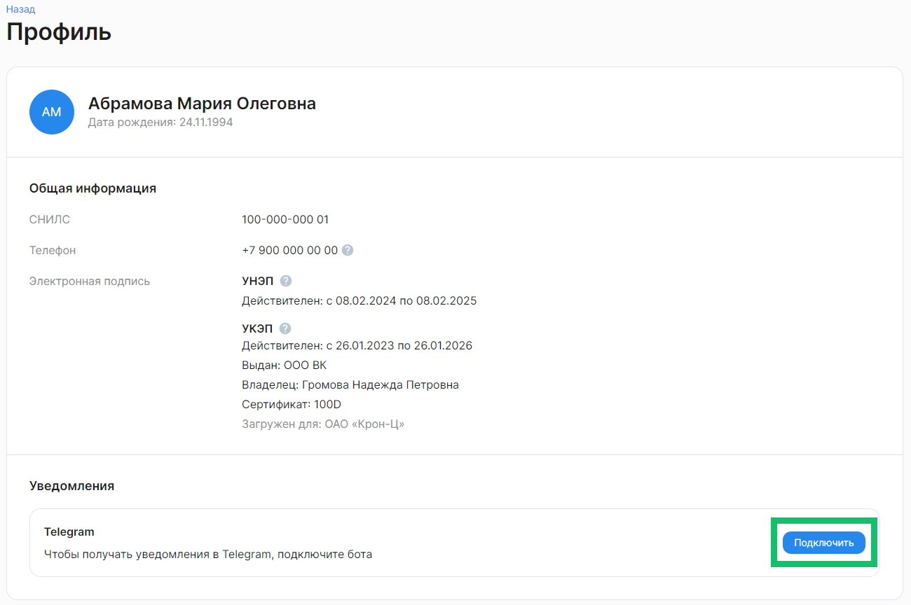
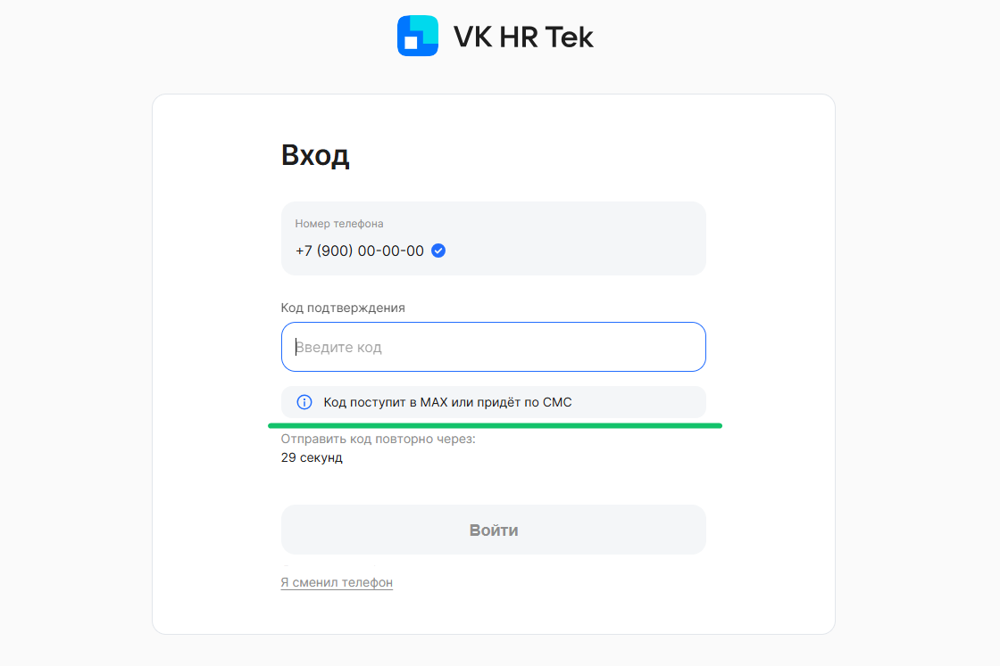

В сервисе реализована автоматическая отправка уведомлений по разным каналам связи: СМС, электронная почта, Telegram.

Уведомления, которые получают пользователи от сервиса VK HR Tek, отправляются только с электронных адресов:
- **no-reply@vkdoc.mail.ru**
- **robot@mlrmr.com**

Если уведомления от сервиса не приходят, попробуйте добавить эти адреса в список доверенных (белый список). 

Уведомления сервиса VK HR Tek могут поступать разным группам пользователей: сотрудникам, кандидатам, представителям компании, руководителям. 

## Дефолтные уведомления

По умолчанию для разных групп пользователей предусмотрены следующие уведомления:

|**Группа**|**Событие, предшествующее отправке уведомления**|**Тема уведомления**|**СМС**|**Email**|**Время отправки (МСК)**|
|-|-|-|-|-|-|
|Сотрудник|У сертификата УНЭП статус "Выпущен"|Успешный выпуск УНЭП|Да|Да|с 9:00 до 21:00|
|Сотрудник|Изменились паспортные данные пользователя|Автоматический перевыпуск УНЭП из-за изменения  паспортных данных сотрудника|Да|Нет|с 9:00 до 21:00|
|Сотрудник|Истек срок действия сертификата |Автоматический перевыпуск УНЭП из-за истечения  срока годности УНЭП|Да|Да|с 9:00 до 21:00|
|Сотрудник|Сотрудник добавлен в компанию + отправлено приглашение|Приглашение сотруднику зарегистрироваться в КЭДО|Да|Да|с 9:00 до 21:00|
|Сотрудник|	Необходимо подтвердить выпуск УНЭП на Госуслугах|Подтвердите выпуск УНЭП на Госуслугах|Да|Да|с 9:00 до 21:00|
|Сотрудник|	Регистрация в КЭДО: смена телефона|Изменение номера телефона в сервисе HR Tek|Да|Да|с 9:00 до 21:00|
|Сотрудник|Активный этап заявки перешел на сотрудника и действие,  которое привело к этому этапу, выполнено другим пользователем|Переход активного этапа заявки на сотрудника|Да|Да, если указан  email для инвайтов|с 9:00 до 21:00|
|Сотрудник|Заявка отменена|Необходимо подписать в отделе кадров документы для заявки  «{Название типа заявки} с {даты начала} по {дату окончания}»!|Да|Да, если указан  email для инвайтов|с 9:00 до 21:00|
|Сотрудник|Есть заявка с активным этапом на сотруднике пользователя|Активный этап заявки на сотруднике|Да|Да, если указан  email для инвайтов|10:00|
|Сотрудник|Активный этап заявки с графиком отпусков перешёл  на сотрудника (график отпусков)|График отпусков на {номер года} год  в {Название компании}|Да|Да, если указан  email для инвайтов|с 9:00 до 21:00|
|Сотрудник|Возврат на доработку сотруднику|Вернули на доработку «{Название типа заявки}»|Да|Да, если указан  email для инвайтов|с 9:00 до 21:00|
|Сотрудник|Возврат на доработку сотруднику (график отпусков)|Вернули на доработку график отпусков на {номер года} год в {Название компании}|Да|Да, если указан  email для инвайтов|с 9:00 до 21:00|
|Создатель заявки|Переход активного этапа на создателя заявки|Проверить заявку в компании {Название компании}|Нет|Да, если указан  email для инвайтов|с 9:00 до 21:00|
|Создатель заявки|Возврат на доработку создателю заявки|Вернули на доработку заявку сотрудника {Название компании}|Нет|Да, если указан  email для инвайтов|с 9:00 до 21:00|
|Кандидат|Этап кандидат-заявки перешел на кандидата, анкета  с оффером отправлена на заполнение кандидату|Предложение о работе в {Название компании}|Да|Да|с 9:00 до 21:00|
|Кандидат|Кандидат-заявка успешно завершена|Прием документов успешно завершен|Да|Да|с 9:00 до 21:00|
|Кандидат|Этап кандидат-заявки перешел на кандидата,  анкета без оффера|Анкета отправлена на заполнение кандидату|Да|Да|с 9:00 до 21:00|
|Кандидат|Возврат на доработку кандидату|Вернули на доработку анкету для приёма в {Название компании}|Да|Да|с 9:00 до 21:00|
|Представитель компании|До конца срока действия УКЭП осталось N дней|Истечение срока действия УКЭП|Нет|Да|11:00|
|Представитель компании|Есть заявки с активными этапами на группе(ах)  пользователя и/или его дочерних группах|Необходимость обработать заявки в КЭДО|Нет|Да|10:00|
|Представитель компании|Есть заявки, отмененные по дедлайну с результатом  «Обработать в бумаге»|Необходимость обработать заявки в бумаге|Нет|Да|10:00|
|Представитель компании|Уволен сотрудник пользователя, у которого были  группы в компании|Увольнение представителя компании|Нет|Да|с 9:00 до 21:00|
|Представитель компании|Документ был подписан Госключом после отмены заявки|Подписаны документы в отмененной заявке (Госключ)|Нет|Да|с 9:00 до 21:00|
|Представитель компании|Кандидат-заявка перешла на пользователя,  который стартовал заявку|Кандидаты: требуется действие от создателя анкеты|Нет|Да|с 9:00 до 21:00|
|Представитель компании|Кандидат-заявка отменена|Кандидаты: отмена кандидата|Нет|Да|с 9:00 до 21:00|
|Представитель компании|Есть кандидат-заявки с активными этапами на группе(ах)  пользователя и/или его дочерних группах|Кандидаты: требуется действие|Нет|Да|с 9:00 до 21:00|
|Представитель компании|Есть заявки для планирования графика отпусков  с активными этапами на представителе компании|Согласование графиков отпусков на <год планирования> год|Нет|Да|10:00|
|Представитель компании|Истек срок действия токена или осталось Х дней  до истечения срока токена|Истек срок действия токена для работы в КЭДО или  Токен для работы в КЭДО: осталось <количество дней>|Нет|Да|с 9:00 до 21:00|
|Руководитель|Активный этап заявки подчиненного перешел на его руководителя  (по любому методу выбора руководителя)|Проверить в КЭДО заявку сотрудника «{Название компании}»|Нет|Да|с 9:00 до 21:00|
|Руководитель|Этап заявки с планированием графика отпусков сотрудника  перешел на его руководителя|Согласовать график отпусков на <год планирования> год:  <ФИО сотрудника> |Нет|Да|с 9:00 до 21:00|
|Руководитель|Возврат на доработку руководителю|Вернули на доработку заявку сотрудника {Название компании}|Нет|Да|с 9:00 до 21:00|
|Ассистент руководителя|Переход активного этапа заявки на ассистента|Проверить заявку в компании {Название компании}|Нет|Да, если указан  email для инвайтов|с 9:00 до 21:00|
|Ассистент руководителя|Возврат на доработку ассистенту|Вернули на доработку заявку сотрудника {Название компании}|Нет|Да|с 9:00 до 21:00|
|Ассистент руководителя|Переход активного этапа на ассистента (график отпусков)|Согласовать график отпуска на {номер года} год: {ФИО сотрудника}|Нет|Да|с 9:00 до 21:00|

## Кастомные уведомления

Компания совместно с менеджером ВК может настроить кастомные уведомления. Для этого направьте заполненный файл [Параметры настройки уведомлений](./assets/Settings_notifications.xlsx "download") на адрес поддержки support@hrtek.ru.

Для заполнения файла:
1. Вносите данные в поля, выделенные только зеленым цветом.
2. Укажите название своего юрлица.
3. Выделите цветом необходимые настройки в таблицах для сотрудника, представителя компании, руководителя, корпоративных документов.
4. Для выбранной настройки укажите необходимые данные в зеленой ячейке.
5. Для отправки каждого вида уведомлений можно выбрать один или два канала связи — Email и Telegram. По умолчанию в таблице выделены оба варианта. 
6. Укажите время для рассылки уведомлений (будние дни или будни с выходными).
7. Перечислите бизнес-процессы, по которым будут приходить уведомления. 
8. Сохраните файл. 

По запросу компании разные группы пользователей могут получать по Email и Telegram дополнительные уведомления:

|**Группа**|**Событие, предшествующее отправке уведомления**|**Тема уведомления**|**Email**|**Telegram**|**Время отправки (МСК)**|
|-|-|-|-|-|-|
|Сотрудник|Активный этап заявки перешел на сотрудника и действие, которое  привело к этому этапу, выполнено другим пользователем|Необходимо {Действие} документы по заявке  «{Название типа заявки}»|Да|Да|с 9:00 до 21:00|
|Сотрудник|Активный этап заявки на сотруднике и до дедлайна этапа > Х дней  (включая сегодняшний день)|Подписание документов по заявке «{Название типа заявки}»|Да|Да|Настройка времени отправки|
|Сотрудник|Активный этап заявки на сотруднике и до дедлайна этапа <= Х дней  (включая сегодняшний день)|Подписание документов по заявке «{Название типа заявки}»|Да|Да|Настройка времени отправки|
|Сотрудник|Заявка завершена с отменой|Заявка отменена|Да|Да|с 9:00 до 21:00|
|Сотрудник|Заявка успешно завершена.  Выполнился финишный этап заявки сотрудника  (нет активных или завершенных с отменой этапов)|Заявка успешно завершена|Да|Да|с 9:00 до 21:00|
|Сотрудник|Переход активного этапа заявки с планированием графика отпусков  на сотрудника|График отпусков на <год планирования> год в <Компания>|Да|Да|с 9:00 до 21:00|
|Сотрудник|Заявка с планированием графика отпусков успешно завершена|Согласован график отпусков на <год планирования> год  в <Компания>|Да|Да|с 9:00 до 21:00|
|Сотрудник|Этап заявки с планированием графика отпусков на сотруднике,  до дедлайна <= Х дней|Срок планирования графика отпусков подходит к концу|Да|Да|Настройка времени отправки|
|Сотрудник|До окончания срока действия МЧД осталось Х дней|Важно! Истекает срок действия МЧД|Да|Да|Настройка времени отправки|
|Сотрудник|Нет ознакомления с корп. документом от сотрудника.  Есть версия ЛНА, с которой должен ознакомиться сотрудник|Ознакомление с корпоративными документами компании|Да|Да|с 9:00 до 21:00|
|Сотрудник|Корп.документы — уведомление сразу после  публикации для сотрудников. Есть версия корпоративных документов,  которая стала доступной для ознакомления после публикации|Ознакомление с корпоративными документами компании|Да|Да|с 9:00 до 21:00|
|Сотрудник|Корп. документ X дней на ознакомлении у сотрудника.  С публикации версии ЛНА прошло Х дней (исключая день публикации,  включая сегодняшний) и сотрудник не ознакомился с версией|Ознакомление с корпоративными документами компании|Да|Да|Настройка времени отправки|
|Сотрудник|Возврат на доработку сотруднику.  Заявка возвращена сотруднику на этап,  который необходимо доработать |Вернули на доработку «{Название типа заявки}»|Да|Да, если указан  email для инвайтов|с 9:00 до 21:00|
|Сотрудник|Возврат на доработку сотруднику (график отпусков).  Заявка с планированием графика отпусков  возвращена  сотруднику на этап, который необходимо доработать|Вернули на доработку график отпусков на {номер года} год  в {Название компании}|Да|Да, если указан  email для инвайтов|с 9:00 до 21:00|
|Создатель заявки|Возврат на доработку создателю заявки.  Заявка возвращена создателю заявки на этап,  который необходимо доработать|Вернули на доработку заявку сотрудника|Нет|Да|с 9:00 до 21:00|
|Создатель заявки|Активный этап заявки перешел на создателя и действие, которое  привело к этому этапу, выполнено другим пользователем|Этап перешел на создателя|Нет|Да|Настройка времени отправки|
|Создатель заявки|Активный этап заявки на создателе и до дедлайна этапа > Х дней  (включая сегодняшний день)|Проверить заявку в VK HR Tek|Да|Да|Настройка времени отправки|
|Создатель заявки|Активный этап заявки на создателе и до дедлайна этапа <= Х дней  (включая сегодняшний день)|Проверить заявку в VK HR Tek|Да|Да|Настройка времени отправки|
|Представитель компании|Есть заявки с активными этапами на группе(ах) пользователя и/или  его дочерних группах|Необходимость обработать заявки в КЭДО|Да|Да|Настройка времени отправки|
|Представитель компании|Есть заявки с активными этапами на группе(ах) пользователя|Необходимость обработать заявки в КЭДО (только свои)|Да|Да|Настройка времени отправки|
|Представитель компании|Активный этап заявки перешел на группу пользователя  +дедлайн при наличии (для массовых заявок дополнительно  обязательное условие — предыдущий этап был на сотруднике)|Необходимо обработать заявку|Да|Да|с 9:00 до 21:00|
|Представитель компании|Этап заявки с планированием графика отпусков перешёл на группу|Согласовать график отпусков на <год планирования> год:  <ФИО сотрудника> |Да|Да|с 9:00 до 21:00|
|Представитель компании|Приближается дедлайн этапа на группе в заявке с планированием  графика отпусков.  Сроки планирования графиков отпусков подходят к концу.  Уведомление направляется только  для роли «Менеджер графика отпусков» |Согласовать график отпусков на <год планирования> год:  <ФИО сотрудника> |Да|Да|Настройка времени отправки|
|Представитель компании|График отпусков успешно завершен. Уведомление направляется  только для роли «Менеджер графика отпусков» |Завершен сбор графиков отпусков на <год планирования> год  (<Название компании>) |Да|Да|с 9:00 до 21:00|
|Представитель компании|Приближается дедлайн заявок с планированием графика  отпусков. Уведомление направляется только для роли  «Менеджер графика отпусков» |Сроки планирования графиков отпусков подходят к концу |Да|Да|Настройка времени отправки|
|Представитель компании|До окончания срока действия МЧД осталось Х дней. Уведомление  направляется только для роли «Редактор МЧД» |Важно! Истекает срок действия МЧД (список сотрудников)|Да|Да|Настройка времени отправки|
|Представитель компании|Уволен сотрудник с МЧД. Уведомление направляется только  для роли «Редактор МЧД» |Важно! Увольняется пользователь с действующей МЧД|Да|Да|с 9:00 до 21:00|
|Представитель компании|Включен доступ по профилями сотрудников.  В компании включена настройка «Безопасный доступ  в соответствии с профилями сотрудников».  Всем сотрудникам добавлены значения профилей|Обратите внимание: включен безопасный доступ по  профилями сотрудников|Да|Нет|с 9:00 до 21:00|
|Представитель компании|Отключен доступ по профилями сотрудников.  В компании отключена настройка «Безопасный доступ  в соответствии с профилями сотрудников».  У сотрудников удалены значения профилей |Обратите внимание: отключен безопасный доступ по  профилями сотрудников|Да|Нет|с 9:00 до 21:00|
|Представитель компании|Профиль не используется представителями компании.  Ни одному представителю компании не выдан доступ к профилю(ям) |Обратите внимание: профиль не используется  представителями компании <Компания>|Да|Нет|с 9:00 до 21:00|
|Представитель компании|Отказ от подписания по заявке|Отказ от подписания заявки «<Тип заявки>»|Да|Да|с 9:00 до 21:00|
|Представитель компании|Возврат на доработку представителю компании.  Заявка возвращена группе пользователя на этап,  который необходимо доработать|Вернули на доработку заявку сотрудника|Да|Да|с 9:00 до 21:00|
|Представитель компании|Задача не выполнена сотрудником. До дедлайна < X дней.  Активный этап заявки на сотруднике и до дедлайна этапа < Х дней |Заявки, необработанные в срок сотрудниками|Да|Да|с 9:00 до 21:00|
|Представитель компании|Нет ознакомления с корп. документом от сотрудника.  Есть версия корпоративных документов,  с которой должен ознакомиться сотрудник |Сотрудники не подписали корп. документ  {Название корп. документа} в срок|Да|Да|с 9:00 до 21:00|
|Представитель компании|Заявка отменена участником процесса|Заявка отменена|Да|Да|с 9:00 до 21:00|
|Представитель компании|Заявка отменена при наступлении дедлайна|Заявка отменена по дедлайну|Да|Да|с 9:00 до 21:00|
|Представитель компании|Заявка перешла на следующий этап  при наступлении дедлайна|Заявка «{Название типа заявки}»  переведена на следующий этап|Да|Да|с 9:00 до 21:00|
|Руководитель|Активный этап заявки подчиненного перешел на его  руководителя (по любому методу выбора руководителя)|Этап перешел на руководителя|Нет|Да|с 9:00 до 21:00|
|Руководитель|Активный этап заявки подчиненного перешел на его  руководителя (по любому методу выбора руководителя)  и до дедлайна > Х дней (включая сегодняшний)|Проверить заявку в VK HR Tek|Да|Да|Настройка времени отправки|
|Руководитель|Активный этап заявки подчиненного перешел на его  руководителя (по любому методу выбора руководителя)  и до дедлайна <= Х дней (включая сегодняшний)|Проверить заявку в VK HR Tek|Да|Да|Настройка времени отправки|
|Руководитель|Этап заявки с планированием графика отпусков сотрудника  перешел на его руководителя|Согласовать график отпусков на <год планирования>  год: <ФИО сотрудника> |Нет|Да|с 9:00 до 21:00|
|Руководитель|Приближается дедлайн подчинённых в заявках  с планированием графика отпусков.  Сроки планирования графиков отпусков подчинённых  подходят к концу |Сроки заполнения графиков отпусков на <год планирования>  год подходят к концу|Да|Да|с 9:00 до 21:00|
|Руководитель|Создано планирование графиков отпусков|Создано новое планирование графиков отпусков|Да|Да|с 9:00 до 21:00|
|Руководитель|Необходимость обработать заявки подчиненных в КЭДО|Заявки подчиненных ожидают ваших действий в КЭДО|Да|Да|с 9:00 до 21:00|
|Руководитель|Возврат на доработку руководителю.  Заявка возвращена руководителю на этап,  который необходимо доработать |Вернули на доработку заявку сотрудника|Нет|Да|с 9:00 до 21:00|
|Руководитель|Задача не выполнена подчинённым сотрудником.  До дедлайна < X дней.  Активный этап заявки на сотруднике и  до дедлайна этапа < Х дней |Заявки, необработанные в срок подчинёнными|Да|Да|с 9:00 до 21:00|
|Руководитель|Нет ознакомления с корп. документом от сотрудника.  Есть версия корпоративных документов,  с которой должен ознакомиться сотрудник.  Уведомление формируется по непосредственным подчиненным  по типу оргструктуры, указанной в параметрах ЛНА |Сотрудники не ознакомились с корп. документом  {Название корп. документа}|Да|Да|с 9:00 до 21:00|
|Руководитель|Этап заявки с планированием графика отпусков  перешёл на ассистента (график отпусков)|Этап перешел на ассистента (график отпусков)|Нет|Да|с 9:00 до 21:00|
|Руководитель|По заявке пришел отказ от подписания |Отказ от подписания заявки «{Название типа заявки}»|Да|Да|с 9:00 до 21:00|
|Руководитель|Заявка отменена участником процесса|Заявка отменена|Да|Да|с 9:00 до 21:00|
|Руководитель|Заявка отменена при наступлении дедлайна|Заявка отменена по дедлайну|Да|Да|с 9:00 до 21:00|
|Руководитель|Заявка перешла на следующий этап  при наступлении дедлайна|Заявка «{Название типа заявки}»  переведена на следующий этап|Да|Да|с 9:00 до 21:00|
|Ассистент руководителя|Активный этап заявки перешел на ассистента и действие,  которое привело к этому этапу,  выполнено другим пользователем|Этап перешел на ассистента|Нет|Да|Настройка времени отправки|
|Ассистент руководителя|Активный этап заявки на ассистенте и до дедлайна этапа > Х дней  (включая сегодняшний день)|Проверить заявку в VK HR Tek|Да|Да|Настройка времени отправки|
|Ассистент руководителя|Активный этап заявки на ассистенте и до дедлайна этапа <= Х дней  (включая сегодняшний день)|Проверить заявку в VK HR Tek|Да|Да|Настройка времени отправки|
|Ассистент руководителя|Необходимость обработать заявки сотрудников в КЭДО|Заявки сотрудников ожидают ваших действий в КЭДО|Да|Да|Настройка времени отправки|
|Ассистент руководителя|Возврат на доработку ассистенту.  Заявка возвращена ассистенту на этап,  который необходимо доработать |Вернули на доработку заявку сотрудника|Нет|Да|с 9:00 до 21:00|
|Ассистент руководителя|Нет ознакомления с корп. документом от сотрудника.  Есть версия корпоративных документов,  с которой должен ознакомиться сотрудник |Сотрудники не подписали корп. документ  {Название корп. документа} в срок|Да|Да|с 9:00 до 21:00|
|Ассистент руководителя|По заявке пришел отказ от подписания |Отказ от подписания заявки «{Название типа заявки}»|Да|Да|с 9:00 до 21:00|
|Ассистент руководителя|Заявка отменена участником процесса|Заявка отменена|Да|Да|с 9:00 до 21:00|
|Ассистент руководителя|Заявка отменена при наступлении дедлайна|Заявка отменена по дедлайну|Да|Да|с 9:00 до 21:00|
|Ассистент руководителя|Заявка перешла на следующий этап  при наступлении дедлайна|Заявка «{Название типа заявки}»  переведена на следующий этап|Да|Да|с 9:00 до 21:00|

 

Чтобы сотрудник смог получать уведомления в Telegram, он должен самостоятельно подключить уведомления от Telegram-бота в **Профиле**. 

## Частота отправки СМС-уведомлений

Лимит на ежедневные повторы уведомлений по этапу заявки без дедлайна — 5 СМС.

## **Учёт рабочих графиков в дедлайнах и уведомлениях**

<info>

В веб-сервис VK HR Tek из 1С передаются графики работы сотрудников. Для подключения импорта графиков работы обратитесь в [поддержку VK HR Tek](/ru/hr/support/contact_channels)

</info>

Все дедлайны и уведомления рассчитываются с учётом индивидуального рабочего графика сотрудника.

**Что это значит:**

- Дата завершения этапа теперь выпадает на **рабочий день исполнителя**, а не на календарный.
- Уведомления приходят:
  - за N **рабочих**, а не календарных дней до события;
  - или через N рабочих дней после события.
- Учитывается график:
  - получателя уведомления;
  - или сотрудника, о котором идет речь в уведомлении.

Больше никаких писем «в выходной» или некорректных сроков.

## **Push-уведомления в мобильном приложении**

Пользователи могут получать push-уведомления в мобильном приложении VK HR Tek. 

Для дефолтных уведомлений с каналом отправки СМС будет работать следующая логика:

* если пуш-уведомления включены, тогда пуш-уведомление придет пользователю:   
  * если пуш в течение 10 мин не будет прочитан, следом придет СМС,  
  * если пуш будет прочитан, то СМС не придет.  
* если пуш-уведомления не включены или у пользователя нет мобильного приложения, то сразу придет СМС. 

Также канал пуш-уведомлений появился для ряда кастомных уведомлений. По умолчанию пуш-уведомления будут выключены.  

<info>

Чтобы включить пуш-уведомления для кастомных уведомлений, обратитесь в поддержку VK HR Tek. В обращении перечислите типы уведомлений, для которых доступно подключение пуш-уведомлений (см. файл [Параметры настройки уведомлений](./assets/Settings_notifications.xlsx "download"))  

</info>

Посмотреть интерфейс

## Отправка одноразовых кодов подтверждения в мессенджер MAX

Начиная с версии 2026.04 приоритетным каналом отправки одноразовых кодов подтверждения для входа в сервис VK HR Tek станет меccенджер MAX:
* если у пользователя есть MAX, то одноразовый код придет в мессенджер (чат-бот «Коды подтверждения»), не по СМС;   
* если у пользователя есть MAX, но пуш-уведомление не доставлено/не открыто, то одноразовый код придет в СМС через одну минуту после неуспешной доставки в MAX;  
* если у пользователя нет MAX, тогда одноразовый код будет сразу отправлен по СМС.

<warn> 
Не путать с одноразовыми кодами от УЦ Контур при подписании УНЭП (коды от УЦ Контур продолжат приходить в СМС)
</warn>  

<info>
Бот MAX «Коды подтверждения» — официальный чат-бот в мессенджере MAX, через который приходят коды подтверждения от разных сервисов (например, для входа на «Госуслуги», для входа в VK HR Tek и др.)  
</info>

Сообщение при входе в сервис

Интерфейс бота MAX «Коды подтверждения»

