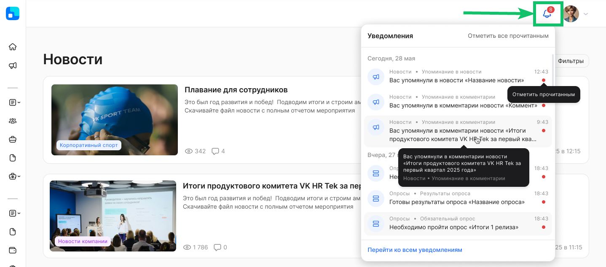
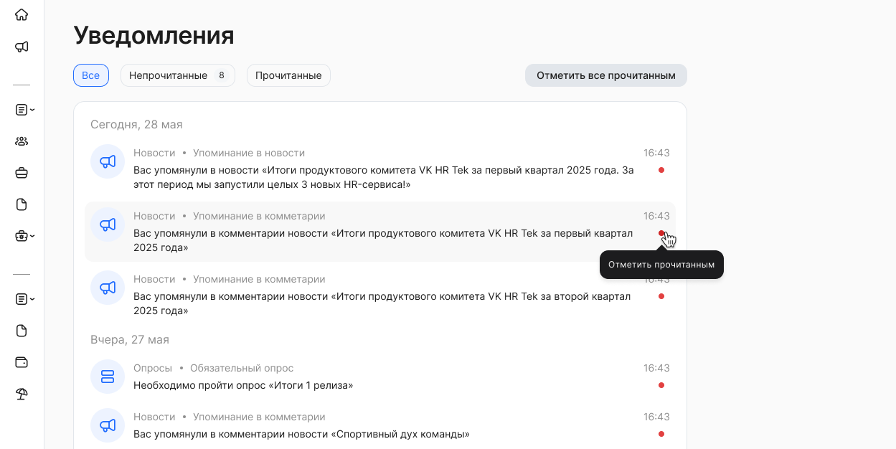

Пользователи социальных сервисов **Новости, Опросы, Сообщества** могут получать уведомления.

Непрочитанные уведомления доступны для быстрого просмотра в элементе «колокольчик», у которого есть метка с подсчётом уведомлений. Нажмите на «колокольчик», чтобы открыть выпадающий список непрочитанных уведомлений.

Уведомления в списке отсортированы по дате и времени их отправки, от новых к старым.  

 

Возможные действия с уведомлениями:

1. Отметить прочитанным. В непрочитанном уведомлении нажмите на красную точку. Уведомление перейдет в статус прочитанного и исчезнет из выпадающего списка без возможности восстановления.  
2. Прочитать все. Нажмите кнопку **Отметить все прочитанным**. Все уведомления (даже не подгруженные) исчезнут из выпадающего списка без возможности восстановления.  
3. Перейти к событию. Нажмите на уведомление, чтобы открыть объект (новость, опрос, сообщество), вызвавший отправку уведомления. Уведомление перейдет в статус прочитанного и исчезнет из выпадающего списка без возможности восстановления.  
4. Переход к списку всех уведомлений на отдельной странице. Нажмите кнопку **Перейти ко всем уведомлениям**, чтобы открыть страницу **Уведомления**. 

 

Для уведомлений доступна фильтрация по категориям: **Все**, **Непрочитанные**, **Прочитанные**.