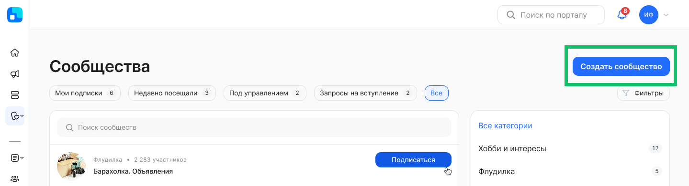
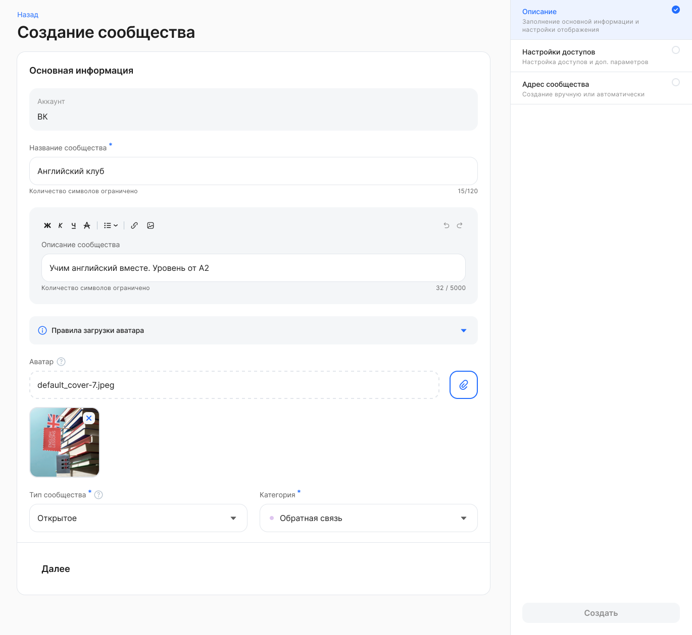
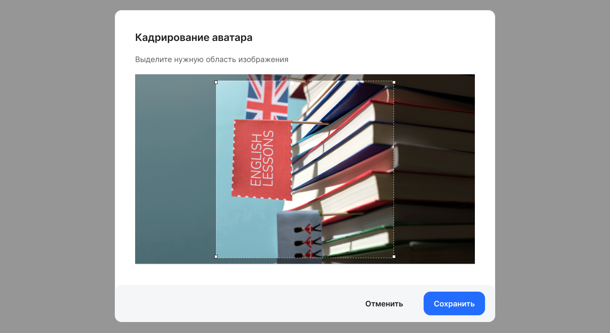
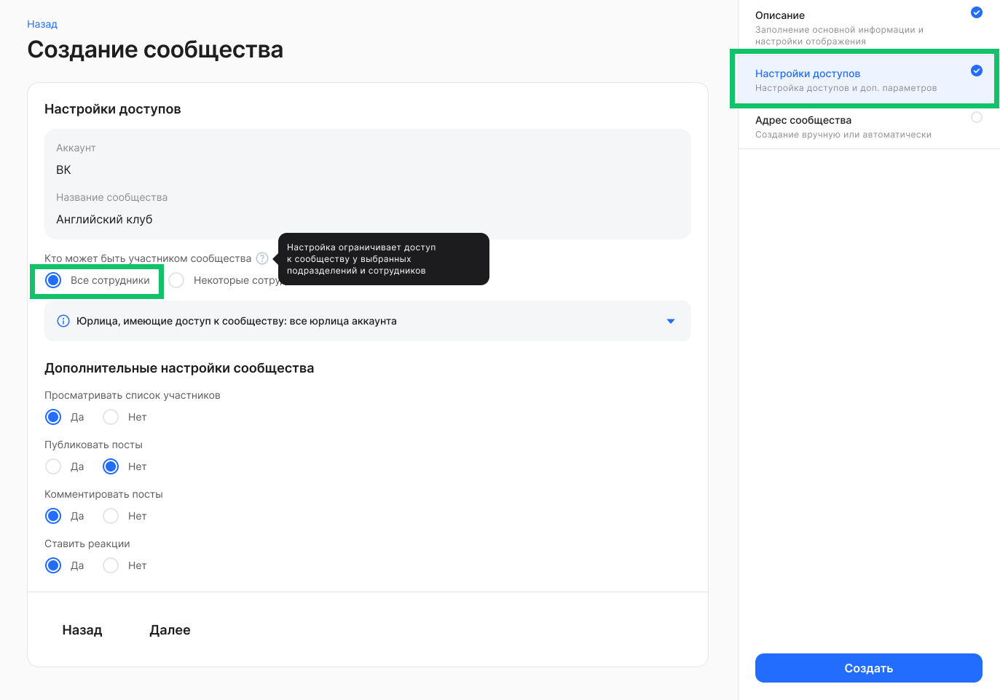
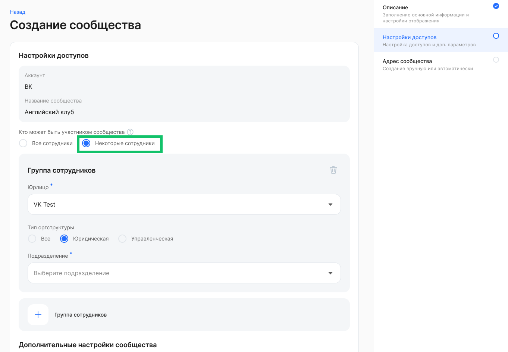
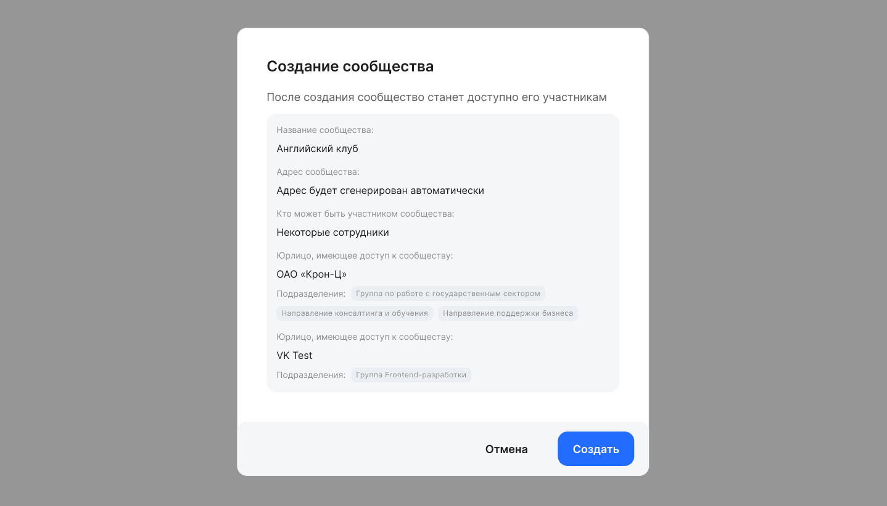
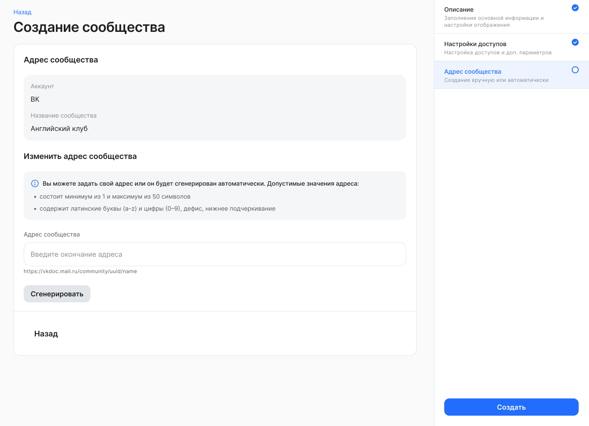
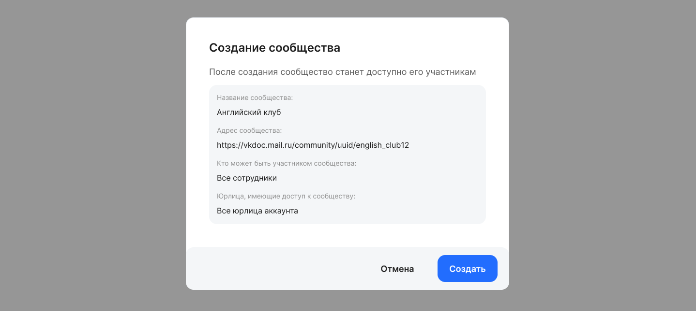

Чтобы получить доступ к созданию сообщества в разделе **Социальные жизнь → Сообщества**, представителю компании должна быть выдана хотя бы одна из ролей: **Администратор модуля Портал**, **Менеджер сервиса Сообщества**. Также создавать сообщества могут сотрудники, которым разрешили такое действие. Подробнее о назначении роли см. в статье [Роли сотрудников в компании](/ru/admin_actions/settings/groups).

## Заполнение описания сообщества

Чтобы создать сообщество, нажмите кнопку **Создать сообщество** и в случае если администратору доступно управление в нескольких группах аккаунтов — выберите аккаунт, от лица которого будет создано сообщество. 





В блоке **Основная информация** заполните следующие поля:

* **Название сообщества**. Обязательное поле. Название не должно превышать 120 символов.  
* **Описание сообщества**. Обязательное поле. Описание не должно превышать 5 000 символов.  
* **Аватар**. Необязательное поле. Чтобы загрузить обложку, нажмите кнопку . Далее выделите нужную область загружаемого изображения и сохраните изменения.

<info>

Правила загрузки аватара: 
- Допустимые форматы изображений: JPEG, PNG, HEIF, WEBP, DNG, TIFF 
- Изображение не должно превышать 10 МБ. 
- Соотношение сторон 1:1. 
- Минимальный размер изображения 420 х 420 пикселей. 

</info>



* **Тип сообщества**. Обязательное поле. Выберите один тип из выпадающего списка:  
  * Открытое: доступно всем, контент виден всем.  
  * Закрытое: вступление по заявке, контент доступен только для участников.  
  * Скрытое: не видно в поиске, вход только по приглашению.  
* **Категория**. Обязательное поле. Выберите одну категорию из выпадающего списка.

Нажмите кнопку **Далее** для заполнения настроек доступов и дополнительных параметров.

## Заполнение настроек доступов к сообществу

На странице **Настройки доступов** укажите параметры для следующих настроек:

1. **Кто может быть участником сообщества**. Возможные варианты настройки: **Все сотрудники** или **Некоторые сотрудники**. Настройка ограничивает доступ к сообществу у выбранных подразделений и сотрудников.  
2. **Просматривать список участников**.  
3. **Публиковать посты**.  
4. **Комментировать посты**.  
5. **Ставить реакции**.



Если для настройки **Кто может быть участником сообщества** выбран вариант **Некоторые сотрудники**, то сообщество станет доступно только отдельным **группам сотрудников** в компании или в отдельных подразделениях.

В зависимости от доступа Администратора в блоке **Группа сотрудников** выберите:

* **Юрлицо**. Выберите одну компанию из списка. Если Администратор имеет доступ только к одному юрлицу, то поле будет заполнено автоматически.   
* **Тип оргструктуры**. Доступны варианты для выбора:  
  * **Все.** Сообщество будет доступно сотрудникам всех подразделений компании вне зависимости от типа оргструктуры.  
  * **Юридическая.** В поле **Подразделение** выберите одно подразделение. Если требуется добавить доступ для еще одного подразделения, то добавьте новый блок с группой сотрудников. Если надо назначить доступ на всю оргструктуру, то выберите верхнее в иерархии подразделение.  
  * **Управленческая.** В поле **Подразделение** выберите одно подразделение. Если требуется добавить доступ для еще одного подразделения, то добавьте новый блок с группой сотрудников. Если надо назначить доступ на всю оргструктуру, то выберите верхнее в иерархии подразделение.

  При необходимости добавьте еще один блок с группой сотрудников.

  Если добавлено больше одного блока **Группа сотрудников**, то любой из блоков станет доступен для удаления. 



На странице настройки доступов доступно создание сообщества с адресом, который будет сгенерирован автоматически. 



## Заполнение адреса сообщества

На странице **Адрес сообщества** укажите своё окончание адреса, или оно будет сгенерировано автоматически.

Допустимые значения для окончания адреса:

* состоит минимум из одного и максимум из 50 символов,  
* содержит латинские буквы (a–z) и цифры (0–9), дефис, нижнее подчеркивание.



В поле **Адрес сообщества** задайте окончание адреса. Введенный адрес отобразится под полем ```https://vkdoc.mail.ru/community/uuid/name```.

При дальнейшем вводе адреса окончание ```name``` изменится на введенный/сгенерированный адрес.

```uuid``` будет известен после создания сообщества.

Кнопка **Сгенерировать** позволяет сгенерировать адрес, предложенный системой. Если сгенерированный адрес меняется, кнопка генерации снова становится активна.

Для добавления значений и настроек сообщества, указанных на всех пройденных этапах, нажмите кнопку **Создать**. 



Пользователь может создать сообщество, не заполнив поле с адресом. В таком случае адрес будет автоматически сгенерирован системой.