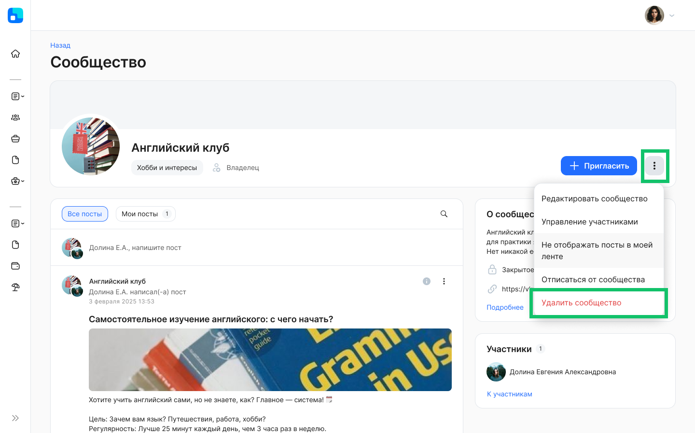
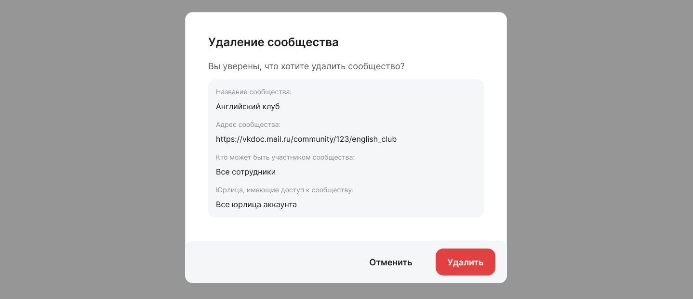
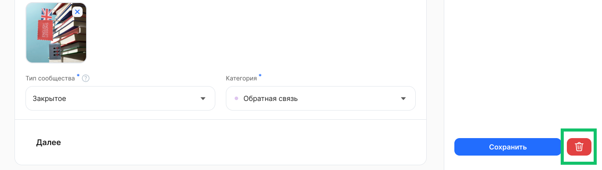

В разделе **Социальная жизнь → Сообщества** можно удалить двумя способами:

1. Перейдите на страницу сообщества и нажмите кнопку   и **Удалить сообщество**. Подтвердите удаление.

2. Откройте страницу редактирования сообщества, которое хотите удалить, нажмите кнопку . Подтвердите удаление.

