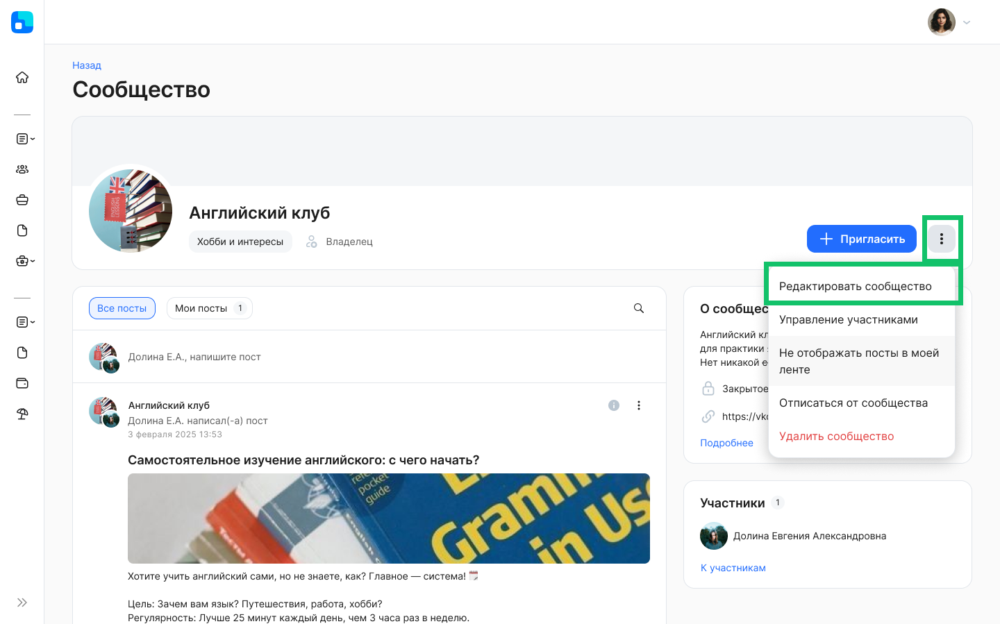
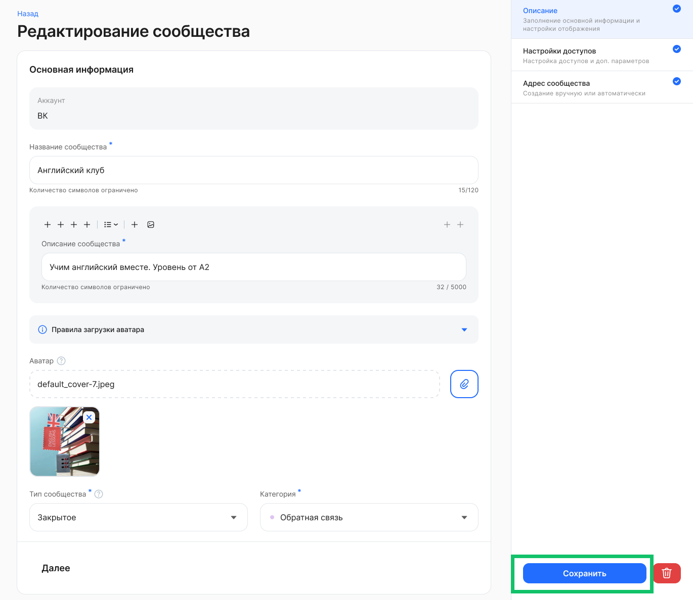
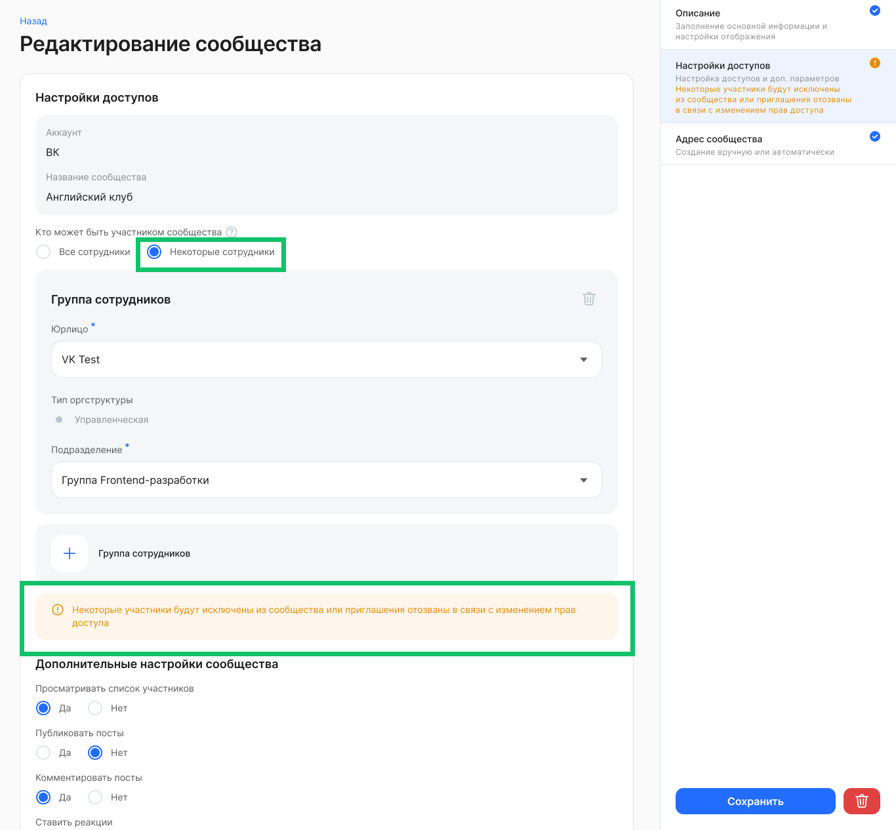
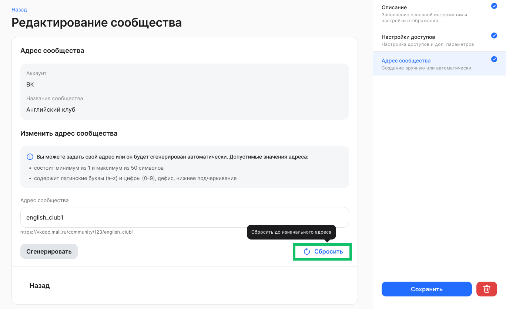

Чтобы перейти к редактированию сообщества, перейдите на страницу сообщества в разделе **Социальная жизнь → Сообщества** и нажмите кнопку **Редактировать сообщество**.

На странице описания можно редактировать значения во всех полях, которые заполнялись при создании. Сохраните введенные изменения.   
   

На странице настроек доступов можно изменить значения для всех параметров, которые были указаны при создании. Если в настройке **Кто может быть участником сообщества** было изменено значение с **Все сотрудники** на **Некоторые сотрудники**, то в связи с изменением прав доступа некоторые участники будут исключены из сообщества или приглашения для них будут отозваны. 

На странице заполнения адреса сообщества можно отредактировать окончание адреса, которое было задано пользователем или сгенерировано системой. Если после изменения адреса понадобится вернуть изначальный адрес, то нажмите кнопку **Сбросить**.

