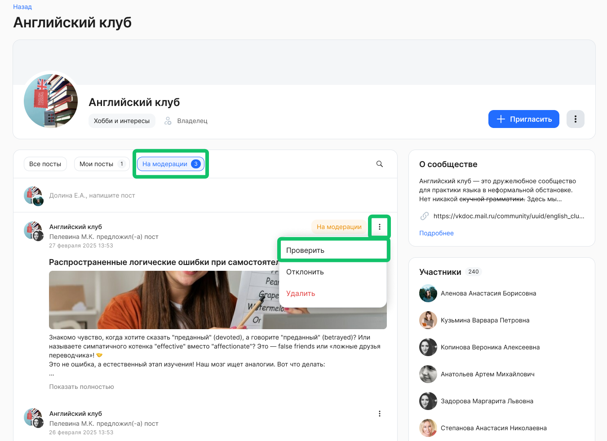
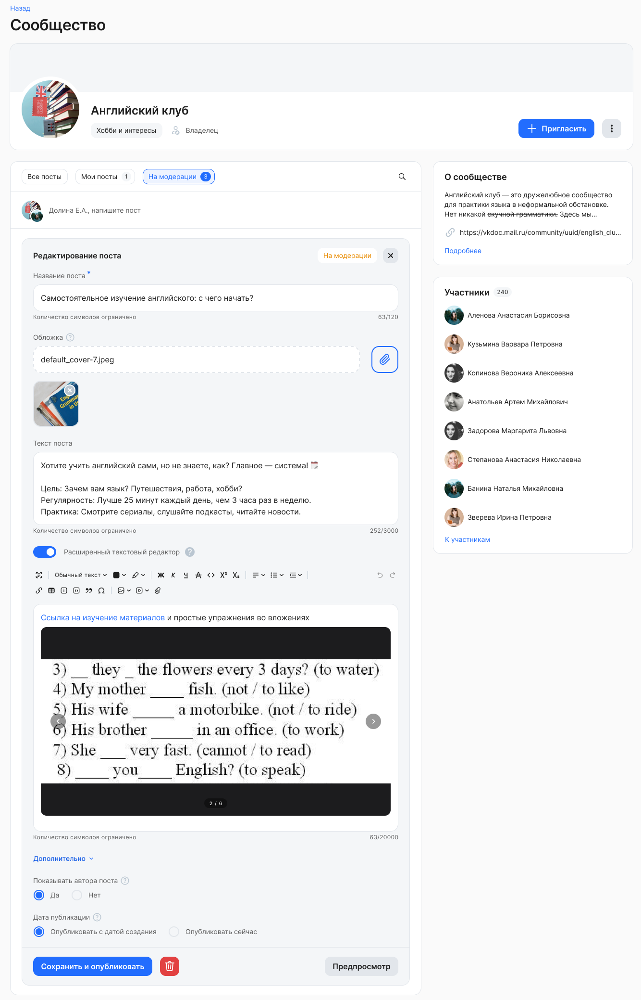
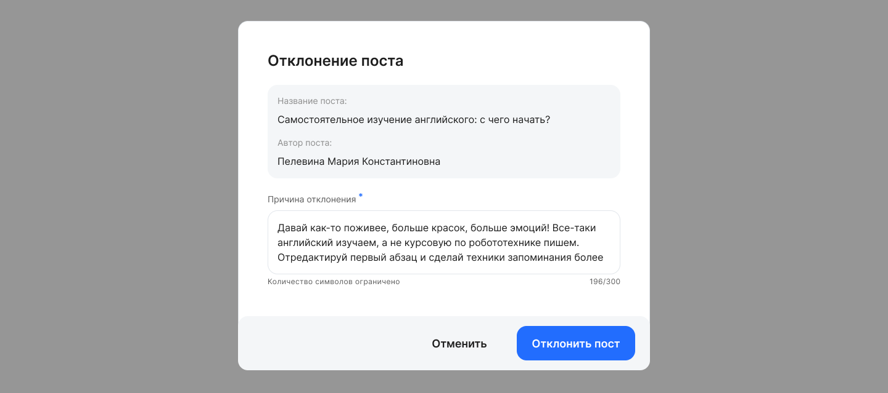

Отправить пост на модерацию можно только в сообществе, где была включена настройка **Модерировать посты**.

После того, как пользователь отправил созданный пост на проверку, пост попадает к владельцу (администратору/модератору/менеджеру сервиса Сообщества/администратору модуля Портал) в список **На модерации**.

Чтобы проверить пост перед публикацией, откройте сообщество и нажмите кнопку **Проверить** в нужном посте.

Владелец (администратор/модератор/менеджер сервиса Сообщества/администратор модуля Портал)  может удалить пост или отредактировать любое поле со значениями, оставленными автором поста, а также настроить показ имени автора поста и определить дату публикации:

* **Опубликовать с датой создания**. При выборе настройки пост будет опубликован задним числом с той датой и временем, в которые был прислан на модерацию.  
* **Опубликовать сейчас**. Пост будет опубликован с текущей датой и временем. 

В случае успешной проверки, сохраните и опубликуйте пост в сообществе.

Если в посте требуются исправления от автора, то пост можно отклонить.  

Чтобы отклонить пост от публикации в сообществе, откройте сообщество и нажмите кнопку **Отклонить** в нужном посте.

В форме отклонения поста укажите причину (до 300 символов) и подтвердите действие. 

Автор поста увидит комментарий о необходимости исправить пост в своем списке **На модерации**. 