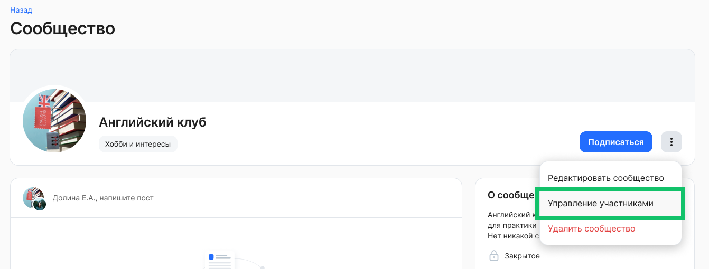
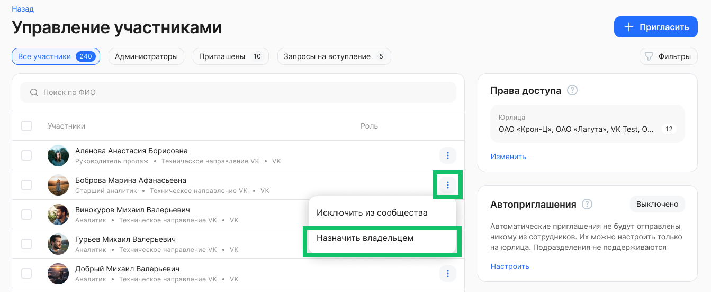
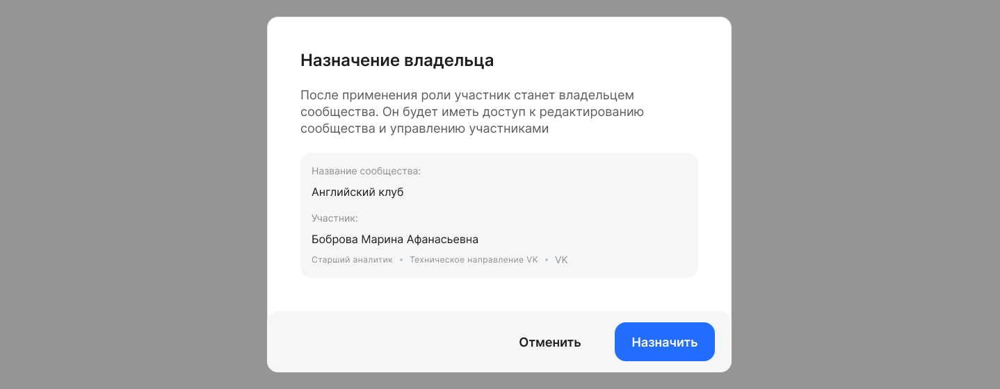
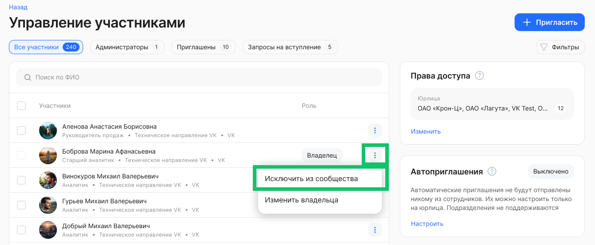
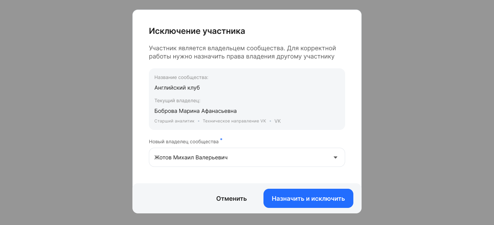

Чтобы назначить нового владельца сообщества, Администратор модуля Портал должен перейти на страницу сообщества и нажать кнопку **Управление участниками**.

Администратор модуля Портал может исключить участника или назначить его владельцем, например, в случае если в сообществе нет владельца. Причины отсутствия владельца:

* Владелец лишился прав доступа к сообществу.  
* Владелец больше не является сотрудником компании (уволен).

Чтобы назначить нового владельца из числа участников, напротив имени нужного сотрудника нажмите кнопку **Назначить владельцем** и подтвердите действие.

Если требуется удалить из сообщества участника, который является владельцем, то напротив имени сотрудника с ролью **Владелец** нажмите кнопку **Исключить из сообщества**.

На форме **Исключение участника** выберите нового владельца из числа участников и подтвердите действие. 

Если требуется сменить текущего владельца на нового, при этом не исключая его из сообщества, то напротив сотрудника с ролью **Владелец** нажмите кнопку **Изменить владельца**.

