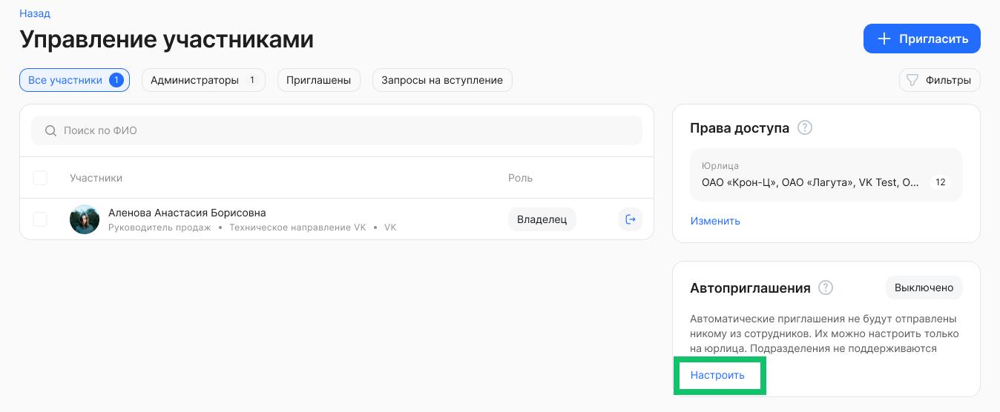
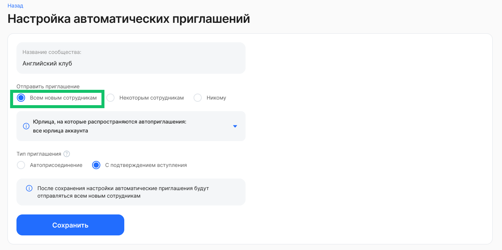
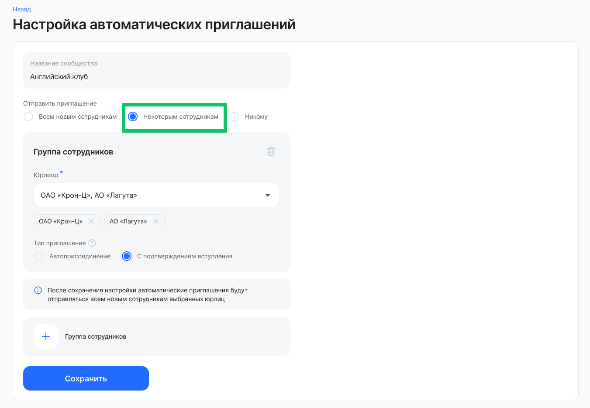
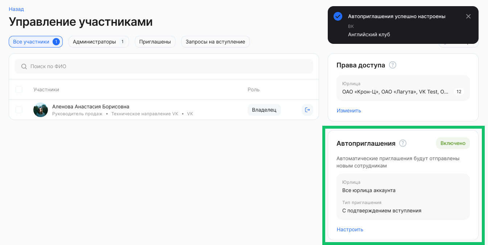

Автоприглашения настраиваются только на юрлица, указанные в настройках доступа сообщества, и не настраиваются на конкретные подразделения.

Если доступ к сообществу назначен для конкретных подразделений, то блок с автоприглашением не отображается на странице сообщества. Блок появится, если к сообществу есть доступ хотя бы у одного юрлица или аккаунта.

Чтобы настроить автоприглашения, в блоке **Автоприглашения** нажмите кнопку **Настроить**.

Задайте параметры для следующих настроек:

* **Отправить приглашение**. По умолчанию установлен вариант **Никому**, т.е. отправка автоприглашений выключена. Чтобы включить отправку, выберите один из вариантов:  
  * **Всем новым сотрудникам**. Приглашения получат сотрудники из всех компаний аккаунта или всех компаний, на которое назначено сообщество, а также все новые сотрудники.   
  * **Некоторым сотрудникам**. Приглашения получат сотрудники из одного или нескольких выбранных юрлиц, а также новые сотрудники.   
* **Тип приглашения**. Доступны два типа приглашения:  
    * **Автоприсоединение** — пользователь, которому направили приглашение, автоматически вступает в сообщество (становится участником сообщества).   
    * **С подтверждением вступления** — пользователь должен подтвердить, хочет ли он вступать в сообщество.

Если требуется отправить приглашения сотрудникам из определенных компаний в аккаунте, то для настройки **Отправить приглашение** выберите вариант **Некоторым сотрудникам**.

В блоке **Группа сотрудников**, в поле **Юрлицо** выберите название компании из списка. Доступен выбор компаний только из тех юрлиц, на которые назначено сообщество.

Сохраните настройки и подтвердите действие.

В блоке **Автоприглашения** появится информация о статусе включения и текущих настройках с возможностью их изменения.  

В случае если сообщество остается без владельца (уволился, потерял права доступа), то ранее указанные настройки автоприглашений удалятся.