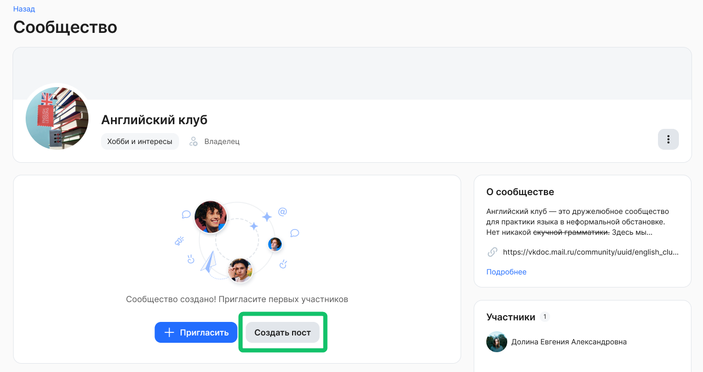
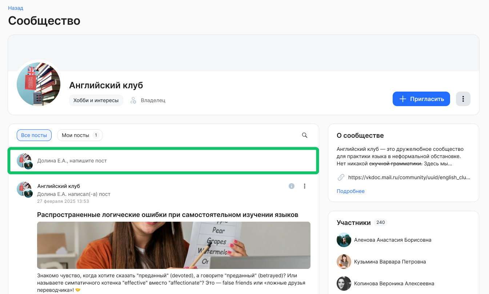
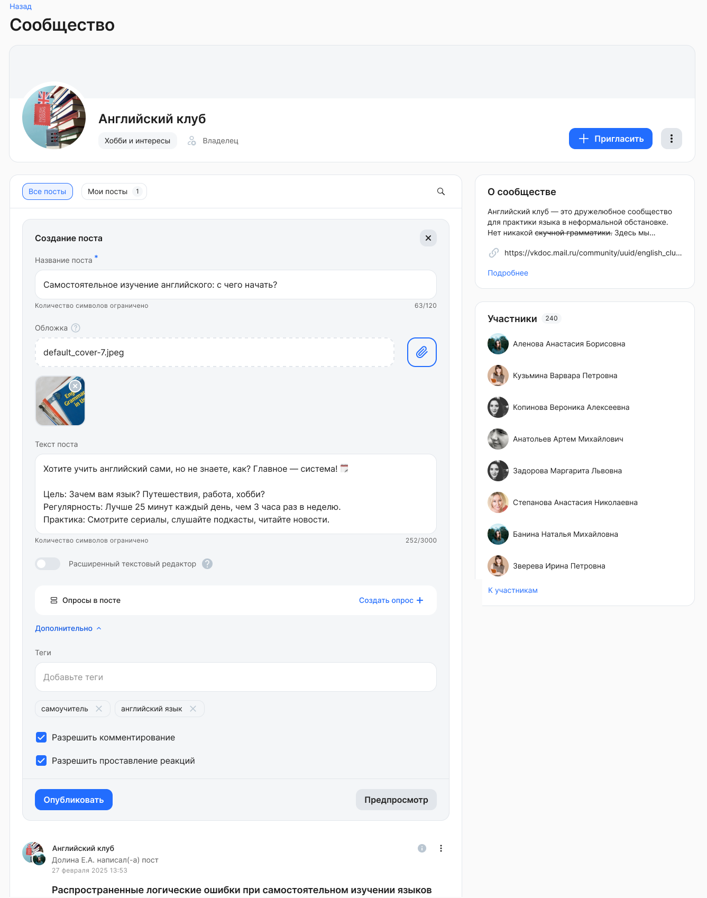
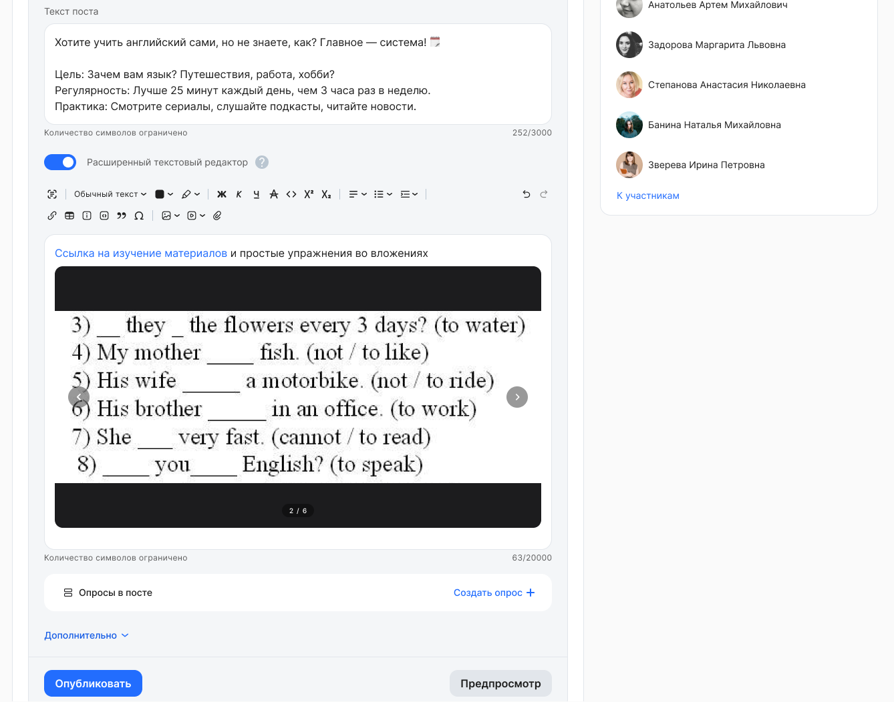
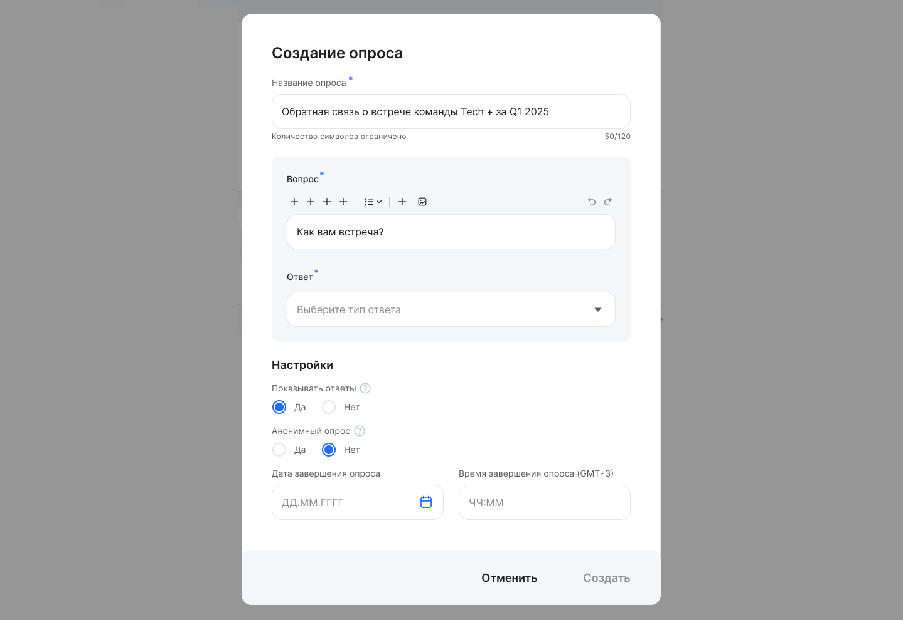
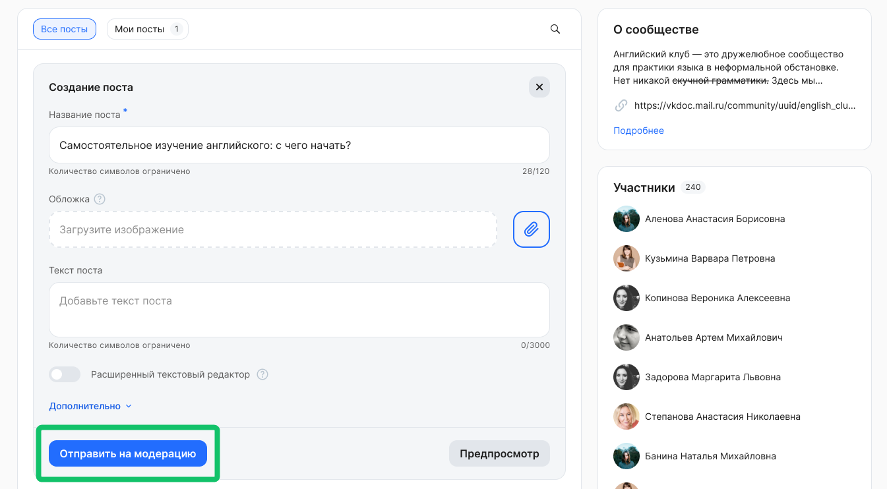
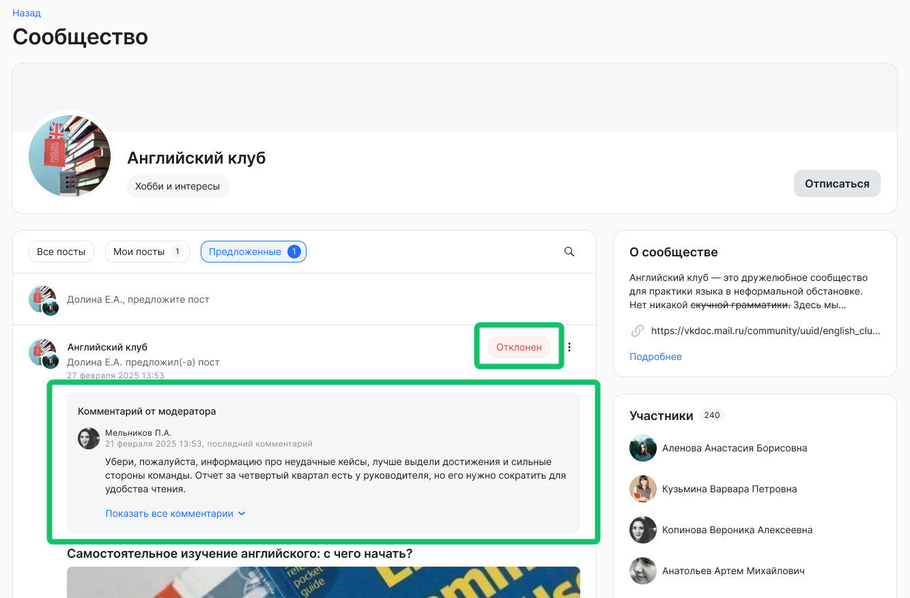
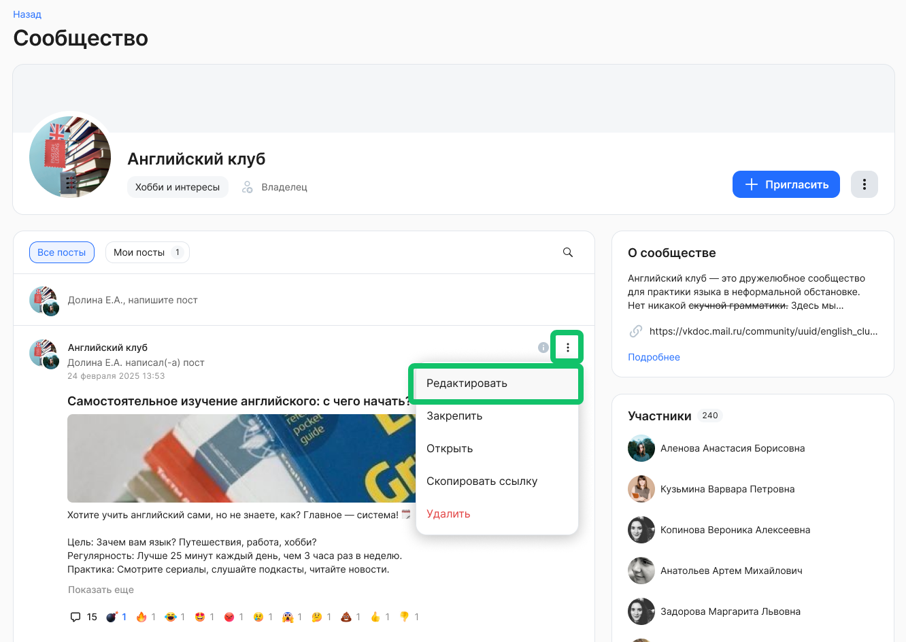
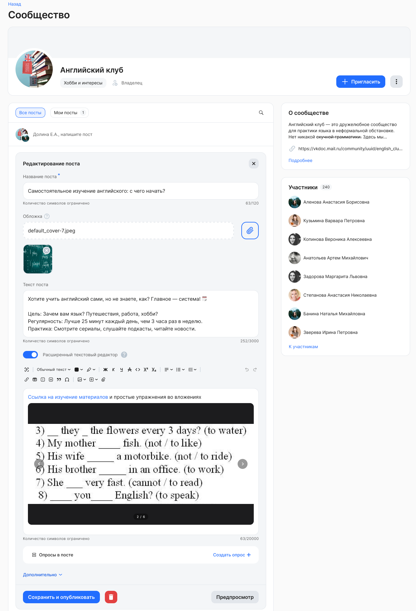

Владелец сообщества может публиковать посты в своём сообществе.

Также участники сообщества могут публиковать посты, если это разрешено правилами сообщества.

Пользователи, которые не являются участниками открытого сообщества, могут создавать посты без вступления в это сообщество. 

Чтобы создать пост, откройте страницу сообщества и нажмите кнопку **Создать пост**.

При создании второго и последующих постов в сообществе, нажмите на область, которая расположена над лентой постов и в которой указана надпись «ФИО, напишите пост» или «ФИО, предложите пост».

При создании поста заполните следующие поля:

* **Название поста**. Обязательное поле. Название не должно превышать 120 символов.  
* **Обложка**. Необязательное поле. Чтобы загрузить обложку, нажмите кнопку . Далее выделите нужную область загружаемого изображения и сохраните изменения.

<info> 

Правила загрузки обложки: 
- Допустимые форматы изображений: HEIF, JPEG, PNG, WEBP, DMG, TIFF 
- Изображение не должно превышать 10 МБ. 

</info>

* **Текст поста**. Необязательное поле. Текст поста не должен превышать 3 000 символов.  
* **Расширенный текстовый редактор**. Активируйте переключатель, если требуется добавить в пост изображения, файлы, ссылки и т.д. Возможно упоминать пользователя в посте (по аналогии с новостями).    
* **Дополнительно**. Раскройте блок, чтобы настроить:  
  * **Теги**. Придумайте свои теги — ключевые слова, с помощью которых пользователи будут ориентироваться в теме поста.   
  * **Разрешить комментирование**. По умолчанию опция включена, если в настройках сообщества было разрешено комментирование. Отключите опцию, если требуется запретить комментирование и показ комментариев под постом.  
  * **Разрешить проставление реакций**. По умолчанию опция включена, если в настройках сообщества было разрешено проставление реакций. Отключите опцию, если требуется запретить комментирование и показ реакций под постом.

В **Расширенном текстовом редакторе** напишите текст поста и добавьте к нему необходимые сопроводительные материалы: изображения, видео, файлы, таблицы и другие элементы. Текст новости не должен превышать 20 000 символов.

Возможности оформления содержания поста:

* Обычный текст, жирный/курсив/подчеркнутый/зачеркнутый.  
* Текст с фоном.  
* Выделенный текст и заголовки.  
* Подстрочный текст.  
* Надстрочный текст.  
* Изображения и изображения с подписью .  
* Карусель с изображениями (не более 10 штук) и изображения с подписями.  
* Видео и видео с подписью.  
* Прикрепленный файл с возможностью скачать.  
* Исходный код.  
* Маркированный список.  
* Нумерованный список.  
* Ссылка.  
* Цитата.  
* Таблица.  
* Справка.  
* Спецсимволы.

Изображения в содержимом новости должны соответствовать условиям:

* типы файлов: JPEG, PNG, HEIF, WEBP, DMG.  
* максимальный вес файла 10 мегабайт.

Файлы в содержимом новости должны соответствовать условиям:

* типы файлов: PDF, DOCX, XLSX, CSV.  
* максимальный вес одного файла 10 мегабайт.

Также в пост можно добавить мини-опрос. Для этого нажмите кнопку **Создать опрос**.   
В форме создания опроса укажите:

* название опроса,  
* вопрос,  
* тип ответа: один из списка, несколько из списка, текст,  
* варианты ответов (для типа ответа: один из списка, несколько из списка), лимит — 10 шт.,  
* если есть ограничение символов для ответа — минимальное и максимальное количество символов в ответе (тип ответа: текст),  
* настройку показа ответов для пользователей,  
* настройку анонимности опроса,  
* дату и время завершения опроса.

Чтобы просмотреть добавляемый пост так, как увидят её другие пользователи сервиса, нажмите кнопку **Предпросмотр**.   
Если в просматриваемом посте найдены какие-то ошибки или недочёты, вы можете внести изменения. После этого можно сохранить пост по кнопке **Опубликовать**. 

Кнопка **Опубликовать** отображается только для постов того сообщества, у которого была включена настройка **Разрешать публиковать посты** и <u>выключена</u> настройка **Модерировать посты**.

## **Отправка поста на модерацию**

После создания поста в сообществе, где была включена настройка **Модерировать посты**, посты будут отправлены на модерацию.

После отправки на модерацию, посты будут отображаться в списке **Предложенные** до момента их публикации. 

Если модератор отклонит пост, то автор поста получит уведомление об этом и в самом посте будет виден комментарий (причина) отклонения.

## Редактирование поста

Чтобы отредактировать пост, перейдите на страницу сообщества в разделе **Социальная жизнь → Сообщества**, найдите нужный пост и нажмите кнопку **Редактировать**.

В посте можно редактировать значения во всех полях, которые заполнялись при его создании. Сохраните введенные изменения. 

